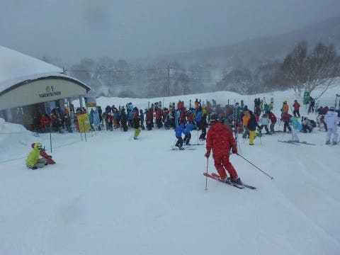

# 2月18日（日）の志賀高原詳細モード…吹雪＆激寒の一日．なぜ，週末の営業時間だけを狙って悪天候なのか（涙）

📅 投稿日時: 2018-02-20 01:54:24

🏷️ カテゴリ: [2018スキー滑走日記](c11b88dc181f34079ab41db74a3587646.md)

えー．

この週末の土日．

嫌がらせのようにリフト営業時間を狙って

悪天候が続いたわけですが．

本日はすっきり晴れたようですね．

…金曜日が晴れて最高の天気だったというのに．

土曜のちょうど営業開始から降り始め，

ナイターも営業できないほどの悪天候となり．

さらに日曜の営業終了まで吹雪が続く…

という悪天候だったのに．

日曜の営業が終わったころから天気が回復してきて．

月曜はすっきり晴天で．

ええ．最高の天気になったようですね…

もう，激烈に日ごろの行いが悪い人が

いたとしか思えませんね…（涙）

さらに．

これから一週間．

また，志賀高原ではほとんど積雪が

なさそうです（泣）．

皆さんの冷え冷え踊りが効いているのか，

気温は冷え冷えなのに…

なぜ降らないのか…（天を仰ぎながら）

…ってことで，本題．

悪天候だった日曜の志賀高原，詳細レポートです．

えー．

まず．

朝，起きてみると．

うげげげげ．

…埋まってますね，車…

土曜の夜から日曜の朝にかけての積雪は

結構あったようで．

…これは，新雪パフパフが楽しめるか！！！

と，大期待して，いつもの焼額へ向かいますが．

ふむ．

朝イチの気温は-15度！

金曜夜の最終予想，

　朝は-15度程度まで冷え込み．

という予想通りの，冷え冷え！

で．

天気は…

…

…

かなり北風が強く，視界も悪い雪降りです（涙）．

焼額は全リフト通常営業だったけど．

北風に弱い奥志賀は，第1ペア以外の

全リフト，ゴンドラが運休だったようで…

あぁ…土曜に引き続いて，日曜もダメか…

でも．

こんな天気だけど．

久しぶりの積雪だし，新雪が楽しめるはずっ！！！

久々の太い板，出動だっ！！

そして…

オリンピックコースへ，Go！

うほーーー！

新雪！！！

今朝の車の埋まりっぷりから見て，

腰パフか…？？

と，思ったけど．

あれ？

脛くらいまでしか埋まってない…

もっと深いと思ったのに…？？

さらに．

こんな感じで，脛の前の雪がサラサラ流れていくというより，

押しつぶされて固まっていくような重めの雪だったので．

うーむ．

朝，駐車場で期待していたレベルと比べると，

イマイチの状態…（涙）

でも．

重い雪だけど，朝イチはまだ楽しめるっ！！

せいぜいひざパフ程度だったけど，

久々の新雪！！！

重くてバランスをとるのが難し目だけど．

でも，久しぶりのパフパフだぁ…！！！

…と，喜んでいたのも3-4本程度．

サラサラじゃない重めの雪は，人が滑ると

踏み固められていくので．

新雪バーンはあっという間にただの

荒れ荒れ凸凹バーンと化していきます…（涙）．

こんな感じで視界が悪い中．

コースの凸凹が良く見えないので…

踏み固められてるかと思ったら，いきなり

予想外に重い雪に突っ込む…

という．

「前後バランス能力の限界にチャレンジ！」

って感じの，スキーヤーの能力が試されるバーンに

なり果ててしまいました…（泣）．

だもんで．

圧雪バーンのGSコースへ行ってみると…

雪質は冷え冷えのいい感じなのですが．

でも．コース上は…

ううううーーーん．

人口密度が高いよ（涙）．

悪天候だけど，奥志賀がほぼ全面運休という

影響もあり，焼額に人が流れてきたからか…

午前10時過ぎには．

うぎゃーーー！

第1ゴンドラ，かなりの列が…（泣）．

11時近くまで，ゲートの外に連なるゴンドラ待ちが

続いたので．

お昼はちょいと一の瀬方面へ遠征…！

…だけど．

ダイヤモンドも視界は悪いし．

一の瀬ファミリーも…

正面バーンの上の方は，下から見えませんね…

ファミリーは，リフトはガラガラだったけど．

正面バーンの上部は，結構人がいますね…

そして，新雪が積もったにもかかわらず…

正面バーン上部は，下地の固いのが出てきてます（涙）．

ちょうどエッジが引っかかる，滑り良い硬さの

バーンではあったけども．

一の瀬正面バーン上部は，風で飛ばされてほとんど

積雪がなかったようです…（残念）．

一の瀬正面バーン下半分や，パノラマ，

パーフェクターコースの雪は普通に柔らかくて

滑り良かったけど．

でも，やっぱり．

一の瀬ファミリーも風が強くて．

リフトに乗ってると凍死するかと思うほど寒く…

やっぱり，こういう風が強くて寒い日は．

ゴンドラがある焼額が一番いいなぁ…

と，焼額へ戻ってきました．

なんてったって．

昼を過ぎても，気温が-13℃と

激冷えですから！

こんな日にリフトに乗ってると，

冷凍人間になってしまいます…

午後の焼額は．

午前中の混雑とうってかわって，

日曜午後恒例の，ガラガラバーン！←ってか，こんな悪天候で午後遅くまで滑る人そうそういないって

ってなわけで．

この日も夕方まで．

-10℃を下回る吹雪の天気が続いたけど．

やはりお約束通り．

16:15の営業終了まで滑り続けてしまったのでした…

…しかし．

こんな悪天候の中でも，土日2日間必死で

滑っていたというのに．

前日の金曜も，翌日の月曜も．

最高のスキー日和の晴天

というのを見て．

「なぜ…なぜ週末が終わったらすっきり晴れるの！？？」

と，悶絶してしまった，

Skier_Sだったのでした…

## 💬 コメント一覧

### 💬 コメント by (naoちゃんねる)
**タイトル**: お世話になりました
**投稿日**: 2018-02-20 08:23:39

突然声掛けしてしまい、失礼しました。

とんでもない極寒＆吹雪でしたが、優しいおねえちゃんと一緒に滑れて、娘はとっても楽しかったようです。

我が娘のスピードに合わせて頂いたり、ご迷惑をお掛けしました。また志賀高原行きますので、お会い出来ましたらよろしくお願いします。それまでに娘をもっと鍛えます（笑）

本当にありがとうございました。

https://youtu.be/TnPTmInHtkM

### 💬 コメント by (KENKEN)
**タイトル**: 20000mも視野に。
**投稿日**: 2018-02-20 08:24:21

日曜日の午後は会えませんでしたが、週末はお世話になりました。

3年目にして初めての出会いもあり貴重な機会になりました。

しかしお嬢さん早すぎです。

さすがゴールドステッカーの血を引くだけはありますね。

あと数年で金色のステッカーを板に貼ってる姿が目に浮かびました。

今週末は家族サービスしますので、再来週宜しくお願いしますm(__)m。

### 💬 コメント by (かず)
**タイトル**: Unknown
**投稿日**: 2018-02-20 11:48:33

日曜　僕もオリンピック1本目WAX失敗して前転　2本目から現地対応で快適でした　風と気温で締まってましたね　

月曜　気合い入れてゴンドラ1番に並びましたよ　ステップインなのでダウンヒル〜熊落　FTいただきました　熊　立てば腰位ありそうですが　ボードだと膝上位？天気もよく風もなくて最高　しかし最高は1時間半でした

予報見ると今シーズンパウダー最後かな？？

### 💬 コメント by (Goku)
**タイトル**: Unknown
**投稿日**: 2018-02-20 15:08:38

日曜日は午前しか御一緒できませんでしたね。

結局、ヤケビで１日滑ってましたけど、寒さに負けてゴンドラ終了を待たずに早退しました。

それにしても、昨日、今日と山は快晴で、仕事に身が入りません

もう嫌がらせとしか思えません(笑)

### 💬 コメント by (隠れ読者)
**タイトル**: Unknown
**投稿日**: 2018-02-21 02:44:01

お疲れさまでした

自分は、今年初 志賀高原で 気温低かったけど 雪が降ってなかった 5時くらいに山道入ったんですが…道路に雪がない事に驚きました。

基本的に連泊するとき以外は、焼額奥志賀、横手山方面には、行かないのですが、17日は風が強かったですね…

18日は、西館山東館山は、結構視界も良くて 良かったですよ～

あ、でも 焼額に比べて 乗り継ぎも不便デスヨネ><

焼額の尾根のｺｰｽがｸﾙｰｼﾞﾝｸﾞ感あって 好きです

### 💬 コメント by (Skier_S)
**タイトル**: なぜ週末が終わってから晴天なのか…
**投稿日**: 2018-02-21 05:15:38

＞naoちゃんねるさま

日曜日はお世話になりました～！

こちらのペースに巻き込んじゃったみたいで

すみませんでした．

けど，うちの娘も楽しんだようです…

あと，家の娘にアイス買っていただいたり，

いろいろありがとうございました～！

また志賀にお越しの際はよろしくお願いします．

＞KENKENさま

3年目にして初の出会いがありましたね（笑）．

うちの娘も，朝の集団爆走について行くほどの

スピード狂（？）ですので…

一緒に滑る人たちがそういう人たちばかりですから，

いろんな意味で一般とズレた方向性に育っている

気がします（笑）

＞かずさま

月曜は良かったでしょうね…

うらやましいです…

このあとしばらく積雪なさそうですし，

3月は気温が高めになりそうです（涙）．

うーむ．

もう1～2回はパウダー来てほしいんですが…

＞Gokuさま

午後は3時過ぎまで一の瀬方面で滑ってました…

ヤケビに戻ってきたら，もうみなさん帰られたのか，

日曜は珍しいことに，終礼参加者がいませんでした（笑）．

しかし，なんで週末が終わったら天気が良くなるんでしょうねぇ…

平日降って，週末晴れるパターンが嬉しいんですが…

まぁ，雪が少な目なので降ってくれただけよしと

しないといけないんでしょうけど（笑）．

＞隠れ読者さま

あら．日曜に志賀で滑ってらしたんですか．

焼額～一の瀬方面を滑ってたなら，

私を見かけている可能性も…

西館・東館は視界良かったんですね．

一の瀬も，ファミリーの下半分は

視界が良かったので，標高が低い西館以下は

やっぱりクリアだったんですね…

焼額にいらっしゃるときは，ぜひ私を

発見して，シルバーステッカーGetしてください！

