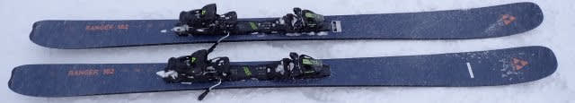
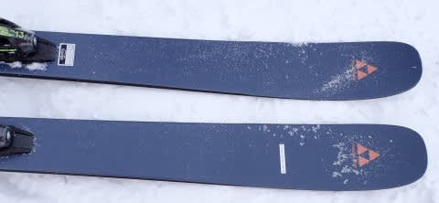
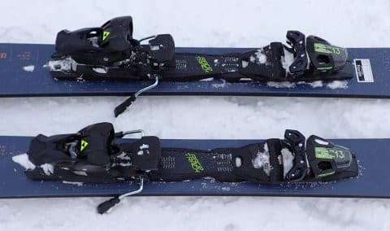
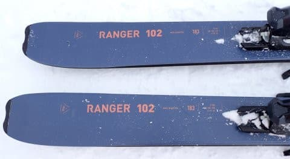
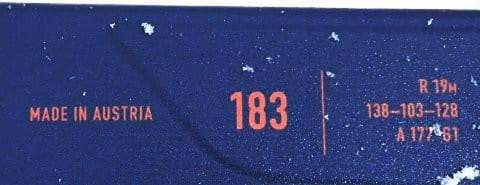

# 2025シーズンモデルのスキー板，試乗レポートその15…FISCHER RANGER 102

📅 投稿日時: 2024-06-19 00:51:56

🏷️ カテゴリ: [スキー板試乗](c0bd8048615710cee890e403a36cc9a2b.md)

やっぱり夜はちゃんと寝ないとダメだ…

今日は昼間の会議中，1時間近く完全に

意識を失ってました（涙）

リモート会議だから良かったけど，リアル

会議だったらと思うと恐ろしい…

しかし，1時間近く完全に意識を失って

いたとは…

気づいたら会議が終わっていたこの

恐ろしさよ．

しかし．

いつも思うけど，会議って眠くなることが

多いですよね～（私だけ？）

だもんで．世の中の眠れなくて困っている

人は，みんなくだらない会議に出れば，

睡眠薬なんてなくても寝られるのでは…？

くだらない会議の催眠効果は絶大ですよね…

ってなことで，本題へ．

本日も2025シーズンモデルのスキー板の

試乗レポート．

今回はフィッシャー編です！

〇FISCHER RANGER 102 183cm

フリーライド・オールマウンテン

フィッシャーのフリーライド用のレンジャー

シリーズ．

センター幅84，90，96，102，108，116mmと

6種類あるうちの，だいたい真ん中に位置する

モデルですね…

メタルも入っていて，オンピステも行けると

言っていますが，センター102mmとなると，

どちらかというとオフピステメインに

なりますか…

でも．一番下の写真の数字を見ると，

RANGER102と言っておきながら，

センター幅は103mmなんですね（笑）．

この時の試乗コンディションは，圧雪の

上に新雪が5-10cm乗った状況だったので，

試しに履いてみましたが…

うん．圧雪のゲレンデも行けるという

ことになっていますが．

あんまりグリップしませんね…

トップとテールが食いついてたわんでくる

感じは全くないです．

この板は，そんな滑りを期待しては

いけませんね．

とはいえ，メタルの張りはある程度

あるので．

サイドカーブなりに滑っていけば，

かなり縦に落ちていく感じだけど，

エッジに乗って滑っていけなくは

ないけど…

でも，ちょっとでも圧をかけると

簡単にずれていくので．

やっぱり，ガッツリカービングの

板ではないです．

新雪が乗った圧雪バーンを滑って

みた感じでは，荒れたバーンの走破性は

ありますが，どちらかというとドリフトした

中で荒れた斜面を舐めていくように滑っていく

感じで．荒れた斜面でも切っていける感じ

ではないですね～…．

楽には滑り降りていけますが．

高速で安定感高く…という感じではないです．

で．

コース脇の新雪に入ってみましたが．

さすがにコース脇の新雪では，幅と

ロッカーの効果もあり，浮力があって

滑りやすい！

ターンするたびに浮力でポンポンと

雪面の上に浮き上がってくるので，

楽に切りかえることができるので，

新雪の走破性はいいですね…

でも，ホントのディープな新雪だと，

もう少し幅があってもいいのかも．

とりあえず．

この板は，新雪やオフピステがメインで，

ゲレンデ「も」滑ることができるファット

板という感じで．

ゲレンデをガンガン攻めて楽しく滑れる…

という板ではないので．

私としては，ディープな新雪をメインと

して使う板で，バーンが踏まれてきても

しばらくは滑れるけど，あらかた踏まれて

圧雪になってきたら普通の板に履き替え…

って感じで使うかな．

ディープな新雪はちょっとしか滑らず，

ある程度踏まれた荒れたゲレンデや

圧雪の上に軽い新雪が乗ったぐらいを

滑るなら，FISCHERならGT85や80，

VOLKLならPEREGRINE82や80の方が

いいかな，と思います．
