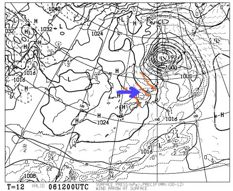
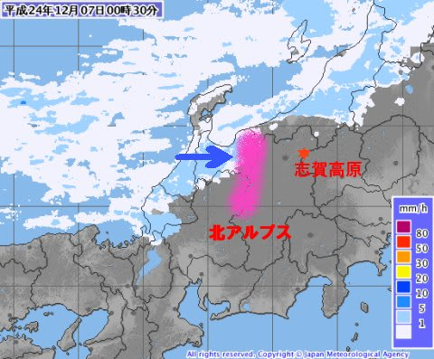
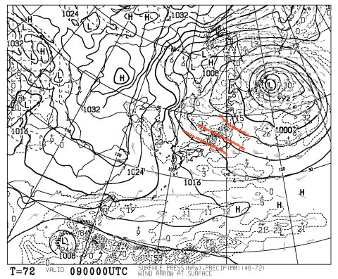
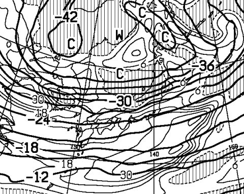

# この土日の志賀高原の天気は…？

📅 投稿日時: 2012-12-07 01:46:30

えー．

この週末．

かなりのスキー場がオープンするみたいですね…

志賀高原は，焼額が第2高速リフトの営業を決めましたし．

熊の湯もクワッドが動くようです．

…高天ヶ原と一の瀬は，まだ公式にクワッドリフト運転をアナウンスしてませんが…

まぁ，動くでしょう(楽観）．

しかし．

この木，金と．

気圧配置が悪いのだ．

こういう感じで…

赤くマークしたように，右下がりに等圧線が傾いている場合は．

青矢印のように西風になるので…

こんな感じで…

雪雲は，赤く記した北アルプスにブロックされて．

長野県に届かないのだ…

日本海側では降るんですけどね～，

ということで．

かなりの冷え込みにもかかわらず．

新潟と違ってそれほど雪の積み増しが期待できない志賀高原ですが．

大丈夫です．

土曜から降ります．

…って，土日は晴れたほうがいいんだけど(涙)．

土曜は，最初は南風に乗って，ちょっと湿り気味の雪かもしれませんが．

朝の早いうちはそこそこ降ります…

午後に向かっては気温がぐっと冷えて，雪が降り続けます．

うーん．

でも．今のところ．

激しい降りというより，降ったりやんだり程度かな～．

とりあえず，土曜はあまり太陽が拝めずに，降ったりやんだり．

朝はそれほど気温が冷えないけど，午後に向かって寒くなりそう．

日曜は…

また，こんな感じで等圧線が右下がりになっているので．

うーん．

雪はそんなに降らないかも…

まだなんともいえないけど．

もしかすると志賀では青空がちらちらと見えるかも．

ということで．

日曜の朝は土曜に降った雪にピステンが入った，きれいな圧雪が滑れるかな．

でも，日本上空には…

－30度の強い寒気が入っているので．

もしかすると，西風でもそこそこ降るかもしれませんね…

今のところ．

日曜の午後は．

しっかり降りそうです．

夕方くらいから強くなって，かなり積もりそうなんだけど…．

…土日の終わりに降っても，タイミング悪いよ(涙)．
