# コドモとコモド！子連れダイブクルーズ9　ようやく1stダイブ…そしてCanonS90デビュー

📅 投稿日時: 2011-07-12 01:01:55

娘に見送られて，ボートに乗り込み，クルーズ一本目のダイビングへ，

ようやく，コモドの海へエントリーっ！

…うむ．

水温は31度とあったかいけど．

透明度はあんまり良くないな～

15m強，ってところかな．

で．

今回．

昨年まで7年以上酷使してきたOlympusのC-4100を引退させて．

ニューカメラ，CanonのS90のデビュー！

とりあえず，手にしたS90起動し…

まずは，AD28のワイコンを装着してのワイド撮影．

初めは，

ISO200，

露出補正-1.7段，

絞り優先AEのF2.0

あたりの設定で行ってみますか…

果たして．

S90は，名機C-4100に負けない絵を出してくれるのか？？

どきどきの水中初撮影は…

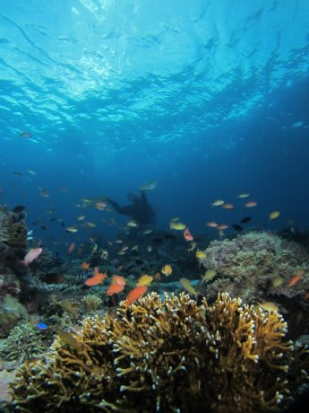

うむ．フラッシュ調光もバッチリ．

バックの海の色も，撮影者の意図どおり．

露出補正をマイナスにかけておけば，太陽が入った場合

でも，大体思い通りの露出で，狙った海の色に仕上がる！

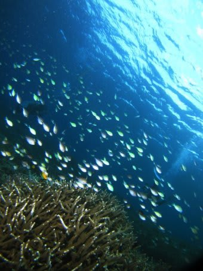

グラデーションの出方も，名機C-4100に負けてない．

さすが，大型CCD撮像素子＆F2.0の威力…

妻のIXYでは，自然光＆フラッシュのミックス調光が上手くいかず．

太陽を入れた逆光でフラッシュをONにすると，

背景光の露出は飛んじゃいますが，

S90では逆光＆フラッシュの条件でも，ちゃんと背景光の

露出を適切に保ったままでいてくれます．

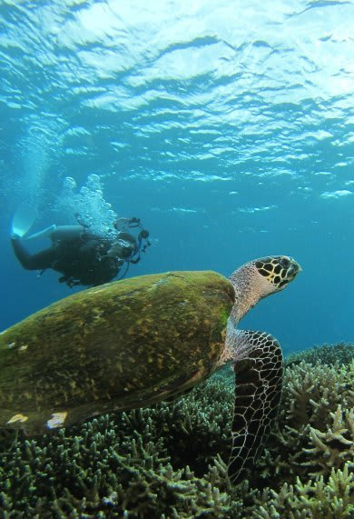

やっぱりこうじゃなきゃ…

また，最短シャッタースピードでも露出オーバーになるときは，

IXYでは勝手に絞りが絞られてしまい，フラッシュが全然

届かない写真を大量生産しちゃいますが．

S90では最短シャッタースピードで露出オーバーになる

場合にはちゃんと警告が出るので，

警告が出れば絞りをちょいと絞ってやればOK．

絞りを変える際も，ボタンをポコポコと押す必要は無く，

ハウジングの前についているダイヤルを回せば

絞りが変えられるので楽チン．

操作性もGoodですな～

…露出補正が2ボタン操作なのは惜しいけど．

絞り優先AEがあるので，撮影するたびに絞り値が

変わってしまうことが無く，撮影した写真をモニタで見てから

絞り値，ISO，フラッシュ強度の修正をしてもう一枚，という

撮影がちゃんと出来ます．

こんな当たり前のことがうれしい…

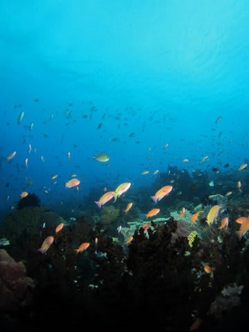

実際，水中で撮影してみると，ISO200だとF2.0で

露出オーバーぎみの傾向があったのでISO80に

調整．

これで大体思い通りの絵が出そう．

…写真の歩留まりが，IXYの時と全然違う．

ようやっと，名機C-4100の後継機として使えそうな

カメラにめぐり合えた…

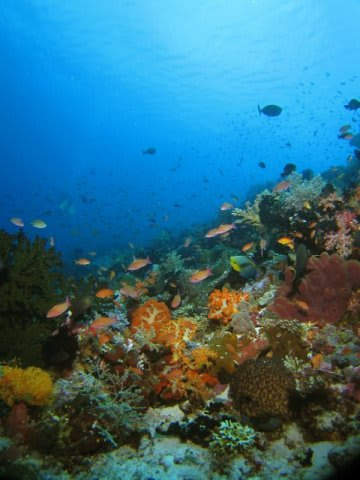

これだ！

ストレスフリーな写真撮影！

やっぱこうじゃなきゃ！

気に入った！S90！

そして，本来はS90に対応していないドームレンズ，

INONのUFL-165ADも出動．

かなりケラレるけど…

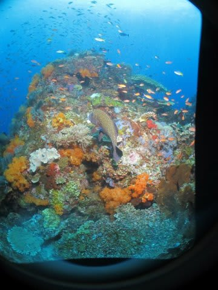

周囲をトリミングすれば，それなりの写真が楽しめます．

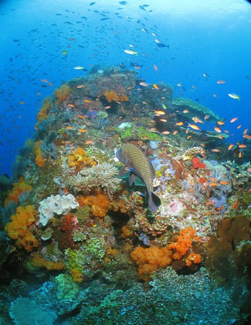

性能として文句ない上に，ドームレンズがつかえるのはいいなぁ～

すばらしいっ！

ただ，欠点は…

ストロボのチャージが遅いよ．

一枚撮って，次の撮影までのリサイクルタイムが長め…

＃あとから気づいたけど，S90はフラッシュ発光強度を

＃マニュアル設定できるんだから，外光オートフラッシュの

＃S180を使っている私の場合，カメラ側の発光強度を

＃マニュアルで最小にしておけば良かったんじゃないか…

あと，一部，バックの青色が変に彩度が上がってる．

標準で，かなり彩度をあげる方向に調整されているようで．

「ナチュラルカラー」の設定にしておけばよかったのかなぁ．

あるいは，RAW撮影しときゃよかったなぁ．

…といった感じで．水中では，海のきれいさより

S90の特性をつかむのに必死で．

エグジットしてから

「あれ？海の印象があんまり残ってないなぁ」

コモドにしてはちょいと魚影が薄かったか．

透明度もそれほど良かったわけでもないから，

印象に残ってないんだなぁ．

でも，無造作に撮った写真を後で見返すと

こんな感じだったんだから，

いい海だったことに間違いないんだけど…

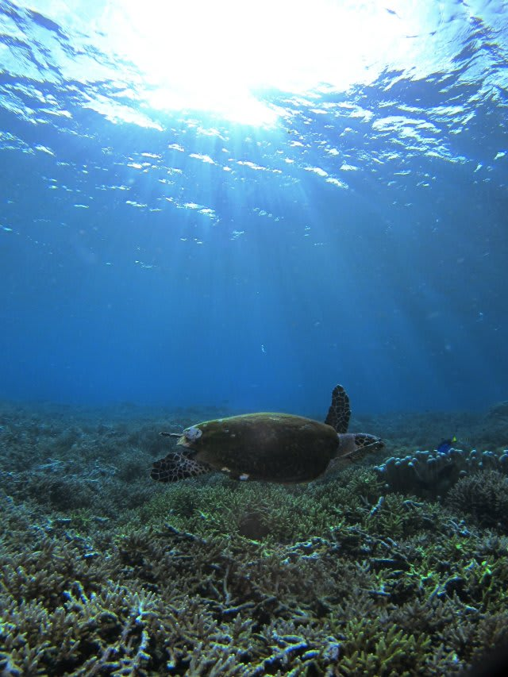

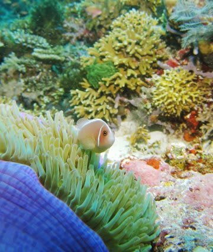

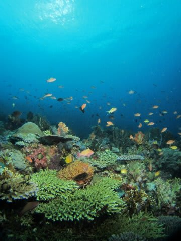

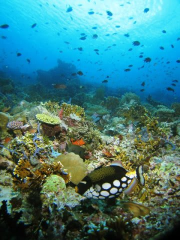

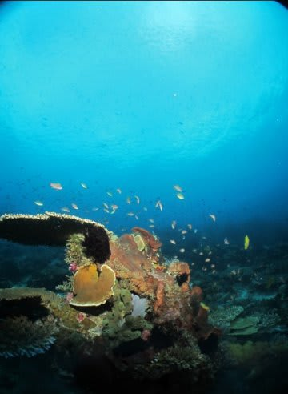

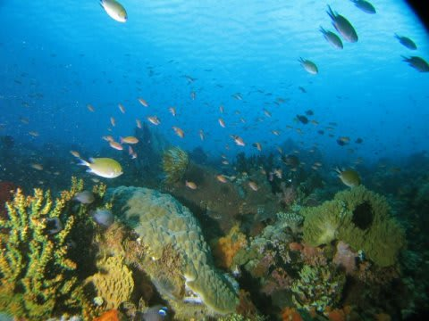

とりあえず，無事コモドの1本目，終了！
