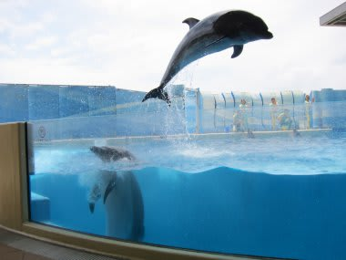

# 水族館へ行ってみたのだが…　これが癒しなのかなぁ？？

📅 投稿日時: 2012-06-12 00:36:33

🏷️ カテゴリ: [日記](cc4b5682fb7b8b144980957a978653fb0.md)

えー．

スキーに行かない週末だったので．

ちょいと娘を連れて，江ノ島水族館へ行ってみました．

あー．

あれですね．

結構コンパクトな水族館ですが．

結構楽しめますね．

大水槽のメインは相模湾の魚だそうで．

伊豆でもぐってるんじゃないか？

っていう魚がいっぱい．

あー．でも．

こんな風にもぐってみたい魚影の濃さではある．

イルカショーは残念ながら鴨シーや油壺に劣る感じですが．

で．

この水族館の特徴は．

クラゲの水槽が並んだ，クラゲだけのひと部屋があるところですか．

1時間に一回，照明を落とした部屋に，音楽にあわせ

いろいろ色を変える水槽の照明にクラゲが浮かび上がって．

なかなか幻想的ではある．

…んだが．しかし．

最近は，クラゲがはやりなのか？

クラゲの部屋は親密な「あべっく」がいっぱい…

なぜ，南の海の水槽の前ではなくクラゲの水槽？？

私はクラゲ，そんなに好きじゃないんだけどな～

二人でいちゃいちゃしながらそんなものを見て

楽しいのかい…？？ 

PS.水族館に来ても，こんなものを必死に撮ってしまったりする…

[好き](ea449064ef369c8a3e269cdf0ba88a5ca.md)なんですよ…

## 💬 コメント一覧

### 💬 コメント by (ひろりん)
**タイトル**: Unknown
**投稿日**: 2012-06-12 13:32:57

水族館に行くと「旨そう」とか、「浜値で幾らなんだろう」しか・・・（汗）

A旗をお持ちになれば潜る場所（大瀬とか）までお連れしますよ（笑）

そのまま居なくなるかもですがｗｗｗ

### 💬 コメント by (Skier_S)
**タイトル**: Unknown
**投稿日**: 2012-06-12 23:34:52

私は水族館に行ったら，ハゼの前で

しばらく動かなくなります(笑）．

そーいや，昔なんかの番組で水族館の大水槽の中の魚が

「魚屋さんが見積もったらいくらになるか」

をやっていた気が…

A旗を持っていけば…

ってことは，船をお持ちなんですか？？？

