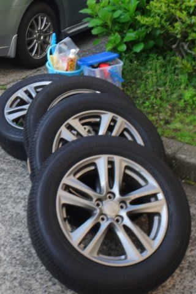
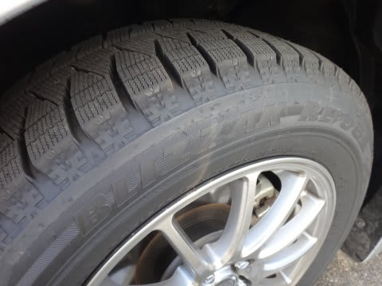
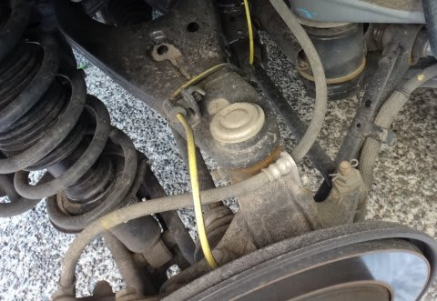
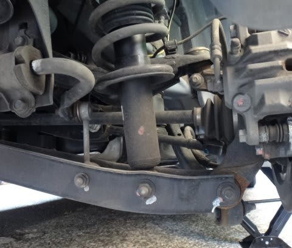
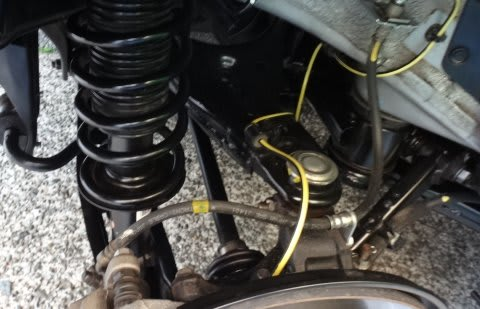

# レガシィのタイヤを夏タイヤに換えてみた

📅 投稿日時: 2014-06-11 01:09:07

🏷️ カテゴリ: [車](cba0e8330b3f2ded7c1addfacc75d4547.md)

かなり古いネタになっちゃうんですけど．

えー．

GW明けぐらいに．

さすがに，もう雪は降らんべー，

…ってことで．

スタッドレスを夏タイヤに換えてみました．

1シーズン，1万7000kmお世話になった

BLIZZAK REVO GZ君．

摩耗はまだ5割くらいで，まだ来シーズンも

イケそうですな．

で，スタッドレスを外すと…

うが！

やっぱり，サスアームに錆が浮いてる…（涙）

…冬の間半年間，塩まみれの道を走りまくっているし．

サスアームの回りって，洗車しても水が回らないからな～．

ハブキャリアのアッパーアームの取り付け部付近と…

ロワアームの取り付け部付近．

かなりさびてる…（涙）

とりあえず，この錆をとるのだ！

そして，錆止めペイントで隠すのだ！

…

ってことで．

格闘すること数10分．

きれいになりました～

って感じで．

タイヤ交換なんだか，下回りメンテなんだかわからない

壮大な作業を4本のタイヤに繰り返し，

トータル4時間．

無事，夏タイヤに変更完了です…

うーむ．

しかし．

気のせいでなければ．

レガシィの防錆．

オデッセイより弱い気がするのは，気のせい？
