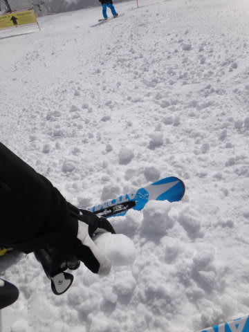

# 2月3日の志賀高原は…予想よりは良かった…あくまで，予想よりは．

📅 投稿日時: 2013-02-03 22:54:45

というわけで．

昨日は，雨＆ガス＆重い雪＆ゴンドラ故障＆混雑＆アイスバーンと，

考えうる限りの最悪な条件の，オールスターそろい踏みか？？

…って感じの．史上最低の一日だったわけで．

…おそらく今日は，昨日の雨で解けた雪がアイスバーンになってるだろうなあ…

と，思ったところ．

いや，予想よりゲレンデコンディションは良かったです．

あー．

あくまで，予想よりは，ですが．

で．

今日は．

昨日までとうって変わって．

朝はマイナス10度程度と，志賀高原の平均的な朝．

寒いよっ！

んで，前日からの積雪はこんな感じで…

5cm程度ですかね～．

そんなに積もってません…

が．

朝は，結構きれいなシマシマっ！

上に載っている雪はやわらかいので，下地が出てこなければ快適っ！

…でも．

ところどころこんな殺人コロコロバーンがあったり…

急斜面はこんな感じで…

ピステン跡の形に凍った下地が出てきてたけど…

意外と，わずか5cmとはいえ，この積雪が効いて．

緩斜面では，昨日の涙の置き土産，どしゃ降り凍結アイスバーンは

それほど気になることなく滑れましたね～（感激…）

で．

なんと．

午前10時ごろには，スカッと晴れてきましたっ！（さらに感激…）

ををを！

（この写真だけ見ると，コンディションよさそうに見える）

時間とともに，斜度のある斜面では，結構硬い下地が出てきましたが．

気温がすごく低いからか，つるつる氷状やらガリガリ振動状態といった，悲しいアイスバーンではなく，

表面がざらざらとした，エッジが効く感じで．

「ちょっと硬いな～」

って程度の表面状態で．

昨日のナイターで滑ったような，あの金属音を響かせるアイスバーンに比べれば，

1億8000万倍くらいましな状況で，

一安心．

あー．

でも．

殺人コロコロはそこら中に残ってましたけどね．

この日は，朝10時ごろ，一瞬ゴンドラ5分待ちになりましたが…

1-2分以上のゴンドラ待ちがあったのは，10時前後の一瞬だけ．

いつもどおり，午後は人がいないがらがらゲレンデになりました．

＃ホントにこのスキー場，経営大丈夫か…？

いやー．

でも．

ゲレンデに硬いところや殺人コロコロがところどころ（かなり？）あり，

2月のトップシーズンのコンディションにしてはイマイチかもしれないけど，

昨日の最悪の状況から考えれば．

全面カチカチのアイスバーンにもならなかったし．

スカッと晴れて，

昨日の気分をリセットでき．

比較的気持ちよく滑ることができた，今日一日だったのでした…

## 💬 コメント一覧

### 💬 コメント by (ゆうこ)
**タイトル**: お疲れ様でした。
**投稿日**: 2013-02-04 00:01:09

先週も今週も、お会いできなくて残念でした。

昨日は本当にお天気に恵まれませんでしたね。辛かったです。

私も毎週行くたびに、こんなに空いていて経営が心配です。空いてるのは嬉しいですが、スキー場が潰れたら困ります。

週末でこんなに空いているんじゃ平日は誰もいないんですかね？

2/8に有給とって4連休にしたので、平日の志賀高原の人出を楽しみにしてます。

やっぱり貸切状態ですかね。

### 💬 コメント by (Skier_S)
**タイトル**: ゆうこさま
**投稿日**: 2013-02-04 01:42:28

いやー．

昨日はひどかったですね～．

今日はまだましでしたが…

実は，平日の志賀高原，日曜の午後より

混んでいたりします．

平日休みの職業の人が来るのかな～？？

焼額ゴンドラ，平日は節電のためか（？）

減速運転をしています…

平日のほうが本数を滑れたりするので，

ちょっと悲しいかも．

### 💬 コメント by (マルハバ)
**タイトル**: ＞経営大丈夫か…？
**投稿日**: 2013-02-04 08:18:18

昨年なにやら

外国資本が狙っている

なんてウワサを耳にしましたが・・・（汗）

プリンスも割引クーポンサイトに登場する

ような時代なんですね今は・・・

### 💬 コメント by (aqura)
**タイトル**: Unknown
**投稿日**: 2013-02-04 12:29:03

いゃー、午後は最高のコンディションでした。前日に比べれば、天国です(^o^)　。　帰りの渋滞も無いに等しかったし…。　今週末は、どうでしょうねぇ？

### 💬 コメント by (Skier_S)
**タイトル**: Unknown
**投稿日**: 2013-02-05 00:27:37

>マルハバさま

うーむ．

焼額は，志賀の中でもまだお客さんがいるほうだと

思うんですけどね～．

プリンス，割引クーポンサイトに載ってますか…．

志賀の中でも，奥志賀は経営母体が２転３転してますし，

サンバレーとかは，前山や笠岳と同じ運命をたどっても

不思議じゃないかも…

>aquraさま

日曜の午後は，前日に比べれば天国でしたよね．

今週末は3連休．

天気はそんなにひどくならなさそう．

7，8日に雪が積もって，コンディションも改善しそうです．

…でも，3連休だから込むだろうなぁ…

って思ってます．

3連休は初日は都合でスキーにいけず，

2，3日目のみ滑走予定です～．

