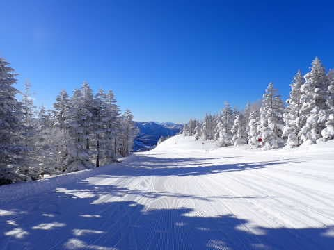
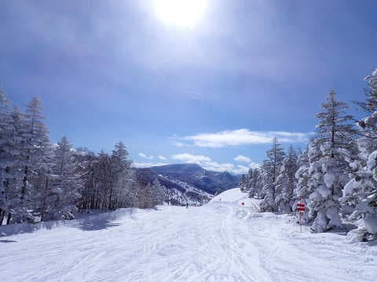
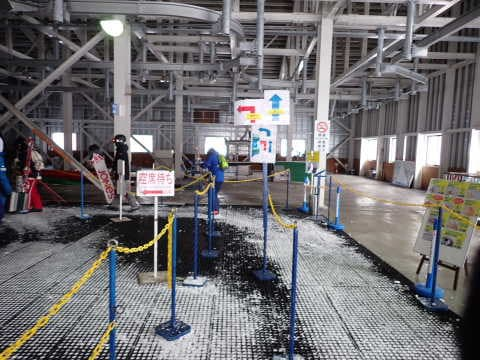
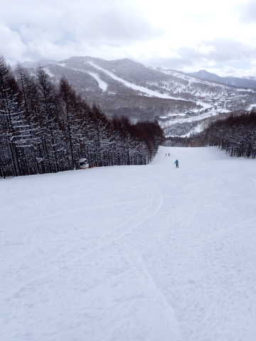
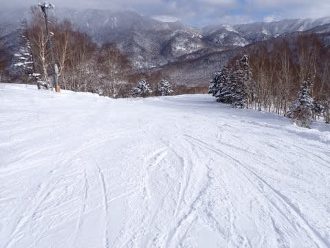
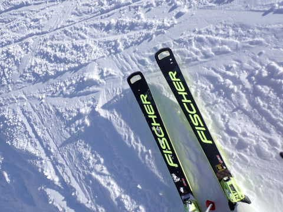
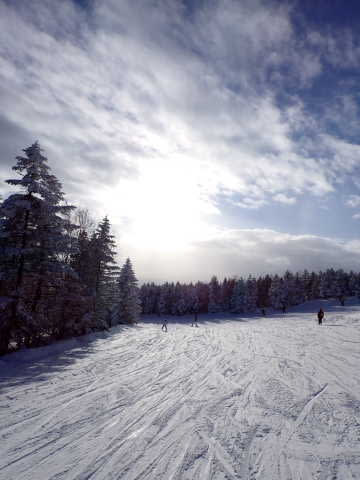

# 2023/1/29(日)の志賀高原スキー場，速報レポート！…意外に終日ほぼ晴れの一日．冷え冷え雪質も良くガラガラのシアワセデー！！

📅 投稿日時: 2023-01-30 02:37:12

えー．

これから1週間は，2月2日にちょっと

降る以外，志賀高原には雪が降らなさ

そうな予感がする今日この頃．

皆様いかがお過ごしでしょうか（時候の挨拶）

というわけで．←何が「というわけ」なんだ？

いつも通りの安定進行で．

今日もラストリフトまで滑り続け．

その後300km運転して帰宅し．

いろいろやらねばならぬことを

やっつけていると，もうこんな時間…(涙)

ってなことで．

長いレポートを書く体力も根性も

残ってないので．

日曜の帰宅日恒例，今日の志賀高原の

速報レポートです！！

まず．

今日の朝イチは…

予想を裏切る見事な晴天！！

深夜に10～15cmほど積もったけど．

圧雪後には全く降らなかったようで．

ふかふかトップシーズン雪が

芸術的にシマシマに圧雪された，

極上ゲレンデでスタート！！

そして．

午前中は，予想を全く裏切る雲一つない

晴天が続き…

それなのに，気温は冷え冷えで雪質は

終日極上のまま！！

さらに，日曜なのにゲレンデもガラガラ！！

ゴンドラも，最大でもゲートの外にまで

人が並ぶこともなく…

11時半を過ぎると，もうほぼ飛び乗り状態

ですよ！！

こんなガラガラで大丈夫なのか…？？

昼ごろにはちょっと曇り空になり．

　昼間は基本的に曇りだけど，

　雪が降ったり晴れたり

という，予想の曇りの要素がわずかに

あったので．

完全に外れたわけではない！！

と言い張りたいところだけど…

午後にはまた日が射してきましたね…

…はい．すみません．

予想外しました

1時間ほど曇り空があったものの．

まさかの，ほぼ終日晴れの一日でした！！

ゲレンデは，雪が柔らかかったので，

第1ゴンドラ側のGSコースは昼ごろには

凸凹が結構出てきて荒れ荒れになったけど．

人が少なかったので，第2ゴンドラ側の

パノラマコースや第2高速側の唐松コースは

最後までそれほど雪は荒れなくて．

…結局日曜は，冷え冷え最高雪の

ガラガラの晴れという．

かなり恵まれたシアワセな一日に

なったのでした…！

先週，今週と．

焼額は完全にトップシーズンのベスト

コンデションなのに，ガラガラという

恵まれた週末が続いてますね～

次の週末までにはそんなに雪は積もら

なさそうだけど．

でも，気温は冷えたままだし．

次の週末も，ベストな状態が続きそう

かな…

ってなことで．

また明日，詳細レポートします！

## 💬 コメント一覧

### 💬 コメント by (レインボー75)
**タイトル**: Unknown
**投稿日**: 2023-01-30 15:49:22

月曜日の志賀高原情報

朝の蓮池-8℃。今日も冷え込む日。晴れ渡っていていい感じ。

白樺、唐松はまさに魔法の絨毯。最高です。

圧巻はオリンピック！私でも気持ちよくエッジが食い込んでくれるかみかみ(巧くなったと)勘違いバーン。上から目線でオリンピックを見下ろせる感じ。こんなことって年に何回もない。幸せすぎます。かのH親分は「今日はヤケビから出たくない」

それでも未練を残しつつ奥志賀へ。ダウンヒルは強烈な横風のうえゴンドラ7分待ち。

だけど頼みの三高はいつもながらと～～っても快感！短いので老人向きです。でもエキスパは、悪くないんだけどあのオリンピックのあとだけに、すべてが物足りない。

昼は豪華にグラフェニで海鮮ちらし2100→1750円。今日はマグロがショボくて残念。でも日によって異なるのもまた楽しい。

午後は雪が降ってきて視界も悪くなったので、よい子は怪我をしないうちに早めの(２時前の)撤収。

エス様ならリフトが動いているのに！となりますが、私らエブリディスキーヤーにそんな未練は皆無です。毎日滑れるんですから！

### 💬 コメント by (炎の北海道民)
**タイトル**: Unknown
**投稿日**: 2023-01-30 18:34:51

北海道のキロロもいい天気でしたよ。

やはり晴れると気持ちいいですね。

ただ、気温がかなり低く、板が滑らなかった。

多分、標高800m付近で終日-15℃ぐらいでしょうか。顔が霜焼けになりました。

しかし終日滑って300kmを運転して帰るとは、絶倫ですか笑？

恐らく300kmの運転もストレス解消なんでしょうね。

### 💬 コメント by (アツシ)
**タイトル**: Unknown
**投稿日**: 2023-01-30 23:02:15

志賀高原は今週も空いてたんですね。実は私、先週末は栂池、今週末は斑尾と浮気しておりましたが、どちらも混んでるんです。日曜午後でも。これはどういうことなのでしょう？もしやリフト券が高過ぎて敬遠されているのか？？

話は変わりますが、リフト券といえば「ウェルカム信州　アクティビティ割」はすごいですよ。滞在割だと2日券が半額になるので、1日券の価格を下回るという逆転現象が起こってます。私は今シーズンはこれをフル活用するつもりです‼️(シーズン券をお持ちの方には関係のないネタですみません)

### 💬 コメント by (しんちゃん)
**タイトル**: 復帰～
**投稿日**: 2023-01-31 01:07:06

膝のケガで戦線離脱していましたが、昨日復帰を果たせました。

久々に皆さんとお会いできてうれしかったです。その節は大変ご心配をおかけしすみませんでした。今後、もうケガしないように「安全第一」で行こうと思います。

土曜のナイターから参戦しましたが、少し柔らかめの膝にやさしいシマシマバーンを堪能致しました。天気雪質食事、全部最高でした。

### 💬 コメント by (スシネコ)
**タイトル**: Unknown
**投稿日**: 2023-01-31 08:25:53

年末から毎週参戦していたのに、行けなかった週に限ってフルメンバーが集合したなんて・・・

志賀高原に行けない時に傍聴席から見学するのがこんなに辛く寂しいものだとは・・・（涙）

と、いうことで今週からまたお邪魔します。今年買ったセミファット、試してみたいので「雪の大盛」を降らせてください　(^∧^)ﾀﾉﾝﾏｽｰ

### 💬 コメント by (レインボー75)
**タイトル**: Unknown
**投稿日**: 2023-01-31 11:47:25

お借りします。

すしねこ様、残念なお知らせです。

雪の大盛りは本日でうりきれとなりました。

### 💬 コメント by (大阪のK)
**タイトル**: Unknown
**投稿日**: 2023-01-31 13:13:14

土日と、同僚の娘二人(小学生)を連れて志賀高原へ参りました。

金曜夜に大阪を出て、ホワイトホテルにアーリーチェックイン。

土曜朝からリフト終了まで、日曜朝からリフト終了まで滑らされました😱

幼稚園年中からスキーに連れ出して、この春中学生になります。

志賀高原焼額山の雪が良いと、他のスキー場に連れて行くと文句を言われるようになりました。

こんなオッサンに付き合ってくれるのも、今年が最後かな😅

### 💬 コメント by (レインボー75)
**タイトル**: Unknown
**投稿日**: 2023-01-31 13:29:08

火曜日の志賀高原情報

朝の上林-6℃、蓮池-11℃。軽い雪がずっとぱらついている。

ゲレンデは、圧雪バーンは7cm位のふっかふかのさっらさらな雪で覆われている。

GSサイドは底付きもあって期待外れ。オリンピックは膝パフ、スーパーは腰パフ位。

残念なのは三高がしばらく運休(週末は動くらしいけど)とのこと。

二高から唐松への狭い連絡路で、端まで来たボーダーを避けきれずに下へ落ちた人を助ける時に、また古傷の膝がギクッ！

以降は膝痛の隊員と、白樺、唐松をグルグルやって昼前に終了。

昼は道の駅のざるそばでした。

### 💬 コメント by (かず)
**タイトル**: Unknown
**投稿日**: 2023-01-31 16:37:54

会うときは何回も会いますね笑  この前言ってた色あせのなんでしたっけ？スプレー？

### 💬 コメント by (Skier_S)
**タイトル**: コメント遅れました
**投稿日**: 2023-02-01 03:42:41

＞レインボー75さま

月，火も良かったみたいですね…

これからしばらく，いいコンディションが続きますよ！！

＞炎の北海道民さま

キロロも晴れたんですね…

志賀も早朝は-15℃近くまで行きましたが，終日-15℃とは…

ちなみに，300km運転のうちのほとんどはアイサイト様が運転してくれるので，

助かってます…

＞アツシさま

やっぱり志賀はリフト券が高いからかなぁ…

今シーズンはかなりガラガラです．

私はシーズン券を持ってますが，家族で滑るときは信州割を使おうと思っています～！！

＞しんちゃんさま

ゲレンデ復帰，おめでとうございます！！

この週末は最高でしたね…

今シーズン，無理せず怪我せず楽しんでください！！

＞スシネコさま

「自分がいないゲレンデは楽しそうに見える法則」があるので，

スキー場に行けなかった週末は悔しさが倍増するのです…

でも，この週末はホントに良かった．

今週末は雪は積もりませんが，コンディションはいいので楽しめると思いますよ～！！

＞大阪のKさま

あれ？今週末も来てらしたんですね．

全くお会いしませんでしたね…

土日とも，朝からリフト終了までは基本です．

同僚の娘さんは基本をしっかり実践する素晴らしい教育がなされてますね（笑）．

やっぱり焼額がコンディションいいですよね…

そこも分かっていらっしゃる同僚の娘さんが素晴らしい（笑）．

＞かずさま

やっとお会いできましたね～！

防水＆UVカットスプレーです．スコッチガードブランドの防水スプレーで，

UVカット機能付きがあります…

アマゾンで買えますよ！

