# 緊急事態宣言が出ても天気予想は続く！4月11，12日の週末の志賀高原スキー場の天気は，4月にしてはいい感じの冷え冷え週末！

📅 投稿日時: 2020-04-09 02:19:27

ってなことで．

自分が住む地域でも，緊急事態宣言が

出てしまった現在．

自分にとっては，

もう週末のスキー場の天気を予想することに全く意味がない

のですが．

もう，完全に習慣と化している，

毎週水曜の天気予想．

毎週の習慣をいきなり止めると落ち着かないので，

懲りずに今週の天気予想，行ってみます！

…の前に．

相変わらず，志賀高原情報を送っていただいている

特派員からの，志賀高原の状況をば…

まず．

本日の朝の気温は…マイナス2.5℃！

　朝は-2~3℃

という予想，また予言精度で当てましたね…！！

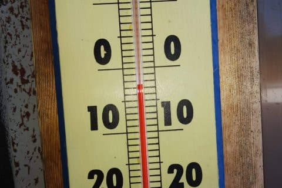

そして，朝から天気はすっきり晴れ！！

…だけど，バーンはかなり固めの

ガリガリ電動マッサージバーンだった

ようで…

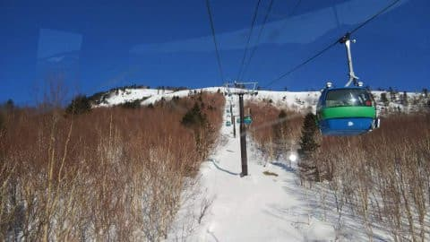

昼間はプラスまで気温が上がり，

日が当たるバーンは，早いところは

午前10時ごろにはしっとりし始めた

ようですが．

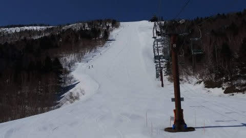

午後になると雲が増え始め，

雪はストップ雪になるほどは

ゆるまなかったようです…

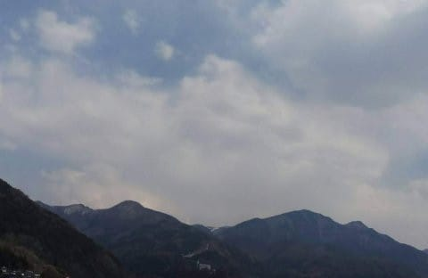

とりあえず．

8日(水）：朝は-2~3℃．天気は晴れ．

　この日も朝はガッチリ固めのガリガリバーン．

　昼間はプラスまで気温が上がるものの，

　午後から雲が多くなっていきそう

という予想．

まるで今日の天気＆コンディションを見てから

書いたような，ドンピシャの予想じゃないですか！！

いやーー．わが予想．今回もすばらしい精度

だよ！！（自画自賛）←確か，風が強くて奥志賀ゴンドラ大丈夫か？…って予想もしてたはずだけど，そこは外したことを隠してないかい？

ってことで．

意外とまだコース上に雪はたっぷりあり，

全面真っ白な志賀高原なわけですが．

果たして，これから週末にかけての

天気や如何に…？？

まず．9日(木)の850hpa気温ですが．

をを！4月というのに，水色の-3℃線が

志賀高原にかかってます！！

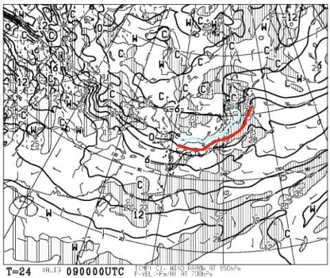

そして．

地上天気図では，水色の降水域がギリギリ

志賀にかかってるので…

これは，9日の朝にかけてうっすら

雪が積もりそう…！！

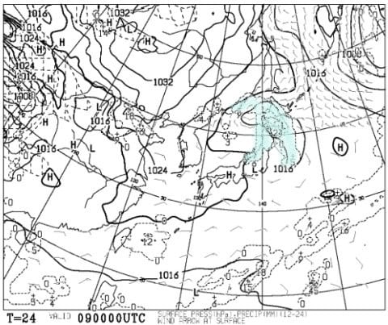

ただ，昼間は曇り~晴れで，

昼間は雪は積もらなさそう．

そして，10日(金)の850hpa図を見ると…

をををを！

今度は水色の-6℃線が志賀高原に近づいてます！

これは，真冬並みの冷え冷え！！

昼間もマイナスをキープし，とても4月と

思えない一日になりそうです…！

そして，この日の地上天気図は，

日本海側に水色の降水域が

かかってるので．

この日も，朝にかけて雪がちょっと

積もりそうで．

昼間も雪がわずかにぱらつきそう！

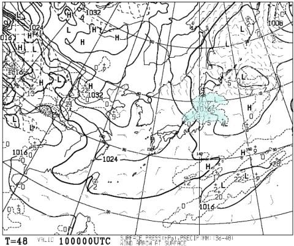

続いて，週末土曜の11日の850hpa図を見ると…

うむ．

この日も水色の-3℃線が志賀にかかってくれて．

最低気温は-5℃を下回りそうな，

まだ冬と言っていい気温！

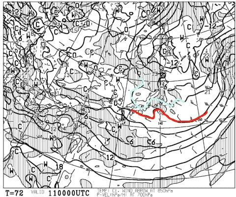

で，地上天気図は，わずかに日本海側に

降水域がかかっているので．

この日は積もるほどの雪にはならないものの，

時折チラチラ雪が舞う天気になりそう…！

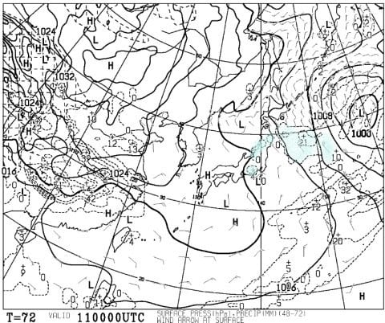

で，ラスト．

週末日曜の12日ですが…

850hpa気温は，この日も赤い0℃線は

志賀高原より南．

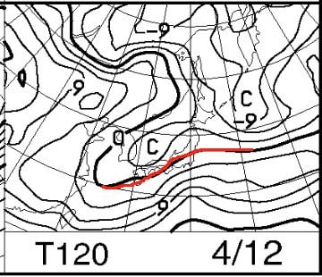

地上天気図では，低気圧が近づいて

いるものの，降水域は志賀にかかってないので．

この日は晴れ⇒曇りの天気かな…

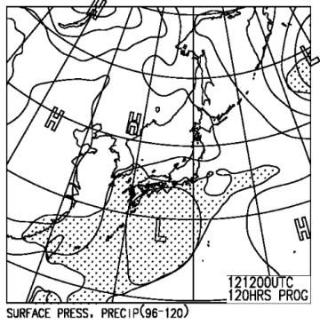

ってな感じで．

これから週末にかけては，

かなりいい感じで冷えそうです！！

これから週末の天気をまとめると…

9日(木)：朝イチは-5℃と冷え冷えで，

　2-3cmほど，うっすらと雪が積もった朝．

　コースはカリカリした硬めの下地ながら，

　わずかに柔らかい雪が乗っているので，

　意外と滑りやすいコンディション．

　昼間も気温はマイナスをキープし，

　曇り空で日差しも強くないので，

　終日下地は硬めで，急斜面は手ごわいか

　もしれないけど，ドロドロストップ雪に

　比べればかなりいい感じの一日．

10日(金)：朝イチは-7~8℃と激寒！

　昼間も-5℃程度までしか上がらない，

　真冬の冷え冷え！寒いよ！

　朝は数cmの積雪がありそうで，

　硬い下地の上にうっすら柔らかい

　圧雪が乗った，この時期としては

　最高級のバーンコンディション．

　積もるほどではないけど，昼間も

　時折雪がぱらつく天気で，

　昼間も雪が緩まない，4月と思えない

　一日．

11日(土)：この日も朝は-5℃レベルの冷え冷え！

　この日も朝はちょっとうっすら雪が

　積もっているかも…

　下地は硬めにながらも，アイスバーンではなく

　ざらざらした感じに締まった感じのバーンで，

　ハイスピード派にはたまらない

　いいバーンになりそうな予感…！

　天気は晴れたり曇ったり．

　昼間も0℃まで上がるかどうかという

　気温なので，雪はそれほど緩まなさそう．

12日(日)：なんと．この日も朝は-3℃を下回る

　冷え冷えの朝．朝イチはかなり固め．

　とはいえ，アイスバーンではないので

　硬いバーンが好きなハイスピード派

　なら楽しめそう．

　昼間も0℃くらいをキープ．

　雪は緩まず，4月中旬と考えれば

　終日冷えた，よいコンディション．

　

…って感じでしょうか．

とりあえず，異常高温だった今シーズン．

2月13，14日という普通ならトップシーズンの

時期の850hpa気温図が，こんなだったのに…

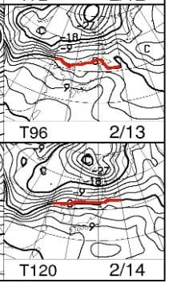

この4月10，11日の850hpa気温図を見ると…

こっちの方が赤い0℃線が2月のときよりも

南にあり，4月の方が，2月よりも

よっぽど冬っぽい天気図ですね(笑)．

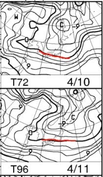

…ってなことで．

1月2月は雪不足で悲惨でしたが．

4月になってその借りを返す勢いで

冷え始めてきてます…！！！

これなら．

緊急事態宣言がGW明けに解除されるまで，

かぐらの雪はもってくれるかも…！？？

…でも．

本音を言えば．

緊急事態宣言が出る前に，

冷えてほしかった…

## 💬 コメント一覧

### 💬 コメント by (かず)
**タイトル**: Unknown
**投稿日**: 2020-04-09 20:50:07

さすがにこの1ヶ月は厳しいですね…

来シーズンの板が買えるか心配なので本日今年の板を購入しておきました笑  今シーズン3枚目…

初のスキーブランド…Sさん印のサロモンです笑  

もちろん試乗なし  カタログではテクノロジー満載！？持った感じかなり重いですけどメーカーのこだわりなのでしょうか？

### 💬 コメント by (Northfox)
**タイトル**: Unknown
**投稿日**: 2020-04-10 00:09:57

去年の奇跡の4月の再来でしょうか？

でも身動きが取れない状況になってから冷えてきても．．．

しかしスキー業界も心配です。

お肉券やお魚券は要らないからスキー券でも配ってくれないかなぁ。好きなスキー板もしくはシーズン券に引換えできます、みたいな。

### 💬 コメント by (Skier_S)
**タイトル**: この4月は奇跡の4月かも…
**投稿日**: 2020-04-10 00:47:47

＞かずさま

ええ！！また板買ったんですか！！！

今度はSALOMONですか…

私もシーズンで板3セット買いたいものです…←数シーズン前にSX2セットと太板の3セット買ったことを忘れている

＞Northfoxさま

いや，これからしばらく，この時期としては冷えそうで．

奇跡の4月の再来になってくれるんじゃないかと期待しています…

スキー券，いいですね！！

喜ぶのはごく一部の限定された人ですけど(笑)．

