# 2022/3/26(土)の志賀高原スキー場は…強風で午前中に次々リフト討ち死に．そして昼前からパラパラ雨も…

📅 投稿日時: 2022-03-27 00:08:45

普通ならスキーに行くどころではない状況

だった本日．

1時間半睡眠で本日根性でスキー場にやってきた

のですが…

今日は悲惨な一日でした(涙)

朝イチに焼額に到着すると…

強風で第1ゴンドラ，第2ゴンドラ運休(涙)

奥志賀ゴンドラも運休(泣)

…まぁ，でも．

ここまでは想定の範囲内．

第2高速と第4ロマンスの2本のリフトが

運転してくれたので，

第2高速リフトでスタートしますが…

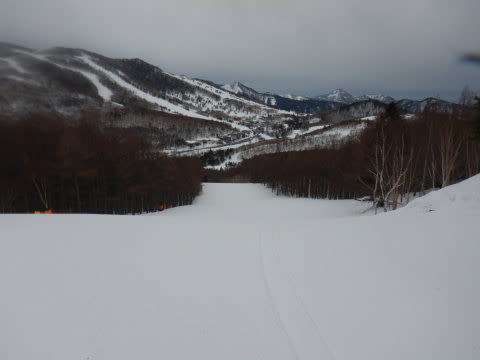

強風でコース上に木々の枝やらなにやらが

散らばってますね(泣)

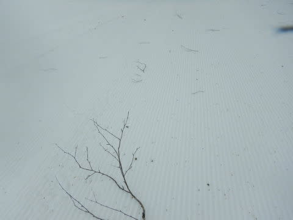

強烈な南風で気温も高く，あさイチから

ちょっと雪も緩めなのが，ちと残念…(涙)

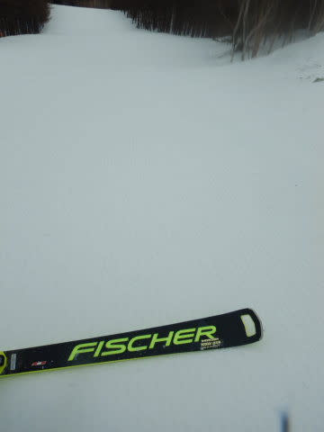

ゴンドラが動いてない焼額を脱出して，

一の瀬方面を見に行くと…

寺小屋，東舘ゴンドラは強風で止まってましたが．

それ以外のリフトはすべて運転してますね！

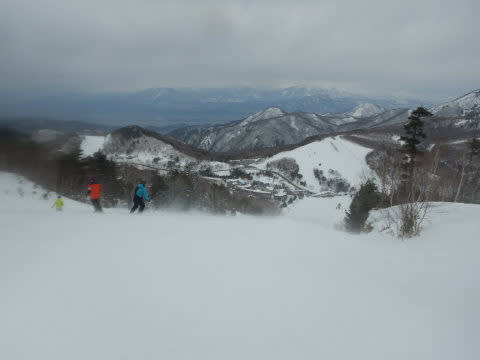

…と，思っていたところ．

かなりの強風で，10時には一の瀬ダイヤと

高天ヶ原クワッドが止まってしまい…(涙)

一の瀬エリアで動いているのは

ファミリーとタンネのみに（泣）

そのせいで，ファミリークワッドのリフト待ちが

すごいことになっちゃったんですが（泣）

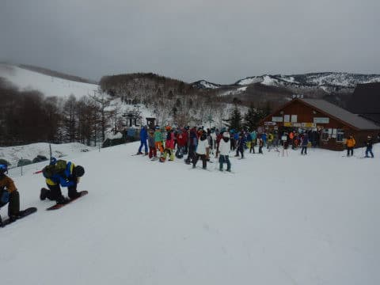

さらに，10時を過ぎると雨も

パラパラと降り始めました(泣）

これは一体何の仕打ちだ…（激涙）

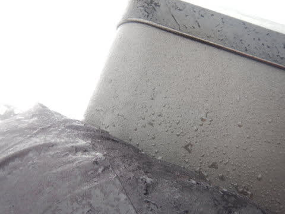

さらに激烈な強風は吹き続け．

ファミリークワッドもヤバいな…

と思っていたら．

11時過ぎに人が集中していた

ファミリークワッドも止まり…

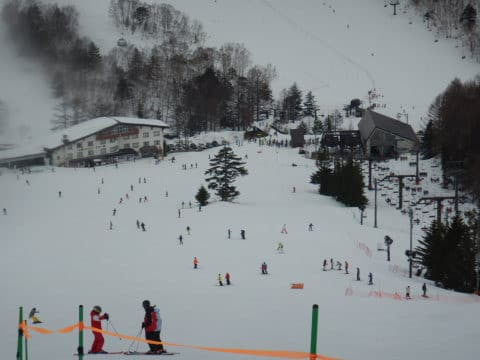

11時40分には，一の瀬ファミリーペアAB線も

とまり，さらに焼額もすべてのリフトが強風で

営業停止(激涙)

なんということだ…！！！

動いているのは，

奥志賀第1ペア，

タンネの森，

西舘下部クワッド，

ジャイアント，

丸池＆蓮池

程度．

…これなら，高速リフトが

動いている西館が一番いいかも？

と，週末は今週がシーズンラストの西館へ！

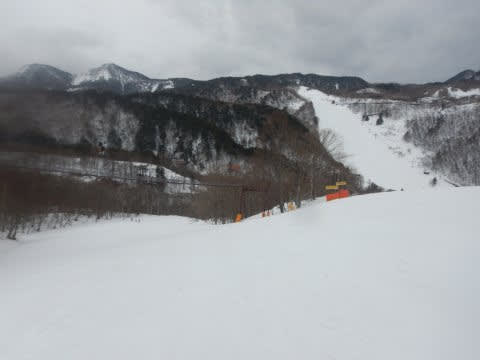

今日は誰かは「リフト営業中はほとんど降らない！」

といい加減な予想をしていたけど…

実際は11時ごろからは，時々雨がパラパラと

降り，ウエアがシットリ濡れちゃう天気(泣）

相次ぐリフト休止と，この悪天候のせいか．

ゲレンデで滑っている人は完全に淘汰され，

午後ジャイアントも，ゲレンデ

もリフトもがらがらだし…

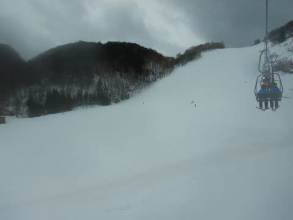

西館もリフトは飛び乗りでした．

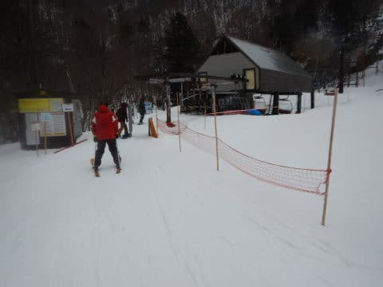

ってなことで．

あさイチは，

「今日はほぼ徹夜で来たし，天気も悪いから

早めに切り上げて休もう…」

と思っていたにもかかわらず．

雨がぱらついていたおかげで，ガラガラ無人の

ゲレンデが意外と楽しく，帰るタイミングを

失ってしまい．

想定外に，ほぼラストリフトの4時半近くまで，

また昼休みも取らず滑り続けてしまった

のでした…

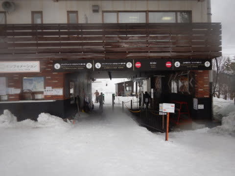

ってな感じで．

今日は予想通り，強風でリフトが止まり，

残念な一日でしたが…

ほとんど寝てないので，「天気が悪い土曜は

滑らないでおこうか」

と思っていたほどの本日．

なぜ，仕事がクリティカルな状況なのに，

天気が悪い予想だったにもかかわらず，

わざわざやってきたかというと．

こんなイベントがあるので，無理して

やってきたのでした～！！

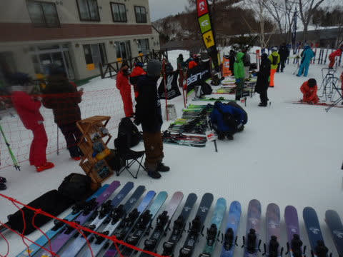

だのに．

一の瀬リフトが止まったので，11時半ごろに強制

終了(涙)

乗りたい板に乗れずに終わってしまったのでした…（涙）

やっぱり，今日は家で仕事していた方が吉

だったのかも…

今，徹夜でスキーに来て，ほぼラスリフまで

悪天候の中滑ったあとに，

必死に仕事している自分がいます…（涙）

## 💬 コメント一覧

### 💬 コメント by (新米パパ)
**タイトル**: Unknown
**投稿日**: 2022-03-27 07:37:30

お疲れ様です。

志賀高原愛、スキー愛に敬服します。

やはり、愛なんですね。

お仕事も頑張って、ご自愛なさってください。

来週末、行けたら行きます！

### 💬 コメント by (ダウンヒル)
**タイトル**: Unknown
**投稿日**: 2022-03-27 16:17:44

お疲れ様です。

昨日は悪天候にもかかわらず、某氏親子様並びにわたくしダウンヒルのホームゲレンデにお越し頂き、わたくしダウンヒルが代表して、厚く御礼申し上げます。

来シーズン、またのお越しをお待ちしております。

風雨強い中、バス発車時刻ギリギリまでジャイアントに居て、戯れて楽しんでました！ご挨拶出来なかったのは残念でしたけど。ＧＷに２日ほど伺いますので、出来たらご挨拶させて頂きます。

Ｓさま、お身体ご自愛くださいませ。

### 💬 コメント by (なるなる)
**タイトル**: Unknown
**投稿日**: 2022-03-27 20:48:17

昨日から、2泊で行きたかったのですが、仕事が忙しくて行けませんでした。

まぁ、一時間半の睡眠で良ければ行けたのですが。私の場合は、もう少し寝れましたが…

お話を聞き、行かなくて正解だったと整理しています。

こういう、恐らくリフトでは戻ってこれない状況の時って、バス覚悟で突入でしょうか?

それとも、一応、車で移動されているのでしょうか?

今後の参考に、お聞きしたいです。私は根性無いので、振り落とされ組ですけど。

### 💬 コメント by (Skier_S)
**タイトル**: 仕事が終わらない…
**投稿日**: 2022-03-28 03:02:46

＞新米パパさま

もう，愛というより中毒といった方が正しいかも…

普通なら絶対行かない．

帰宅後こんな時間まで仕事しなきゃならない状態で志賀高原に行かない…

＞ダウンヒルさま

雨の中ひたすら西舘下部クワッド回してました．

でも，31日で営業終了ってもったいないほど雪が残ってますね…

またGWにお会いしましょう！

＞なるなるさま

あら．仕事忙しいのですね．

まぁ，年度末ですから…

でも，土曜は行かなくて正解です．

今回の西舘は車で移動しました．こういう日はバスは混むので…

### 💬 コメント by (ぽんちゃん)
**タイトル**: Unknown
**投稿日**: 2022-03-28 03:07:02

私は今週は厳しい天気予報に接して、志賀高原行きを断念し東京でのゴルフ⛳️に切り替えました。

半徹夜での車🚗の運転にはお気をつけください！

### 💬 コメント by (northfox)
**タイトル**: Unknown
**投稿日**: 2022-03-28 18:09:11

S様、コメント欄拝借します。

ダウンヒル様>>

私もジャイアントと西館を滑っていました。

で帰りのバスでご一緒していたようですね！

発哺温泉で下車された時に気が付きました。😅

また一緒に滑られるときを楽しみにしています♪

### 💬 コメント by (ダウンヒル)
**タイトル**: Unknown
**投稿日**: 2022-03-28 18:54:12

Ｓさま、お借り致します。

northfoxさま

26日、奥志賀へ向かう最終便に乗っておられたのですか!？真冬時期とは違う「世を忍ぶ仮の姿」でしたし、気付いていただけただけで嬉しゅうございます。慌てて乗り込んだし、周りをジロジロ見る訳にもいかないので、ご挨拶出来なかった件、ご勘弁願います。次に土日出動できるのがＧＷ30、１日。皆さまにもご挨拶機会があるといいなぁ、と思っております。

あぁ、楽しいなぁ...

### 💬 コメント by (Skier_S)
**タイトル**: なんとか仕事のヤマは乗り越えたかな？
**投稿日**: 2022-03-29 05:26:02

＞ぽんちゃんさま

あら…ゴルフですか．

天気悪くなかったですか？

まだまだ雪があるのでスキーシーズンは続きますよ~！！

＞northfoxさま，ダウンヒルさま

お二人同じバスに乗りあってたんですか．

レインウェア着てるといつもと違う格好だから

分からない時もありますよね…

