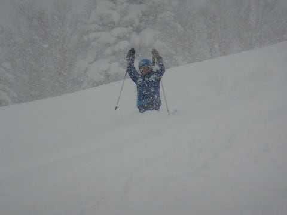

# 2020/12/20(日)の志賀高原焼額山スキー場，詳細レポート！…一日激冷え雪降り！朝イチ圧雪コースでも30cmパウダー＆終日パウダーデー

📅 投稿日時: 2020-12-22 01:19:33

とりあえず，本日月曜の志賀高原．

昨晩からまた20cmほど積もったようですが，

久しぶりに雪が止んだようで．

あさイチはきれいに圧雪されたコースで…

そして，午後は日が射すようになり．

夕方はきれいに晴れていたようです…！

（某20000mな皆様，勝手に写真使わせてもらいました)

とりあえず，これまでの積雪のおかげで．

本日から，奥志賀ゴンドラが動き出し，

さらには明日から，熊の湯クワッドが運転開始です…！

…とはいうものの．

まだ，西館山上部や東館山は，一部積雪不足の

ところがあり，オープンできないようなので．

これからの天気図を見てみると…

うーむ．

志賀高原はこれから数日間，雪は

降らないかな～．

とはいえ，気温はそんなに上がらないので，

今オープンしているコースは，

24日(木)までは柔らか雪が圧雪された

トップシーズンのコンディションで，

曇り～晴れの，スキー日和が続きそうです！

で．

また，25(金)，26(土)と，冷えて雪が降りそう…

降り始めの25日朝だけ，ちょっと重めの雪だけど，

この2日間はかなり冷え込みそうなので，

また軽い雪が積もってくれそう…！

ってな感じで，次の週末までの軽い

予想をしたところで．

本題の，日曜の焼額スキー場の詳細レポートです…！

えー．

まず．

日曜の朝．

麓の湯田中では積雪が15～20cm

ほどでしたが．

志賀の登り坂を登っていくにつれ．

雪が強くなり．

そして，かなり積雪も増えていって

るんですが…？

時折ホワイトアウトする激しい

雪の中，焼額第2ゴンドラ前の駐車場へ

やってくると．

前日夜から止まっている車が

見事にオブジェ化！

うはーー．

一晩ですごい積もったんだなぁ…

これは…一晩での積雪，50cm超えてるかも？

ってなことで．

パフパフパウダーを狙っているのか．

8:30ゴンドラオープン前には，結構人が

並んでます．

山頂に上がると…

あさイチの気温は，見事に予想通り，

-10℃を下回る寒さ！

激冷えです！

ゲレンデは…

うむ．

かなりの雪降りで，ちょいと視界は悪めだけど．

圧雪コースにも，圧雪後に積もった雪が

20～30cmほど乗ってますよ！！

それも，結構軽いよ！！

圧雪コースも，冷え冷え激軽新雪パフパフ

状態！！

…とても圧雪コースを滑ってる写真には

見えないけど…

うほおーーーーーーっ！！

うひゃひゃひゃひゃーーーー！！

雪が軽いので，すごく滑りやすく，

叫び声が出るくらいサイコー！！

ゲレンデはどこに行っても，サラサラ激軽

フレッシュパウダー食べ放題！

…パウダー好きにとっては，

ここはこの世の極楽か？

としかおもえない，快楽のゲレンデ！

圧雪バーンが概ね踏まれた午後になっても，

コース脇は膝～太ももパフで．

子供は腰まで埋まっちゃう深さ…！！

…さらに，昼になっても雪の降りが弱まる

気配は全くなく…

そのうえ，昼間の最高気温も-10℃

近い気温をキープしたので…

この激冷え・雪降りのせいで．

急速冷凍人間製造装置

と化すリフトには待ちが全くなく…

朝のうちはゴンドラも5分近い待ちが

あったものの，午前11時以降は

ゲートの外に人が並ぶことが無い，

ガラガラ状態！

そして，午後になると．

ただでさえ人が減る日曜午後なのに…

さらにこの寒さ＆雪降りで，

ゲレンデ上に生き残る生存者

は次々と減っていき…

だんだんゴーストタウン化が進んで

行きました…！

ごくわずかの選ばれし者

だけしか滑っていないゲレンデは，

降り続く雪が踏まれないまま積もっていき．

ラストに近い時間になっても，コース上に

パウダーが乗っている，エンドレスパウダー

状態！！

そして，ラストリフトの時間になっても，

コース脇にはまだまだ食べられていない

パウダーがいっぱい残っており．

16:00のラストリフトの時間まで，

人がいないガラガラの全面パウダー

ゲレンデを，お腹いっぱい楽しんで

きたのでした…

…ってか．

雪不足だった昨シーズン，こんな終日

パウダーデーって，あったっけ？

もしかすると，リフトスタートから

リフトストップまで，太板を履き続けたのは

2シーズンぶりくらいじゃなかろうか…

いやーーー．

楽しかった．

寒くて雪降りだったけど，志賀高原の

トップシーズンらしい，冷え冷えパウダーを

思いっきり楽しめた一日でした！

## 💬 コメント一覧

### 💬 コメント by (西舘)
**タイトル**: Unknown
**投稿日**: 2020-12-22 06:42:17

12月21日は天候、雪質共に最高でした。

我が家史上初の2ゴンぐるぐるするために焼額に向かいましたが、一の瀬からKonsuke様が！

一の瀬クワッドが止まっちゃたそうです。

Konsukeさんが速いのは滑りだけではなく、リフト乗り降りも超絶速いのは有名な話ですが、バスを降りるのも驚くほど速い。

あっという間にゴンドラ降り場へ。そして階段を上り、ゴンドラに吸い込まれていきました。

走ってないんですよね、だけど私が走るよりも速かった！

### 💬 コメント by (naoちゃんねる)
**タイトル**: Unknown
**投稿日**: 2020-12-22 07:46:34

2日間お疲れさまでした〜

いやー、日曜日はレインボー位のつもりだったんですが、高天ヶ原から帰ってきてから、naoが皆で爆走しまくったのが楽しくてスイッチが入ってしまったのでラストゴンドラでは足りずラスト２高まで滑るハメになってしまいました…

ホント冷え冷え最高雪質でしたね！

来週には志賀高原、繋がって欲しいなぁ…

### 💬 コメント by (Hide)
**タイトル**: やっとです・・・
**投稿日**: 2020-12-22 09:18:07

S 様

いや～うらやましい。

ココ何シーズンかはこんなパフパフ記憶にありません。

27日にやっと初陣の予定です。

今シーズンも地理的に回数激減で寂しい限りです。

### 💬 コメント by (urawa-skier)
**タイトル**: Unknown
**投稿日**: 2020-12-22 09:56:43

土曜日野沢で粉雪を楽しみ、日曜日には焼額山・一ノ瀬で滑りました。野沢から移ってくると志賀の雪の軽さが実感できます。帰路が心配でしたので早く上がろうと思っていましたが、結局２ゴンのラストまで滑ってしまいました。

一ノ瀬ではK様、М様とご挨拶。「笑いが止まりません」と顔に書いてあるのがわかりました。

### 💬 コメント by (レインボー73)
**タイトル**: Unknown
**投稿日**: 2020-12-22 20:45:39

火曜日の志賀高原情報

知人曰く、今シーズン最高。

昨日は野沢に浮気。今日はヤケビの整地で、フィッシャーRC4の実質お披露目。嘘だ。板が斜面に貼り付いたみたいな感覚。切れる。乗れる。進む。何という快感。買って良かった!　幸せってこんなことを言うのかなあ。

昨日の野沢の深雪の疲れもあって、今日は昼過ぎに打ち上げ。でも、一人の隊員はエス化して、リフトが動いているから帰れませんでした。ファミリー正面も貸切悶絶だったとか。

１ゴンが木曜スタート、三高が土曜スタートとかの噂です。

私は妻があなたなんか帰ってこなくてもいいよと、ありがたいお言葉を頂きましたので、27日まで滑ることができそうです。幸せです。

### 💬 コメント by (レインボー73)
**タイトル**: Unknown
**投稿日**: 2020-12-22 20:50:08

訂正です。

最新情報。

１ゴンは木曜ではなく、金曜スタートのようです。プリンス泊の隊員からの、たった今の情報です。

### 💬 コメント by (alpina)
**タイトル**: Unknown
**投稿日**: 2020-12-22 23:20:55

去年、多分3月末午後にガラ空きの1ゴンで偶然ご一緒させていただき声がけさせていただきました者（結構年寄）です。「大変失礼ですがＳ様で?」「そうですが何故おわかりに?」「板、ブーツ、カロリーメイトそして何より神様とお見受けして」・・・・。降車時にステッカーまでいただきました、ありがとうございました。年末年始に初滑りの予定です。で、伺いたいのですが、皆様マスクはどうされているのですか?ご教示頂ければ幸いです。

### 💬 コメント by (Skier_S)
**タイトル**: 今日もコメント回答は夜中…というか，もう朝か（涙）
**投稿日**: 2020-12-23 04:15:03

＞西舘さま

21日は良かったでしょうねぇ…（うらやましい）

KonSukeさんは，滑るのもリフト乗り降りも移動も，

あらゆることが速い＆早いですよ…！

＞naoちゃんねるさま

日曜はしっかりラスト2高まで滑ってましたね．

でも，さらにおかわり4ロマに行ったキッズ達2人がすごすぎる…！

この週末はおそらく奥志賀も一の瀬もつながるはず…っ！！

＞Hideさま

12月にこんなパウダーを滑れるとは思わず．

太板が大活躍でした…

27日は志賀までいらっしゃるんですか？

初滑り楽しんでください！

＞urawa-skierさま

やはり，志賀の雪の軽さは他のスキー場より抜きんでてます（笑）．

みんな笑いが止まらない週末でしたね！

＞レインボー73さま

今シーズン最高ですか…

最高記録の更新が続いてますね！（笑）．

そして，FISCHER RC4 RCデビューさせたのですね…！

そんなに良かったんですか…

せっかく滑るんだから，いい板で滑りたいですよね．

スキーは板，ブーツでシアワセ度が変わってしまうので，

白い粉中毒者は金銭感覚中枢がマヒして，物欲に逆らえなくなるのです…（笑）．

＞alpinaさま

コメントありがとうございます～！

年末年始は志賀高原でしょうか？

私はマスクは，首の周りをぐるっと覆う筒状の，

スキー用のフェイスマスクを使ってます．

布製のスポーツ用マスクを使っている人も，普通の不織布マスクの人もいますよ．

でも，不織布マスクの人は少ないかな…

### 💬 コメント by (ikkun)
**タイトル**: Unknown
**投稿日**: 2020-12-23 21:28:11

あーフォルクルだぁん(笑)  滑りやすいですよね？

