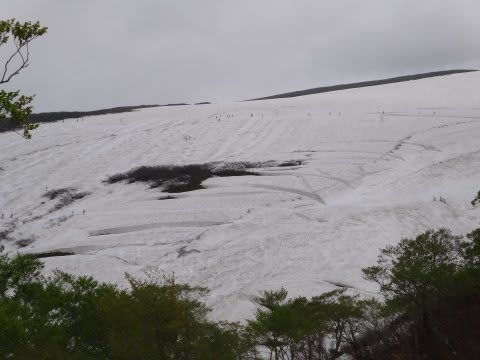

# 6月5日　日曜日　月山スキー速報

📅 投稿日時: 2011-06-06 01:08:00

🏷️ カテゴリ: [2011スキー滑走日記](ca488c98cfb9169941c3e73770dcefb56.md)

で．

予告どおり，日帰り月山に行ってきたわけですが．

往復1000km．

深夜1時半発で，さっき帰ってきました…

行動時間23時間半．

あーー．

南関東在住の人間にとって，日帰りで行くところじゃないですね…

さて．

今日の月山ですが．

天気は時々曇ったものの，概ね晴れ．

気温は暑いほどではなく，長袖Tシャツだとちょっと寒いなぁ，

という感じで，いい感じです．

まだ，リフトはスキーを履いて乗り降りできます．

もう数日は大丈夫そうです．

沢コースから大斜面まで，概ね全面可能です．

でも…

クレバスが多いですね．今年は．

でも，コースのあちこちにある感じじゃなく，

大斜面の途中に横に連なるように一箇所，

これで大斜面が完全に上下に分断されたようになっちゃってます…

ほかにも結構クレバスがありましたが，あとは滑るのに

それほど邪魔じゃないところに．

あー．でも，Tバーコースの途中に数箇所，バックリ割れてる

わけじゃないけど，横に入った溝状（埋まったクレバス？）

の凹みがあります．

しかし．

今日の最大の欠点は．

混みましたね～．

リフトは最大25分待ちくらいでしょうか．

午前中は，15～20分は待った感じです．

午後になると，リフト待ちは5分～0分に減りましたが．

まぁ，結構滑る雪で，予想以上に雪も多く．

結構楽しめました．

恵まれてますね．今年は．

詳細は，明日またレポートします…

## 💬 コメント一覧

### 💬 コメント by (森田勝里)
**タイトル**: お疲れさまでした
**投稿日**: 2011-06-06 20:41:09

23時間半の行程とこの混雑ぶりはヘタレの私にはハードル高い気が。情報ありがとうございます。

### 💬 コメント by (Skier_S)
**タイトル**: 疲れました…
**投稿日**: 2011-06-07 00:09:33

それだけ疲れても，この時期これだけ滑れるんですから…

リフト待ちも，12時前には5分くらいになってましたし．

スキー中毒患者なら，行く価値はありますよ～！！！

一緒に行った人は，「何でみんなもっと月山に来ないの？？」と言うくらい

感動してましたから．

