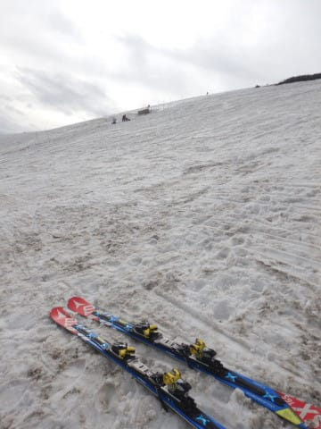
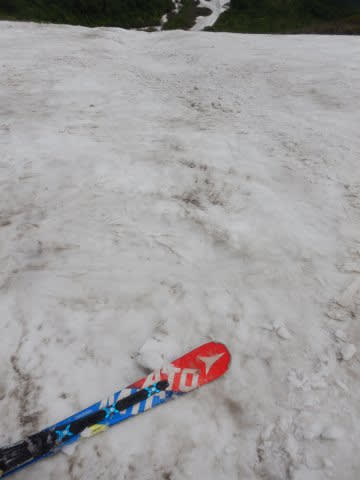
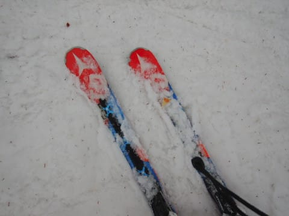
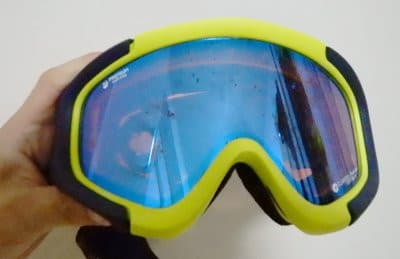

# 2021シーズン，死に絶えていったマテリアルたち

📅 投稿日時: 2021-07-04 02:46:50

🏷️ カテゴリ: [スキー雑談](c1f9d2cb7478308da16419928ea3945e9.md)

ということで．

物欲選手権で，いろいろ新しいマテリアルが

増えたわけですが．

逆に，今シーズン死に絶えていった

マテリアルたちを紹介するという，

悲しい営みをやってみましょう…

2021シーズン息絶えた道具たち

○ ’16 ATOMIC Bluester SX三郎君

厳密には，[2020シーズンにどうしようもなく
ヘロヘロにヘタッて](e6c31e0b2668b576d145d37cb92d0c912.md)死んでいたのですが．

一応，石ころ踏み用ということで，

今シーズンの月山まで生き残って

もらいました…

でも，さすがにもうこれにて引退．

月山を滑ってみて，

笑うほどグリップしない

ダメダメ板となり果てていました…

石ころ踏み板も，四朗君に引き継ぎかな．

お疲れ様でした…三郎君！

○'17 ATOMIC Bluester SX四朗君

こいつは，[このシーズンの3月に剝離](e00384be212f646ebb76a332e7f1d9142.md)し，

滑走日数50日行かずして，実質寿命を

迎えていたわけですが．

…でも，実は剝離したまま，GW過ぎまで

履いてました(笑)．

とりあえず，四朗君は破壊したものの，

このまま引退ではなく，しばらくは

三郎君に代わる石ころ踏み用として

活躍してもらいます…

しかし．

石ころ踏み用として四朗君は残る

とはいえ．

'13SXの頃から考えると6セット，

計9シーズン履き続けていた

ATOMICのSXですが．

ついに最後の1台となってしまいました…

しかし．

私が履いた，'16，'17 SXの4セット中，

[一郎君は実質4か月でエッジ剝離](e56c11ebadfa98e86c1f0cbe36198f076.md)，

[二郎君も3か月ちょい，40日でエッジ剝離](ed5767135dfb18a758390c3e37aae05b5.md)，

[四朗も実質4か月でエッジ剝離](e00384be212f646ebb76a332e7f1d9142.md)君

と，3セットが滑走40日程度で剝離って…

良い板だったんだけど，もう少し

根性があると嬉しかったなぁ…

○'16 SALOMON X-Race

まぁ，こいつも実質は[2020シーズンの
うちに，結構ヘタっていることは分かって
いた](eaf97fd5f798f01a552ed093801699edd.md)のですが．

まだ，雪の柔らかい時や春の雪の時

なんかは，新しくて張りの強い

'18 X-Raceより乗りやすいだろうから，

春や荒れた雪用に置いておこう…

と今シーズンインまで残していたのですが．

この焼額シーズンインの12月．

リフト1本滑っただけで．

「雪が柔らかいのに，全くグリップ

　しない…！！！

　全部スキッディングに

　なっちゃう！！(涙）」

というほどの，想像を超えるひどい

ヘタリ具合だったので，

速攻で完全引退が確定しました…

ということで．

今シーズンは，2セットに死亡宣言が

出てしまい，

私のかなり偏った趣味だったSXと

X-Race．

残るは石ころ踏み用の四朗君と，

’18 X-Raceの2セットのみとなりました…

○'19 ATOMIC WC 130

そして．

昨シーズンまで履いていたATOMICブーツ．

ATOMICのSXとの相性がバツグンだったので，

これまで3代連続でATOMICブーツを愛用して

いましたが．

このブーツも2シーズン120日ほど履いて，

インナーもつぶれまくっていろいろ当たる

ようになった上に，フットベッドが

バキバキに割れてしまい．

さらに，エキップさんで作ってもらった

REXXAMブーツに比べると，ホールドも

甘く，ちょっともう履くのはつらい

感じなので，残念ながら，こいつも

今シーズンで引退確定です…

さよなら，3代履き続けたATOMIC

ブーツ…

○グローブ

このあたりは，毎シーズン一つ以上は

死に絶えて行くのが定番ですが．

ゴンドラに乗る回数が多いと，

どうしても板を持つグローブに

穴が開いてきちゃいます…

今シーズンは感染防止の定員制限で

ゴンドラが混んだので，ゴンドラ乗車

回数が例年より少なく．

いつもは1シーズンもたないグローブが

1シーズンもっただけでも儲けもの…

まぁ，丸々1シーズンもってくれたので，

板より長持ちしてますから(笑)．

○ゴーグル

これも，4000円と激安でGetした

ゴーグルだったんですが．

今シーズンは3月から4月上旬の

7階の週末で6回雨が降るという

雨にたたられたシーズンで．

雨に打たれて，ゴーグルのミラーコートが

剝がれてしまいました…（涙）

最近のゴーグルは大丈夫みたいですが．

古いミラーコートは，雨で簡単に

剝がれちゃいますね…（泣）

まだ1.5シーズンしか使ってませんでしたが，

視界がまだらになり見にくいので，

残念ながら，こいつも引退です…

○スキーパンツ

これも毎シーズン定番ながら…

雪との摩擦で足元の前の方の生地が

薄くなってきて…

そして，指が入るような穴が開いて

きました…

まぁ，大体シーズン1本は

スキーパンツがダメになるのですが．

今シーズンも例外なく，1本ダメに

なりましたね…（涙）

まぁ，[いつぞや](e705da137b37e26824f3f8fcf240f42c1.md)みたいに

完全に穴が開いて破れてはいないので，

まだ履こうと思えば履けますが…

まぁ，[新しいパンツも発作的に購入済み](ed41e9acc5b846e166f2797b4f60f64df.md)なので．

こいつも今シーズンで引退ですね…

ってな感じで．

滑走日数が例年に比べると少なかった

今シーズンも．

順当に板2セット，ブーツ，グローブ，

ゴーグル，スキーパンツがお亡くなりに

なりました…

しかし，スキー道具の消耗が早すぎる…

そして，一番早く死ぬのがスキー板という（涙）

なぜ1シーズンでスキー板2セット死ぬかなぁ？

## 💬 コメント一覧

### 💬 コメント by (ikkun)
**タイトル**: Unknown
**投稿日**: 2021-07-04 10:53:25

やはり乗りすぎ？( *´艸｀)てかお体は大丈夫ですか？そちらも心配してしまうおやじでした(笑)

### 💬 コメント by (Skier_S)
**タイトル**: ＞ikkunさま
**投稿日**: 2021-07-05 03:51:46

やはり滑りすぎでしょうか…

でも，私の周りは平均的に板が1シーズンもたない人がいっぱいいるので

大丈夫かと…

### 💬 コメント by (カンタロス)
**タイトル**: Unknown
**投稿日**: 2021-07-05 18:08:40

Sさま、こんにちは。

死んでいったマテリアル、多いですね…

マテリアルないとスキーできないですから

物欲選手権は必要な儀式(？)ですね！

物欲選手権。「男には負けるとわかっていても戦わないといけない時がある。」で締めくくれますね！

お仕事も官僚並かそれ以上のようですので、お体壊さぬようにお気をつけ下さい。

### 💬 コメント by (なんちゃってレーサー)
**タイトル**: なかなか派手に壊れましたね
**投稿日**: 2021-07-06 00:33:07

海外メーカーの板は，競技モデル以外は品質のばらつきがどうしてもありますからね.....

いくらなんでも板がすぐに消耗してしまう場合は，サイドウォールやエッジを削りすぎていないか，強い板でコブに入っていないかを気にすると良いかもしれません．

### 💬 コメント by (Skier_S)
**タイトル**: この週末もどこにも行かず
**投稿日**: 2021-07-06 02:16:07

＞カンタロスさま

もう，スキー道具は激しく消耗するので，物欲選手権は必須の儀式です…

スキー用具以外，ほとんど高い物は買わないんですが，

なぜかスキー道具だけは金銭感覚が狂います…

＞なんちゃってレーサ―さま

ATOMICとSALOMONは低温接着で製造している関係上，

剝離しやすいという話です…

やっぱりメインマシンですから，コブにも入りますし春の悪雪も

滑りますし，早朝からナイターまで滑るから負荷はハンパないとは

思ってますが．

でも，40日ちょいは短すぎます（泣）

エッジはこまめに研ぎますが，3-4日滑って1回研ぐ程度なので，10回程度しか研いでなくて，

まだエッジは結構残ってます…

