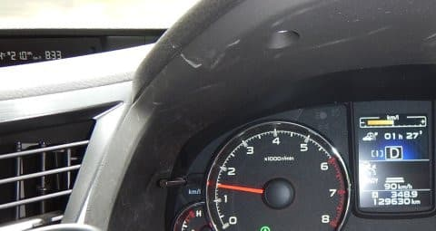
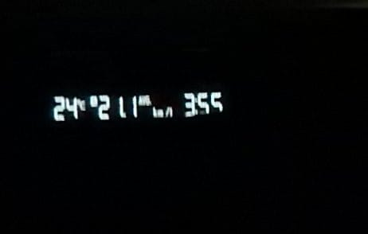
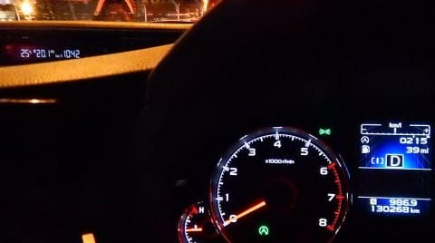
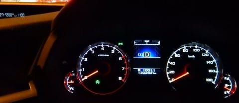
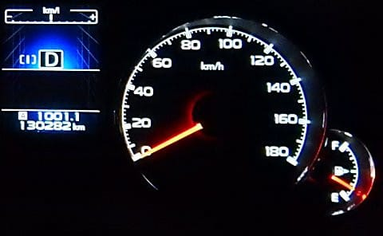

# BRレガシィの実力やいかに？…月山往復1200km，気合のエコランをやってみたら，リッター何km走るかな？

📅 投稿日時: 2017-07-08 06:26:01

🏷️ カテゴリ: [車](cba0e8330b3f2ded7c1addfacc75d4547.md)

ということで．

この週末の月山で[13万kmを突破](e1faf2b7b1c463d5cf6811d873da9ec0f.md)し．

順調に，過走行への道をまっしぐらなわがBRレガシィ君．

とりあえず．

全く無故障で，極めて快適に走ってくれる，

頼れる相棒ですが．

[いろんなドタバタ](e6f69771746576fcaa9469aecacfa5f31.md)で[昨年引っ越した](d20160403.md)，今の家．

ルーフボックスを置いておける場所があるので，

夏は[ルーフボックスを外す](e055b5b744b654941d93c40de1fad1b0b.md)ことにしたわけですが．

今回，ルーフボックスもついてなければ，スタッドレスも履いていない．

標準タイヤのクリーン状態での月山往復になったので．

「ルーフボックスもスタッドレスもなしの，標準状態のBRレガシィ，

　私が気合いのエコランしたら，

　月山往復で平均リッター何km走るんだろう…？」

…と考え．

気合のエコランで走ってみました～！

出発前，我が家の目の前のガソリンスタンドで

ガソリン満タン＆トリップメータリセットしてから，

いざ出発！

とりあえず．

アイサイトのオートクルーズを使うよりも，

自分の微妙なアクセルワークを酷使した方が，

間違いなく燃費が良いので．

ひたすらひたすら微妙なアクセルコントロールを続け，

走った往路6時間で450km．

ちなみに，どんな運転をしたかというと．

車速は80km/h～100km/h程度で，

リニアトロニックの変速比を最高ギア比から

外すと負け

という，極めてシンプルなルール．

…具体的には，

　登り坂で時速80km/hを切りそうにならない限り，

　エンジン回転数1600rpmを絶対超えさせない

ってものです．

如何にエンジンに余計なトルクを発生させず．

CVT油圧を最低に抑え込むか…

ってところに注目した，

超絶アクセルワーク（？）で走ったわけですが．

その結果．

行きの燃費．

月山の麓では，リッター20kmを超えてましたね～！

写真の左上の方に，燃費計表示が見えますが．

リッター21.0kmを表示してます．

＃この写真は，月山よりかなり手前で撮影したので，

＃トリップは350km程度になってますが…

ちなみに，高速の最後の方では，平均21～20km程度を

行ったり来たりという感じで．

最高は平均21.1km/Lまで行きました！！！

いや～

やっぱりBRレガシィ．

高速燃費，かなりいいなぁ…．

ってことで．

そのあとは，土日で月山のくねくね急坂山道を2往復．

山道の上り下りで，一旦リッター18km/Lまで

燃費が悪化しましたが…

再び走る，復路の高速道路．

ここで，気合いのエコラン！

…そして再び，リッター20km越えまで

もっていきました…！

結局．

家から月山往復（月山の登り2往復含む）の

1000km走って，平均燃費20km/L!

(トリップメータが1000km超えてます…）

うーむ．

月山の山道往復が無ければ，平均21km/Lも

行けそうだなぁ…

とりあえず．

月山往復の1000km走りおわって，

ガソリンがまだ約15Lも残っています．

ということで．

気合のエコランで走ると．

フルタンク1300kmくらい走れちゃいそうです…

うむ．

やはりBRレガシィ．

ハイブリッドでもダウンサイジングターボでもなんでもない，

2.5L，4WDの車としては．

かなり高速燃費がいいですねぇ…

ちなみに．

我が車．

入れているエンジンオイルは，スバル純正0W-20．

マニュアル通りの1万km毎交換をしているのですが，

今回はちょうど9000kmほど走ったところの，

交換直前で．

さらにミッションオイル＆CVTオイルも

4.5万km走って交換直前．

…各種オイルの剪断劣化がすすんで，粘度がちょい

落ち気味だったのが，フリクション低下での

燃費向上に効いたのかも…（笑）

そして．タイヤは新車装着時の純正タイヤ．

残り3部山程度で，ちょいと減り気味．

タイヤの摩耗も，燃費が良くなる方向に

効いてます…

＃プリウスカップとかでは，わざと走りこんだ

＃タイヤを使って燃費を良くするくらいで…

＃日経ビジネスの[この記事](http://business.nikkeibp.co.jp/atcl/opinion/15/194452/080500071/?P=3)参照

やっていいのはタイヤの交換だけ、それも特別なものではなく、カタログに載っているタイヤだけです。手を加えるとしたら、走り込むしか無いんですよ。走り込んでタイヤを軽くする。後は空気圧を高くして転がり抵抗を減らす。それくらいです。

ちなみに空気圧は指定圧+0.1kg/m2．

燃費を考えるともう少し上げたいところだけど，

これ以上上げるとフロントのハーシュネスが

悪化するので，この程度に抑えてます．

で．

エアクリーナーは5万km換えてません．

ここもマニュアル通りの交換規定ぎりぎりまで

使い込んでます（笑）．

エアクリーナーの汚れ・多少の詰まりは

ストイキ燃焼制御されている，オットーサイクル

エンジンのパーシャルスロットル域での燃費に

ほぼ影響がないので…

って感じで．

通勤にも使っているにもかかわらず．

この10000kmでの平均燃費はリッター15.5kmを

超えているという，結構燃費がいいBRレガシィ君．

うむ．

燃費がいいから，まだ買い替えなくてもいい．

そう．

買い替えなくても，いいはずだっ！！！←強烈な自己暗示をかけようと努力している

PS.

　ダウンサイジングターボで，カタログ燃費は

　BRレガシィよりずっといい1.6LのLEVORG．

　高速実燃費，気合いのエコランすると，

　これより良くなるのかなぁ…

## 💬 コメント一覧

### 💬 コメント by (しんちゃん)
**タイトル**: エコランできるのがすごい
**投稿日**: 2017-07-08 11:23:25

最高燃費はどれぐらい行くんだろうと考えることが幾度かあり、エコランを試みたこともあるのですが、途中で我慢できなくなってしまいます。

エコランを往復敢行できるその精神力がすごいです。

夏の行動も神ってますね。。。(笑)

### 💬 コメント by (ぴよ＠太田市)
**タイトル**: リニアトロニック
**投稿日**: 2017-07-08 15:06:17

リニアトロニックって車速一定に保とうとすると、アクセルONとOFFで微妙にプーリー比が変わってしまってDレンジだとイライラしませんか？

マニュアルモード6速で行うと今度はまったく加速しないことがありなんだかなぁって感じです

うちのBS9はがんばって16Kmどまり、でかいタイヤはいてるんでこんなもんですかね．．．

アイサイトに加速制限モードがあると自動でももっと伸びる気がします

### 💬 コメント by (olaf2125)
**タイトル**: Unknown
**投稿日**: 2017-07-09 09:06:50

エコランとは言え 2.5Lの4WDでここまで伸びるんですね (‥)

30万km乗れますよ (^^)

### 💬 コメント by (Skier_S)
**タイトル**: エコランは精神力の鍛錬（？）
**投稿日**: 2017-07-09 09:21:09

＞しんちゃんさま

私も，2年前くらいまで我慢できませんでしたが…

一回エコランをやってみて，志賀高原往復で

ガソリン代1000円くらい変わるので，

毎週志賀高原に行く私はガソリン代が月5000円

くらい変わっちゃうので，エコラン派になっちゃいました（笑）

今回は，月山往復1000kmのガソリン代が

5500円くらいなので，普通に走るより2000円くらい

安くなったかな～…

って感じで．

エコランは，スキー貧乏の味方です（笑）

＞ぴよ＠太田市さま

そうなんですよ…

リニアトロニック，高速走行ではちょっとアクセルを

踏み込むと，簡単に最高ギア比から外れるので．

そこから外れないような微妙なアクセルワークを

どれだけ続けられるかがエコランの勝負です…

BSはやはり大きいし，タイヤもデカいから

燃費に厳しいんですかね…

うちのBR，一番安いグレードなもんで，

16インチタイヤですから（笑）

＞olaf2125さま

いやーー．

まさか，リッター20km超えると思いませんでした．

カタログ燃費は14.4kmなんですけどね～．

カタログ燃費より，実燃費はずっといい感じです．

…でも，30万kmは無理かと（笑）

### 💬 コメント by (miya)
**タイトル**: レヴォーグは
**投稿日**: 2017-07-09 14:15:35

こんにちは。いつもスバルネタのコメントだけに

なってますが...

レヴォーグC型の1.6に乗ってますが、110キロ巡行で

17キロくらいでしたねー

アイサイトフル活用でした。

NAよりもターボ車はアクセルワークがシビアですね。

NAの方がエコランしやすいと思います。

BRの方が乗りやすかったなー

昨日イシイスポーツのカスタムで恵比寿のスバルビルに

行ったらD型が展示されてました！

リアシートの4:4:2がうらやましいです。

ヘッドライトも印象変わりますねー

### 💬 コメント by (Skier_S)
**タイトル**: miyaさま
**投稿日**: 2017-07-10 01:46:52

110km走行でリッター17ですか…

大体カタログ値通りの燃費になるんですね．

ターボはちょっとしたことでブーストが上がるので，

エコラン難しそうですね．

90km走行まで落としたら，もう少し燃費

良くなるのでしょうか…？

しかし，もうD型見てこられたのですね．

LEDヘッドライトも印象変わりますか…

うーむ．

D型，いいなぁ…

### 💬 コメント by (オデッセイでお友達になった人)
**タイトル**: 素晴らしい
**投稿日**: 2017-07-22 21:45:47

かなりお久しぶりです。

同じオデッセイから、同じレガシィに乗り換えて、今はレヴォーグ1.6GT-S改に乗っているあいつです。

月山エコランで19.5kmなので、FB25の方が燃費出ますよ！微妙な差ですが。

夏場はエアコン使うので、街中は停止からの加速で、すぐにターボかかって、燃費悪いです。プリセットの速度に加速するときもターボかかってしまいます。でも高速は17km程度の平均燃費が簡単に出ますよ！ああ、うちのレヴォーグ君は{改}だから、ノーマルとは一概に比較できないんですけど。運転して気持ち良いのはレヴォーグですが、BRレガシィよりはムラ多い感じがしますね〜。

### 💬 コメント by (Skier_S)
**タイトル**: オデッセイでお友達になった，現LEVORG乗りさま
**投稿日**: 2017-07-23 23:13:15

うーむ．

やっぱり，FB25の方が燃費いいんですね…（ほぼ誤差ですが）．

2.5Lのトルクで，あまり回転数を上げずに走ることが

できるのが大きいのか…

FB16はブースト上げたらエコラン的には一発アウトですから．

でも，高速アベレージ17km/Lでれば十分な気も…

D型，今日見積もり取ってきましたが．

1.6LのノーマルGTでも乗り出し300万オーバー（涙）

乗り換えはしばらく無理っぽいです…

