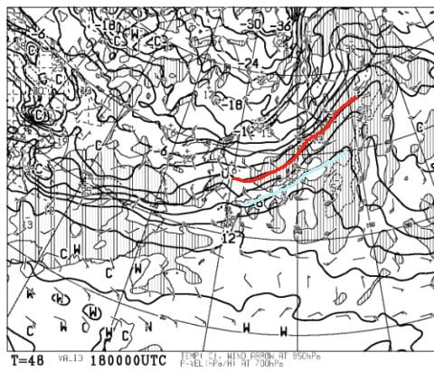

# 2019/12/15(日)の志賀高原，焼額山スキー場の詳細レポート！…朝の積雪は10cm，雪⇒曇り⇒晴れ．ゲレンデ状況ほぼ人工雪で固めのバーン．午前中は混んだけど，楽しめたよ！

📅 投稿日時: 2019-12-17 01:10:43

予告通り．

残念なことに．

来ます．

17日，18日の二日間．

かなり気温が上がります…（泣）

17日(火)夜9時の850hpa気温図は，こんな感じで

赤く印した0℃線は北海道まで北上し．

志賀高原は水色の+6℃線より南に

あります（涙）

そして，18日(水)の朝9時の850hpa気温図でも．

志賀高原は水色の+6℃線の近辺…

これは．

夜中で地上付近の気温は冷えるとはいえ．

志賀高原でも，夜でも雨になっちゃう気温…（泣）．

で．

18日の地上天気図を見ると．

降水域が志賀高原にギリギリ

かかってる感じなので．

…17日から18日にかけて，

液体が降るかも…（激涙）

ただでさえ天然雪が降ってない

この時期．

雪ではなく雨が降る

という事態は全力で避けたいところ．

…ただ，ギリギリ志賀高原に降水域が

かかるかどうかというところなので．

それほど大降りにはならないはず…

とりあえず．

17日から18日にかけての雨．

降ってもぽつぽつ程度の雨で

留まりますように…（全力での懇願)

しかし．

18日の危機を超えても．

その後，23日までは雨か雪か微妙な

気温がずっと続くため．

まだまだ気を抜けません…

現状の天気図だと．

22日もギリギリ雨か雪かきわどい何かが

降りそうな天気図なんですが．

雪になるように，私が全エネルギーを込めて

踊っておきます…

という，あまりよろしくないニュースのあとは，

本題へ．

15日の日曜の志賀高原焼額山，

詳細レポートです！

えー．

まず．

土曜の夜はかなり強い降りで

雪が降っていたタイミングもあったので．

日曜の朝に，かなり期待して

宿の外に出てみると…

…

…

積雪，これだけですか…(ちょい涙）

風が強かったので，車の上は1-2cmしか

積もってませんが．

一晩の積雪は10cm弱という

ところ．

まぁ，

　そして，前日の晩から雪が降り続け，

　運が良ければ10cm以上．

　運が悪ければ2～3cmの積雪．

という予想は，概ね当たったのかな…

…

でも．

予想が外れて，50cmほど積もって

ほしかった←欲張りすぎだから

あさイチは，雪がぱらつく天気で，

気温も-5℃以下と結構低く．

ゲレンデは，かなり締まった圧雪バーン！

明け方は雪の降りが弱かったので，

圧雪後の積雪は無く．

また，気温が冷えた昨晩は

かなり人工雪を打っていたため．

天然雪がちょっと降ったにもかかわらず．

ほぼ人工雪バーンといっていい，

かなり締まった，硬めのバーン．

でも．

締まったシマシマバーン．

これはこれで，スピードが出て

かなり気持ちいいのだ！

いつも通り，朝イチの誰も滑ってないシマシマを

気持ちよくいただくのだ！！

と，数本は気持ちよく滑っていたものの．

…そうです．

人工雪の硬めのバーンと言えば．

時期に現れてくるこいつ．

…そう．

殺人コロコロです．

残念ながら，数本滑ると，

こいつがバーン全体を覆いはじめて，

快適度はちょいダウン…（涙）

とはいえ．

最初のうちはゲレンデも空いていて．

…さらに．

昨晩から，かなり人工雪を打ったのか．

唐松コースの滑れる幅．

昨日はコース半分だったのが，

今日は2/3以上が滑れるようになっていて．

大回りができるようになってたし．

そして，

リフト待ちもそこまでひどくなくて，

結構楽しめたのですが．

…ただ．

昨日と同じく．

某都道府県連の指導員研修会が

実施された焼額．

今日は朝9時にはゲレンデに皆さん

繰り出してきて．

ちょっと人口密度が上がって

きました…（ちょい涙）

この団体さんと当たると，ちょっと

リフト待ちが…

輸送能力が低いペアリフトは，

午前10時過ぎにはかなりの待ち時間に

なってしまいました…（激涙）

とはいえ，輸送能力が高い高速リフトは

それほどひどく待たずに済み．

そして，講習の皆さんも，コースの端っこで

低速の指導種目をメインに練習していたので．

コース上はそれほどひどい混雑には

感じませんでした．．．

おそらく，滑れるエリアが狭いので．

一般ゲストに迷惑がかからないよう，

かなり気を使って講習してくれたんだと

思います…

ってな講習も，午前11時過ぎには終了して．

それ以降，ゲレンデ人口密度は一気に下がり．

そして．

雲の隙間から日が射すようになってきましたよ…！！

午後1時ごろには…

青空が広がってきましたっ！！

　天気は午前中は曇り～雪がぱらつくが，

　午後に雪は止み，夕方に向かって

　太陽がのぞき始める．

という予想が，大体当たったかな…←その前の一文，「あさイチのバーンは，うっすら天然雪に

　圧雪がかかった，かなりよさげな感じ」というのは外している気がするが…？

さらに，午後2時ごろになると…

ゲレンデの人口密度は，かなりガラガラに

なってきましたよ！

…そのうえ．

朝の殺人コロコロが無くなり．

ところどころ固いものの．

朝より雪質が良くなってきてるかも…？？

ってな感じで．

午後3時を過ぎるころには，もうかなり

寂しくなったゲレンデを飛ばし放題！

…なんですが．

この頃になると．

ちょっとゲレンデはそこかしこ

固めの下地が出てきたところも多く．

大変残念なことに，

　急斜面のバーンは，午後には

　柔らかい雪がはがされて硬いところが

　出てきそう…

という，

当たってほしくない予想が当たるの法則

が，今回も見事にあてはまったようです（涙）

で．

今日もツルツル斜面にめげず，

16時のラストリフトまで滑る

わけですが…

夕方には，斜面が急なところは，

ツルツル＆ちょっと凸凹の，

ちょいと手ごわいバーンと

化してました…

ってな感じで．

誰もいなくなったツルツル＆でこぼこバーンを．

今日もしっかり，日が暮れるまで

滑ったのでした…

…しかし．

天然雪がほとんど降っておらず．

焼額山は，この週末も土日とも，

第4ロマンスリフトと第2高速リフトの

2本のみの営業で．

人工雪を打ってないコースは，まだ

こんな感じなので．

ゴンドラが動くのは，まだまだ先の

ことになりそうです．

一の瀬クワッドも，高天ヶ原クワッドも

まだまだ動きそうにないし．

これからしばらく，天然雪がドサドサ積もる

気配もなく．

…ヤバい．

今シーズンは，ヤバい…（涙）

予想通りに年末寒波が来るように，

今から必死に踊っておきましょう…！！

## 💬 コメント一覧

### 💬 コメント by (なるなる)
**タイトル**: Unknown
**投稿日**: 2019-12-17 20:46:05

最近、S様のレポートや天気予報を見るたびに(涙)(涙)の連続です…

今週末は今シーズン初の志賀高原に行こうかと予定していたのですが、

一の瀬と高天ヶ原のクワッド動かないならどうしようかと。

週末の天気予報楽しみにしています。

ぜひとも、全山滑走可能な予報にしていただけると…　無理ですよね…w

初めてシーズン券なるものを買ってしまったのですが、こんな事になるとは…（激涙）

### 💬 コメント by (五輪の書)
**タイトル**: Unknown
**投稿日**: 2019-12-17 21:47:30

いつもありがとうございます

銀嶺さんのブログ見ると

岩菅や横手は雪かも、てことは

志賀の一番高いとこ以外は雨

ご意見一致なのかしらん

この時期一旦雨降ると氷の層が出来るので悪くない説ありますよね

霙(と期待)の後にガツンと降る様、踊りに励みます

年末寒波に合わせて聖地志賀に伺いますので

### 💬 コメント by (NorthFox)
**タイトル**: Unknown
**投稿日**: 2019-12-17 22:38:40

なかな良いはなしが無いですね．．．

年末の28,29に志賀の予定なのですが、今激しく思案中です（涙）。

年明けは八方と乗鞍の予定なんですが、八方はともかく乗鞍はかなりヤバイ状況です。

どうしてこんなことに。神田の街へのお布施が少なくてスキーの神様がへそ曲げたのでしょうか。

### 💬 コメント by (五輪の書)
**タイトル**: Unknown
**投稿日**: 2019-12-18 07:33:53

ほんとですね

乗鞍は山頂10㎝山麓0㎝

暫く雪予報ないし

白濁温泉大好きなので正月お宿予約してました

温泉旅行なるかも

滑るのは他のとこになるかも

### 💬 コメント by (若杉勲72)
**タイトル**: Unknown
**投稿日**: 2019-12-18 16:09:56

火曜日水曜日と連続して、ヤケビは雨。平日組はガツガツしなくていいので、当然とんぼ返り。それにしても一日が長い。スキーをしてると一日なんて一瞬なのに。

皆様、心置きなくお仕事にいそしんでくださいませ。

### 💬 コメント by (Skier_S)
**タイトル**: コメント遅れてごめんなさい
**投稿日**: 2019-12-19 01:37:01

＞なるなるさま

天然雪は積もりませんが．

人工降雪機がこれからフル稼働できるので．

運が避ければ，今週末に高天ヶ原クワッド動くかも…いや，まだ分かりませんが．

一の瀬正面バーンやら，焼額ゴンドラ，奥志賀の営業は

諦めた方が良さそうです．

全山滑走ができるのは，いつのことやら…

＞五輪の書さま

17，18日は私の予想通り雨でしたね（涙）

そして，19日からは冷えるのに降らない（泣）

ダメです…

もう少し必死に踊らないと，神様は許してくれないようです．

＞NorthFoxさま

もう，全然降る気配がありません（泣）

28，29なら，今よりは良くなってそうですけど．

まだ滑れないゲレンデがあるかも…

ぜひ神田の街にお布施をしてやってください（笑）．

＞若杉さま

2日連続の雨ですか…（涙）

スキーしてないと一日長いんですね（笑）．

ゲレンデ状況が悪いなら，私は心置きなく仕事ができますよね…（なんのこっちゃ）

