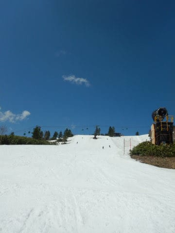

# このGWもタフな日程だった…

📅 投稿日時: 2022-05-10 00:14:17

🏷️ カテゴリ: [2022スキー滑走日記](cc9cb73e4320f6a97af6fccc37587a61a.md)

ってなことで．

10連休のGWが終わり，本日から社会復帰しましたが…

疲れた．

本当に疲れた…

いや．

このGWの日程が無理すぎた．

ちょっとGWの疲れが出てるようです…

とりあえず何とか本日は乗り越えましたが．

皆さんのために，

私が体を張って得た教訓

をお伝えしておきましょう．

○ワクチン3回目接種の翌日に，

　朝2時起きでスキーに行って

　ラストリフトまで滑り，

　その夜に飲みに行ったら死ぬ

ワクチン接種翌日，朝2時から

夜11時までの21時間活動し続けで．

それも6:30から9時間半スキーを滑り続けてて，

夜に飲みに行く…なんて行動パターンだと

確実に死ぬのでマネしないように．

バカなのでその翌日も早朝から滑って

さらに深夜まで飲んでたので，もう一度

死ぬかと思いました．

○9日のうち中1日休みを入れただけで，

　8日間ぶっ続けで早朝からラストリフトまで

　滑り続けたら死ぬ

1日だけ7:30スタート，あと1日は7時頃スタート

ってのもありましたが…

8日のうちお昼休みも2日だけしか

取らず，

それ以外基本的に6:30～16:00まで

滑り続けると，基本死にます．

…早朝から滑れる2ndシーズン券の

危険さが分かりました…

危険だ．早朝がタダってのは身体に悪い…

○4日間ぶっ続けで滑ったあと

　5時間運転して深夜に帰宅し，

　その27時間後にまた4時間かけて

　志賀に戻った中1日の休みは

　休みとはいえ全く身体が

　休まらないので死ぬ

その中1日も，昼間に自力でタイヤ交換やら

下回りのメンテナンスやらやって，

板も4セットワクシングして…とかやってたら

全く休まった気にならず，その後また

4日連続でスキーすると死にます．

やめた方がいいです．

おススメしません．←誰もそんなことやらないってば

○その中1日の休み後，朝2時に家を出て

　早朝から滑り，ラストリフト後に

　1時間半かけて長野市まで行って

　飲み会して，その次の日に早朝から

　滑ると死ぬ

ええ．

死にます．

次の朝，よく起きれたもんだ…

○こんなヘビーなGWを過ごしつつ，

　最後の日のラストリフトまで滑り続けて

　深夜帰宅し，翌日朝7時前に家を出て

　仕事をすると死ぬ

ホントに死にます．

今日は死ぬかと思った…

ってなことで．

睡眠不足気味のご無体仕事から

解放される10日間なのに，

さらに体をいじめてしまってはいけない

ということを自らの体を張って学びましたので．

皆さんにお伝えしておきたいと思います．

以上，Skier_Sの教訓でした←いや…これはだれの参考にもならんよ…

## 💬 コメント一覧

### 💬 コメント by (大阪のK)
**タイトル**: Unknown
**投稿日**: 2022-05-10 08:48:09

Sさん。

確かに我々一般人には、必要のない忠告のよう存じます。

GWに7日連続で志賀高原に、車中泊していただけですから。

くれぐれもお身体を大切になさってください。

また、12月にお会いしましょう！

### 💬 コメント by (Skier_S)
**タイトル**: ＞大阪のKさま
**投稿日**: 2022-05-12 01:03:59

いや…6泊7日車中泊ですか！！？？

それはすごい…

普通の人にはできません（笑）

十分，普通の人じゃない認定されるレベルかと．

また来シーズンお会いしましょう～！！

### 💬 コメント by (ikkun)
**タイトル**: Unknown
**投稿日**: 2022-05-12 14:10:36

いじめた分御返しが来ないように❗てか接種三回目は皆さんヤバい確率高いようですが大丈夫でしたか？  近くにゲレンデあるシアー？あ雪はほどほどで(泣)

### 💬 コメント by (Skier_S)
**タイトル**: ＞ikkunさま
**投稿日**: 2022-05-13 02:27:08

接種3回目の翌日だからなのか，激務の疲れなのか分からない，

結構しんどい状態で滑ってました…

ただ，発熱は無かったので他の人より副反応は軽かったのかも？？

