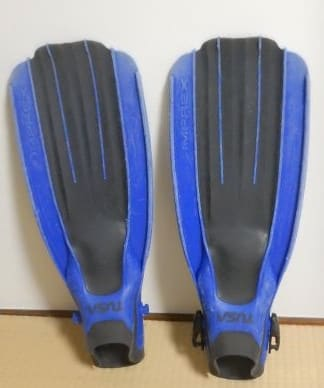
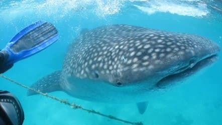
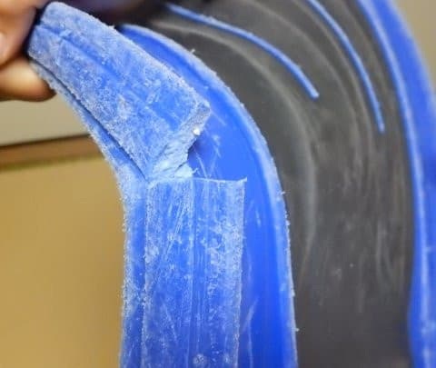
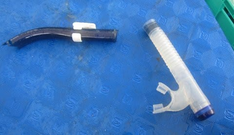
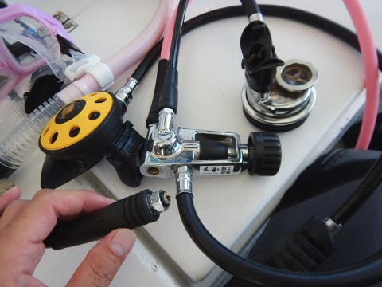
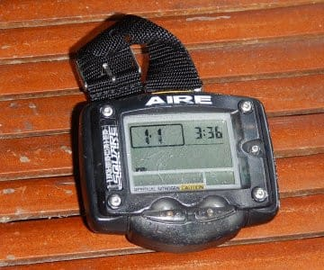
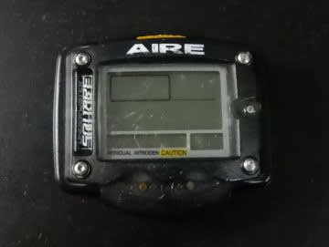

# この1年で，ダイビングを始めたころの器材が次々死に絶えていきました…（涙）

📅 投稿日時: 2019-09-12 00:50:41

ってなことで．

私がダイビングを始めてから，

もうそろそろ20年近く経って

しまうようなのですが．

ダイビング用具ってやつは，

基本的に結構長持ちするもので，

2シーズン，せいぜい3シーズン

もつかもたないか…

というスキー用具に比べれば

圧倒的に長寿命です．

特に．

1シーズンもつかどうか…

という

消耗品並みの短寿命であるスキー板

に比べれば，比較にならない

ほどの長寿命を誇ります．←いや，普通の人にとっては，

スキー板の寿命ってもう少し長いから…

たとえ，毎日潜るダイビングガイドの

ような人であっても，

ダイビングのBCを毎年買い

替えるとか．

レギュレーターを2～3年で

買い替える…って人は

そうそういないと思います．

ってなことで．

普通のダイバーにとっては．

一回ダイビング器材を揃えたら，

ウェットスーツやグローブなどの

ヘタるもの以外，そうそう

買い替えることはないと思います．

で．

約20年間，500本以上潜ってきた，

我がダイビング器材も．

さすがにウェットスーツやら

ブーツやらBCやらは，

2代目になっているものの．

それ以外の器材は，概ねダイビングを

始めたころのモノを使いつづけて

来たわけですが…

なぜか．

昨年から今年にかけて．

一体何があったというのか．

長らく使い続けてきた器材たちが，

次々死に絶えて行ったのでした…

まず．

ダイビングを始めたころから

愛用していた，プラフィン，

TUSAのIMPLEX．

旅行にもっていくとき，

ゴムフィンより軽いプラフィンが

良いのと．

安いので選んだ，このフィン．

20年の酷使に耐えて．

いろんな経験をともに

積み重ねて来ましたが…

なんと．

このフィンが．

こんな風に，バッキリと折れて

しまいました…（涙）

プラフィンって，こんな風に

割れるんだ…！！！（驚）

…さらば．

Cカード取得時から，一緒に

過ごしたわがフィンよ…

そして．

その次に．

長らくお供してきた，シュノーケル．

こいつがいきなり，まん中で

ポッキリと折れてしまい

ました…（涙）

シュノーケルも，そうそう

簡単に壊れるモノじゃないと

思ってたけど…

20年も酷使してると，

もろくなるみたいですね…（泣）

さらば，我がダイビングに20年間

付き合ってくれたシュノーケルよ…

で．さらに．

20年の長きに渡って使っていた，

レギュ―レータ―．

こいつのセカンドステージの

中圧ホース取り付け部が…

なんと！

折れてしまいました…！

折れたのがダイビング中ではなく，

問題は無かったのですが．

…というか．

中圧ホースを付け替えようとしたら，

ぽろっと折れてしまったというのが

正解ですが．

いやー．

こんなところ，

折れるんだ…！！

そして．

ダイビングを始めたころから

愛用している，ダイビングコンピューター，

AIREのSQUARE．

7年電池交換せずにもつという，

当時としては驚異的なバッテリー

のもち＆お値段の安さに惹かれて

買ったのですが．

7年どころか，20年近くたっても，

まだ電池交換しないで

もってるよ…

すごいなぁ…

いつまでもつのかなぁ…

と，感動していたら．

20年間の酷使に耐えたこいつも，

ついに今年電池切れで

息絶えました…

さすがに1999年発売モデルの

このダイコン．

サポート終了のアナウンスが出ており，

メーカーの電池交換サービスも

受付が終わってます（涙）．

電池交換を請け負っている業者さんも

いるようですが．

7000円～8000円もかかるようです（泣）

自分で電池を換えようか…

とも思いましたが．

どうやら，自分で電池を換えた人の

報告によると，電池交換後，

正常に起動しなかったようで．

自分での電池交換は無理なようです…

…さらば．

わが500本に付き合ってくれた，

ダイビングコンピューターよ…

そのほか，メッシュバッグも穴が開き，

取っ手がちぎれてお亡くなりになりました．

ってな感じで．

去年までは，ウェットとBC，

マスクとブーツ以外は，

ほとんどダイビング

を始めた時のモノをずっと

使っていたのですが…

ここ1年で，全てが死に絶えて．

逆に，ダイビング開始時から

生き残っているのは．

ダイビングフロートと

マスクのバンドカバー，

レギュレータ本体＆圧力計

（ホース類はすべて交換済み）

くらいになりました…

そして．

さらに今回．

ダイビングを始めた時からの器材では

無いのですが．

そのほかの，大事なパートナーも

息絶えてしまいました…（激涙）

これについては，また後日…

## 💬 コメント一覧

### 💬 コメント by (KENKEN)
**タイトル**: Unknown
**投稿日**: 2019-09-12 07:04:09

自分のプラフィンも20年近く使ってますね。

(フルフィットフィンが欲しいけど)

殆ど機材は2代目ですが、ウェットと視力が変わったマスクだけは3代目です。

ダイコンはTUSA IQ500を自分で電池(100円)交換して使ってます。

これからシーズンオフなのでヤフオクなどで5000円程度で買えますよ😁。電池も10年位持ちそうです。

### 💬 コメント by (さら)
**タイトル**: Unknown
**投稿日**: 2019-09-12 16:41:39

こんにちは。

そんなに 長持ちしてくれるんですね。

大事に扱えば。

私は ダイビング二年生なので まだまだですが、自分の器材たちを 大切にしていこうと思います。

### 💬 コメント by (Skier_S)
**タイトル**: ダイビング道具は長持ちです…
**投稿日**: 2019-09-13 01:33:16

＞KENKENさま

私も今回，フルフットフィンにしたかったのですが．

やはり，フルフットフィンはどれだけ安くても1万円超えますし．

重いので，今回も安いプラフィンにしました…

しかし，TUSA IQ500ってのも，私のAIRE SQUAREと

同じくらいの世代のダイコンですよね…懐かしい．

自分で電池換えられるんですね．

ダイコンは，そろそろNitroxを使ってみようか…？

とか思っているので，残念ながらエアにしか対応しない

古い機種は今回の購入候補の対象外でした…

だもんで，夏が終わって投げ売りしていた新品を買っちゃいました．

新しいダイコン，安いわりにかなりの時代の進歩を感じたので，

また記事にする予定です(笑)．

＞さらさま

基本的に，ダイビング重器材は10年以上はもちますよ．

BCも，初代のものは15~6年，400本ほどもちました．

レギュレーターは，オーバーホールをきちんと続けていれば

20年以上もつと思います…

私のレギュは，ホースはもう2回ほど交換していますが

20年経ってもまだ現役です．

フィンやシュノーケルも，20年，500本もちました．

ぜひ，自分の器材を大事にしてやってください！

