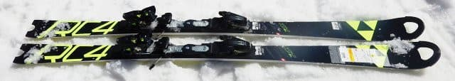
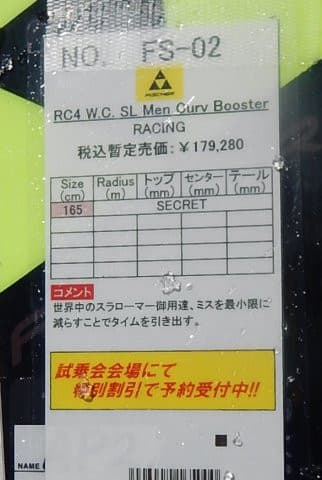
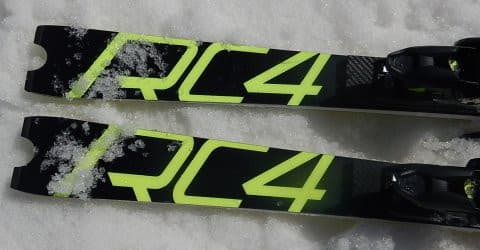
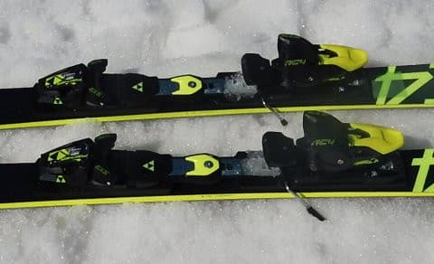
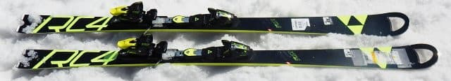
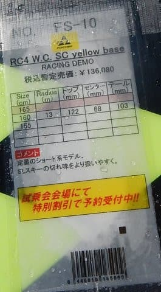
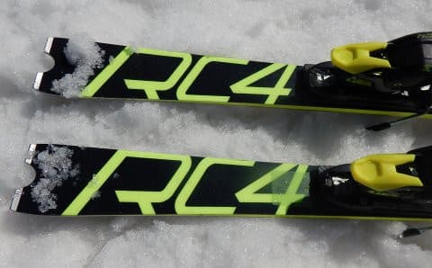

# 2019シーズンのスキー板，試乗レポート第6回…FISCHER編その1

📅 投稿日時: 2018-04-20 01:32:08

そういえば．

明日…というか，今日ですね．

20日の金曜日．

志賀草津道路がオープンです～！

今週末から，草津越えで志賀にアプローチ

できるようになりますね…

夜6時から朝7時までは夜間通行止めですが．

草津7時なら，焼額8:30に間に合うので．

うむ．

私は今週から，草津越えで志賀往復ですね．

例年だと，オープン直後に積雪でクローズって

ことが良くありますが．

今シーズンは，そういうことは絶対なさそうな

超高温ですから（涙）

安心して草津越えでアプローチできますね…（悲）

ってなわけで．

本日も2019シーズンモデルのスキー板の

試乗レポートなわけですが．

本日はフィッシャー編です．

では，どうぞ～！

----

○　FISCHER RC4 W.C. SL Curv Booster 165cm

SL競技用．

この板，Z18＋Curv boosterという強烈なビンディングが

ついてますが．

完全にSL競技用のトップモデルです．

滑ってみると．

板を動かして小回りする板ではなく，

ガッツリカービングスペシャルです．

小回り板と思えないどっしり安定感で．

ビクともずれない感じがあります．

重くて板が動かせなくて最初は戸惑ったけど，

谷回りで体を正しいポジションに運び続けていれば，

もう恐ろしいほどのガッツリグリップと

切れ上がり（横への走り）を見せます．

強いテールの張りで，板が横にスポーーーんと

走って切り替わっていき，

谷回りの早い段階から，ガッツリ板がグリップ

して回っていきます．

そこから正しいポジションをキープしつづければ，

ものすごいグリップでチョー気持ちよく，

きれいに深く回っていく，

スーパーカービングマシーン．

重いので，ズラシの小回りは厳しいですが，

けど，カービング小回りは最高．

おそらく，固い雪ならさらに本領を発揮するんで

しょうけど，緩み始めた春雪でもかなり

気持ちいいカービングができました…

お値段がすごい高いけど，

そして，重くてカービングしかできないので，

一日この板を履いていたら疲れそうだけど．

これを履きこなせる体力と技術があれば，

結構楽しい板だな，と思いました…．

○FISCHER RC4 W.C.SC Yellow base 165cm

基礎小回り用．

基本的にはSLをマイルドにして，履きやすくしたモデル

ですが．

滑ってみると，やはりW.C. SLに比べ軽快で，

動かしやすく，自由度は高いです．

でも，決してズレズレではなく，

結構いい感じでグリップする，エッジグリップが

比較的しっかりした板．

山回りは気持ちよくたわんでグリップしていき，

しっかりグリップで小さい半径で回り，

そしてテールまで使えて．

ばね感のある，気持ちよい返りが来ます．

それでいて谷回りは板を動かして作っていける．

かなり乗り手が自由に半径を作っていける板．

あまり板に圧をかけないで行けば，

そこそこのミドルっぽいターンまでは

引っ張れます．

フリーで滑るときの表現力というか，

乗り手の自由度という意味では，

カービング小回りスペシャルの

SLよりはかなり高い感じ．

全日本クラスの技術選選手も，小回り競技は

SLでなくSCを履いているらしい…

荒れた春雪でもコントロール性が高いので，

手ごわさはないし．

小回りベースのゲレンデ履きとしては，

かなりいいかも．
