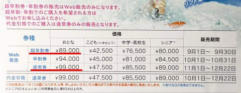

# 2025シーズンの志賀高原スキー場の全山シーズン券情報が届いたよ！…来シーズンは超早割で大人89000円，通常99000円

📅 投稿日時: 2024-08-08 03:29:41

🏷️ カテゴリ: [スキー雑談](c1f9d2cb7478308da16419928ea3945e9.md)

本日，ポストを見ると．

志賀高原索道協会から郵便が届いてるなぁ…

と思ったら．

来シーズンの志賀高原スキー場のシーズン券の

申込書が届いてました～！

いや…来シーズンのリフト券の案内が

例年より早い気がするけど．

昨年から，超早割ができて申込期間が

9月からに前倒しされたから，案内が

早くなったんだな…

ってなことで．

シーズン券の案内で，一番気になるのが

そのお値段．

果たして，来シーズンはまた値上がりするのか…？？

お値段は…

どどーん！！

9月30日まで購入期限の超早割で大人89,000円

10月31日まで購入期限の早割で大人94,000円

それ以降だと大人99,000円

ですか…！！！

ちなみに，早割価格で買えるのはWeb販売のみで，

代金引換だと通常料金になっちゃうみたいです…

しかし．

過去のシーズン券の料金を振り返ると…

2014シーズン　65,000円

2015～17シーズン　67,000円

2018シーズン　70,000円

2019シーズン　72,000円

2020～22シーズン　77,000円　

2023シーズン　超早割85,000円，通常95,000円

2024シーズン　超早割89,000円，通常99,000円

なので．

通常料金を比較すると，10年で1.5倍に

なった感じですね…（涙）

2017シーズンから2020シーズンまでの

3シーズンで1万円上がった時は，

高くなったなぁ

と感じたけど．

2022シーズンから2024シーズンで，

超早割でも1.2万，通常料金で2.2万も

値上がりするとは…！

ちなみに．

2020シーズンから2022シーズンまで，

3シーズンの間は77,000円で変わって

無いように見えますが．

2022シーズンから，利用開始が12月1日

からになり，利用期間が短くなったので

実質2022シーズンは値上がりでした（泣）

そして．

今シーズンも利用可能期間を見てみると…

うぎゃーーー！

やっぱり来シーズンも12月1日からか…っ！！

うーん．

来シーズン，さらにお値段上がるんだから．

贅沢は言わないから，12月第1週からたっぷり

雪が積もって，焼額のゴンドラが営業開始日

から動いてくれて．

さらに贅沢は言わないから，その後毎週

膝パフや腰パフの冷え冷えパウダーが

積もり続けて．

せめてものささやかな願いとして，

パウダーが積もった後の週末は毎週

すっきり晴れてくれて．

そしてあんまり贅沢は言わないので，

GWまで積雪1m残って，営業最終日まで

GSコースとオリンピックコース，

パノラマコースが滑れることを

祈るばかり…←めちゃくちゃ贅沢言ってるから

## 💬 コメント一覧

### 💬 コメント by (副院長)
**タイトル**: Unknown
**投稿日**: 2024-08-08 08:41:22

おはようございます。ささやかなお願い、同感です。今シーズンはラニーニャ？期待しています。

### 💬 コメント by (1kamakura)
**タイトル**: Unknown
**投稿日**: 2024-08-08 09:35:35

江戸の秋

あー、どんどん値上がりしていますね。

ディズニーシーが7000円台になった時に、なんて高くなったんだ！

と思いましたが、今や10000円！

あの時はまだマシだった〜😢

8万9万払うんだから、雪が十分にほしいですね〜。

自然相手じゃ、どうにもならないけど…

### 💬 コメント by (スシネコ)
**タイトル**: Unknown
**投稿日**: 2024-08-08 12:59:49

やっぱり値上がりしましたね。これ以外にも毎週のように高速代・ガソリン代と宿泊代がかかるので、もはや阿鼻叫喚です・・・・

宿泊代といえば、常連だった宿がナント2倍の料金設定になってしまったので、もう泊まれなくなってしまいました。スノーモンキーの外国人観光客が多かったので、心配はしていたのですが・・・

贅沢は言わないから、ナイターもシーズン券で滑れないかなぁ。

### 💬 コメント by (富山県民)
**タイトル**: Unknown
**投稿日**: 2024-08-08 18:42:23

こんにちは。

志賀高原全山シーズン券があるのですね。

早割でも89000円とはかなり高いですね。

私はスキー場のシーズン券を購入したことがないです。

### 💬 コメント by (Skier_S)
**タイトル**: 全山シーズン券じゃなく，ヤケビ限定県がお買い得かも…
**投稿日**: 2024-08-08 21:44:49

＞副院長さま

もう，ホントにささやかなお願いなので，ぜひお願いをかなえてほしいです…

＞江戸の秋さま

もう，どんどん値上がりしていってます．スキーは庶民のスポーツじゃなくなってきてるかも…

せめて金額が上がる分，設備がよくなるとかコースやリフトが増えるといいんですが．

それは望み薄なので…

＞スシネコさま

昨シーズン一気に値上げしたので，今シーズンは上げないんじゃないか…

と思ってたけど，甘かったです（涙）

また上がるとは…！！

宿代も上がりますか…

ナイターもシーズン券で滑りたいなら，やっぱりヤケビ限定しおーずん券ですね…！！

＞富山県民さま

そうなんですよ…高いんですよ…

まぁ，インバウンドが来まくっている白馬八方とかよりは安いんですけどね．

シーズン券を買うと，どれだけ滑ってもお値段一緒なので滑らないと損という

気分になって毎週スキー場に来るようになります(笑)

### 💬 コメント by (アツシ)
**タイトル**: Unknown
**投稿日**: 2024-08-10 08:46:01

＞ Skier_S さんへ

＞ シーズン券を買うと，どれだけ滑ってもお値段一緒なので滑らないと損という気分になって毎週スキー場に来るようになります(笑)…... への返信

ご無沙汰してます。いつの間にか夏本番。長いオフシーズンも半分過ぎたなあと思っていたら、ヤケビで滑る夢を見た今日この頃です。

私は昨シーズンに初めて志賀高原のシーズン券を買いましたが、まさにSさんのおっしゃるとおり、滑らな損、というわけで毎週志賀に行くようになった結果、志賀での滑走日数が27日と、一昨年まで平均10日前後だったのと比べて約3倍増となりました(笑)今年もシーズン券買います❗️

### 💬 コメント by (Skier_S)
**タイトル**: ＞アツシさま
**投稿日**: 2024-08-12 00:43:56

いやーー．やっぱりシーズン券があったら滑らないと損でしょう！！

滑れる限り滑っておかないと（笑）．

シーズン券，ヤケビ限定券か全山券か悩むところですが，またシーズン券買って

志賀高原で滑りまくってください．

また志賀で会いましょう！

