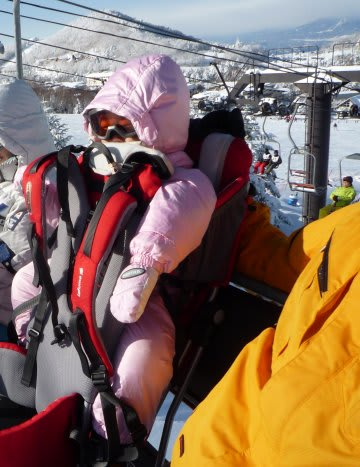
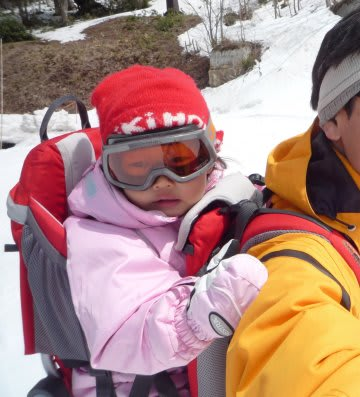
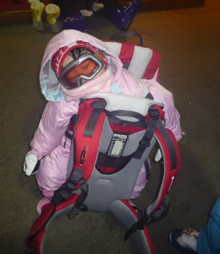

# 背負われると気持ちいいのかな…？

📅 投稿日時: 2011-02-03 01:33:27

🏷️ カテゴリ: [スキー雑談](c1f9d2cb7478308da16419928ea3945e9.md)

家族で滑りに行ったとき．

まだ3歳になったばかりの娘は，ゲレンデで滑れないので．

私が背負って滑るわけですが．

娘はリフトに乗るのも，

背負われて滑るのも大好きなんですけど…

…大体，1時間も背負われると寝ちゃいますね～．

リフトの振動とかが気持ちいいんでしょうかね～

