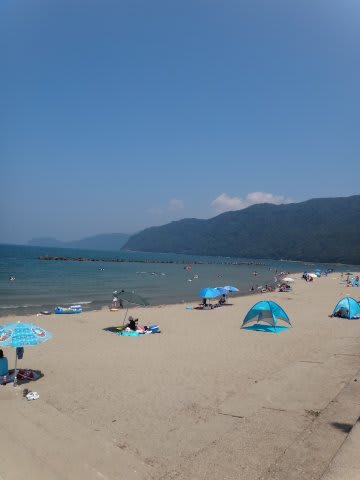
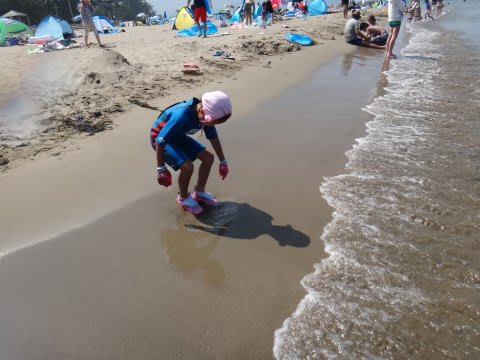
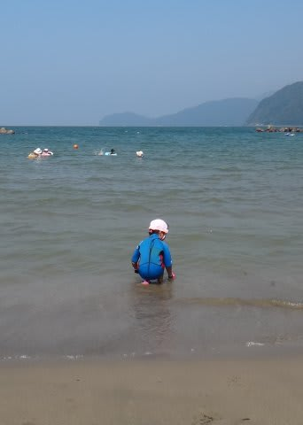
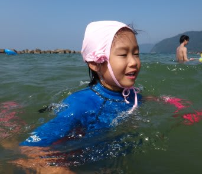
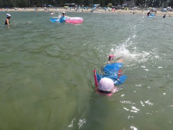
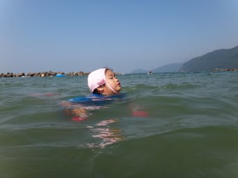
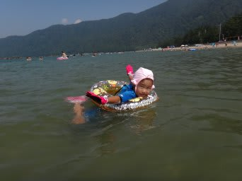
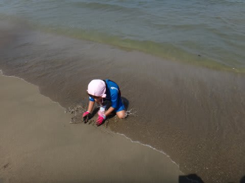
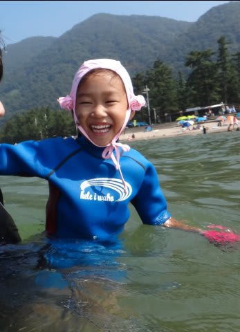

# 娘を海水浴へ連れて行ってみた…第2弾

📅 投稿日時: 2013-08-16 00:45:00

🏷️ カテゴリ: [登山・旅行](c1d637a11a25b457ac978d197adbdafc5.md)

ってことで．

前回．

[首都圏近辺の海はお気に召さず，泳ぎもしない](e14b5d8191b559a1b0ccdb593c171560f.md)という

お姫様っぷりを発揮した我が娘．

…沖縄とか，南の島でしか泳げないなんて．

私はお前をそんな軟弱な子に育てた思い出はないっ！！！

＃そうなるように育ってしまった理由に，思い当たる節はいっぱいありすぎるけど…

お前は，南の海以外でも泳げないといかんのだ…っ！

北の海でも泳げないとダメだろっ…！

…

…ってことで．

今度は北へ向かい，日本海へ連れて行ってみました(何か違う)．

さすがに日本海は，首都圏近辺と違って混んでませんね～．

娘「海草，ないね」

ちょっとだけ海に入り…

娘「海草，ないよ～っ！」

…娘，そんなに喜んで報告しなくて良いから…

嬉々として海へ突進していく娘．

娘「海～っ！たのし～っ！」

…そう．よかったね…

ってことで．

シュノーケリングしたり．

泳いだり

浮き輪で漂ったり

砂遊びしたり…

超うれしそうな我が娘．

…楽しそうなのは良いけれど．

これは，もしかすると…

私「娘～．もう帰るよ～っ！」

娘「いやーーーっ！まだ泳ぐ～っ！！！！！」

…

…やっぱり，このパターンか…

…わたしゃこれから，数100km運転して帰らなきゃならないんですが…

結局．

娘は，日暮れ近くまで泳ぎ続け．

帰宅したのは深夜を回っていたのでした…

＃とりあえず，南の島以外でも泳げるようで…一安心．

## 💬 コメント一覧

### 💬 コメント by (miya)
**タイトル**: Unknown
**投稿日**: 2013-08-16 12:38:53

うちの娘も沖縄以外で海に

入ったことがないです…。

もしかしたら、同じ状況になるかも(汗)

でも今週末は辻堂のプールです!

そもそも海にいかないかも…(笑)

### 💬 コメント by (Skier_S)
**タイトル**: えええ！それはゼイタクですね…
**投稿日**: 2013-08-16 17:16:18

沖縄以外でまだ泳いだことがないって…

それはまたすごいゼイタクですね．

うちの娘は，海草がない海なら泳げるように

なりましたから(笑）．

miyaさんの家でも，鍛えてやってください（笑)

でも，どうもうちの娘も，海よりプールが好きかも…

関東近辺の海はどこも混んでいて，海より

プールがいい気がします！

### 💬 コメント by (マルハバ)
**タイトル**: 羨ましい娘さんです・・
**投稿日**: 2013-08-16 21:55:10

ウチの娘が海で泳いだのは

過去たった２回だけ・・・（汗）

初めては、パラオの無人島ウーロン島のビーチ、

そして２回目はモルディブ・バンドスのビーチ・・・

海は「しょっぱいから・・」との理由でキライだそうで

それ以後何年も行ってません・・・（涙）

でもプールと我が家のバスタブは大好きで

いまだに潜って遊んでますが・・（爆）

### 💬 コメント by (KENKEN)
**タイトル**: うちの娘も
**投稿日**: 2013-08-16 22:39:08

1歳のときに1日だけ瀬戸内海で泳いだ(海に浸かった)だけで、ほかは全部沖縄(しかも離島)という贅沢ぶりです。

プールは家から歩いていけるほど近い(＆安い)ため、よく行くんですけどね。

おかげでこの夏にうちの娘もなんと泳げるようになりました。

息継ぎができないので数ｍですが・・・・・

水泳教室に行かそうかとか思ってたけど、全然必要なかったです。

まったく子供の成長には恐れ入るばかりです。

### 💬 コメント by (Skier_S)
**タイトル**: 外出中でコメント回答遅れました…
**投稿日**: 2013-08-18 23:36:16

>マルハバさま

レス遅くなってすいません．

しかし，「沖縄でしか泳げない」の上を行く，

「海外でしか泳いだことがない」

…それも，パラオとモルジブって…

これは，超贅沢と言わずになんといいましょうか（笑)

>KENKENさま

こどもの成長は早いですよ～．

うかうかしてると抜かれますよ（笑)．

うちも，ホントに幼稚園のうちにシュノーケリングマスター

するとは思いませんでしたから．

来年は，KENKENさまの娘さんも，ぜひシュノーケリングを！

数m泳げるなら，息継ぎしなくてもいいシュノーケリングの

方が楽だって気づくはずですよ～．

うちの娘も，今は普通に泳ぐよりシュノーケルの方が良いみたいです…

