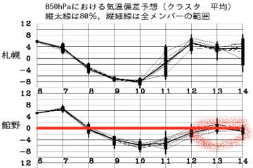

# 日曜はYetiで滑ってます…そして今日はタイヤ交換

📅 投稿日時: 2020-11-08 05:00:00

🏷️ カテゴリ: [日記](cc4b5682fb7b8b144980957a978653fb0.md)

えー．

今日はお仕事＆タイヤ交換のため，

Yetiに行かず家でじっとしていた

Skier_Sです．

[熊の湯のスタッフブログ](https://ameblo.jp/kumakumanoyu/entry-12636292394.html)では，

11/14openは厳しい状況です

と書かれたりしてますが（涙）

とりあえず，来週末，熊の湯＆横手が

オープンする可能性があるので，

本日一生懸命タイヤをスタッドレスに

交換してました…

いつも通り，タイヤ交換というより，

汚れた下周りを…

必死で磨いて，腐食しないようにシャーシコートを

塗りまくるという営みだったわけですが．

やっぱり，新車の頃に比べると，

ピカピカになる度合いが落ちてきてますね…（ちょい涙）

で．

来週末の熊の湯オープンは厳しそう…

という話ですが．

前回，[12日以降はぐんぐん気温が上がりそう](e75dfb19a9fbd3cb9a0b5cd1bd5d42c6d.md)な

予想だったところ．

予想は嬉しいことに低温方向にずれ．

12~14日は平年並みの気温になる予想に

なってきてます！！！

…これもひとえに，

私の冷え冷え踊りのおかげ

ですので．←だから，あなたが志賀高原の天気を決めてるんじゃないから！

皆さんも私にならって，

引き続き全力で冷え冷え踊りを踊ってくださいますよう，

よろしくお願いします…

## 💬 コメント一覧

### 💬 コメント by (ad)
**タイトル**: Unknown
**投稿日**: 2020-11-09 00:23:34

sさんの天気予報いつも楽しみにしてます。横手山が今週オープンすることを期待してます

### 💬 コメント by (Skier_S)
**タイトル**: ＞adさま
**投稿日**: 2020-11-09 02:50:51

うーむ．

熊・横手が今週にオープンするよう願っているのですが…

とりあえず，これから夜も寝ないで，休まず止まらず死ぬ気で

冷え冷え踊りを踊り続ければ何とかなるかもしれません(笑)

