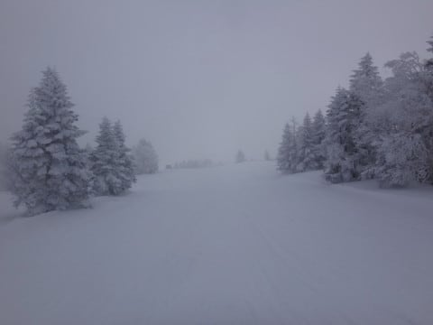
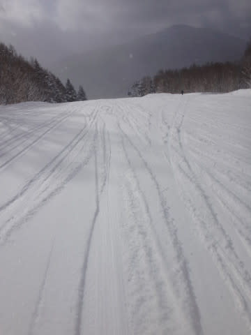
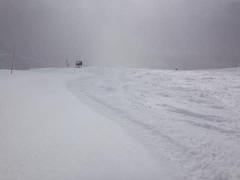
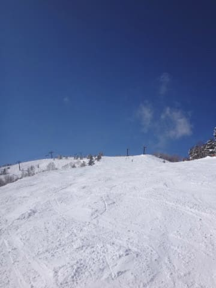
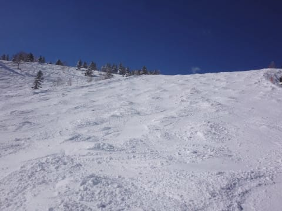
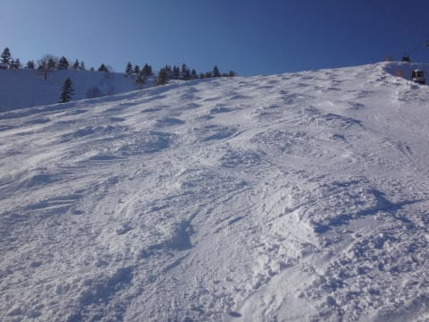
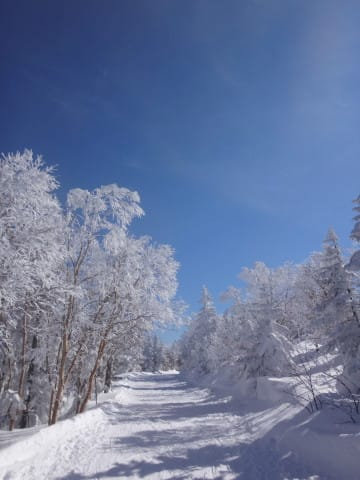

# 2月19日，日曜の志賀高原速報モード…朝は曇ってたけど，予想通り晴天に！朝はパウダー10cm，午後はコブコブ…

📅 投稿日時: 2017-02-20 01:55:59

🏷️ カテゴリ: [2017スキー滑走日記](c7d777cecfc91bdf0fa464ad62c6d49ab.md)

えー．

本日も，リフトストップまで滑り．

さらに渋滞で帰宅が遅かったので．

日曜夜定番の速報モードにて…

とりあえず．

金曜の夜の予想の．

　日曜は朝のうち曇り，雪もちらつくかもしれないけど，

　じき晴れて，太陽のもと滑れるかな～．

　日曜も朝は新雪がちょっと積もるので．

　日曜朝はまたゲレンデ状況が結構回復してそう．

　…午後はまた下地の固いのが出てきそうですけど…

…っていう，

まさにこの通りの天気でした！！

まるで予言者であるかの如くの的中だったのだ！！

ふはははは．

ウェザーニューズやその他の予想も，

日曜の晴れを予言したものは無かったのだ！

ものども，見よ！わが天気予想の正確さを…（バーン）←久しぶりに原田知世に撃たれた音

ということで．

日曜の焼額山の山頂は，

雪がちらつく天気でスタート．

昨晩から積雪は15cm～20cmくらいかな？

朝イチは，圧雪コースも新雪が乗ってます！

朝イチは今シーズン一番軽い，フワフワブーツパフの

ゲレンデでしたね～！

そして…

をを！！

10時ごろにはすっきり晴天に！

いやーー！

気温冷え冷え，太陽ピカピカの

最高のスキー日和だよっ！！！

…と，思ったら．

朝，ゲレンデ全面を覆っていた柔らかい雪が

じきに踏み固められていき…

あう？？

なんだか，コブになってきましたよ…

そして，夕方には強烈な全面コブ（涙）．

このコブ溝には．

予想通り，金曜の雨でかたまった，

ちょいと固めの下地が出てきてます…

これは…

疲れる．

かなりの疲労蓄積バーンでした…（泣）

でも．

午後10時以降は，すっきり晴天というのに，

気温は終日，かなり冷え冷え．

終日Goodな雪質で楽しめたので．

午前中，ちょっとゲレンデの人口密度は

多めではあったものの．

まぁ，かなり恵まれた週末だったかな！！

また明日，詳細レポートやります～！
