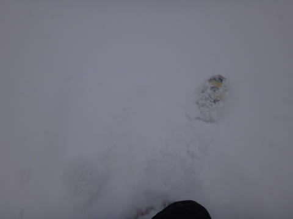
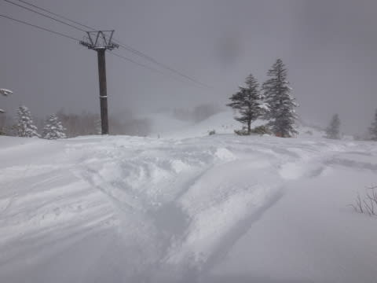

# 1月24日の志賀高原，速報モード…吹雪→晴れ→吹雪．終日積雪のパフパフデー！

📅 投稿日時: 2016-01-25 01:57:57

ということで．

今日も帰宅が遅くて．

こんな時間になったので．

本日も，速報モードで…

＃決して道路が通行止めとかになったわけではなく，

＃単にいつも通り，最後まで滑ってたからなので，ご安心を

えー．

本日．

大雪の予想が，朝7時過ぎまで全く積もらず．

「大雪じゃなかったの？」

…と思った人が多かったと思うのですが←自分含む

朝8時近くから，

なぜか突然，

風が強まるとともに，

強烈に激烈な降りになり…

…なんてこったっ！！

わずか1時間で20cmクラスの積雪に…．

おかげで，ゲレンデ全体ブーツパフ！

圧雪コースも，ブーツパフ！

＃そのおかげで．

＃焼額第2ゴンドラと，奥志賀ゴンドラは昼近くまで運休でしたが…

そして．

終日雪の天気予想だったのに，

昼間は2時間ほど，薄日が射す穏やかな天気に！

運休中のゴンドラも動き出したというのに．

朝の荒天で，今日滑るのをあきらめてみんな帰っちゃったのか．

ガラガラ！！！

誰もいないよ！

おかげで，コース脇は終日パフパフ…

…ってか．

午後2時ごろに．

また激烈な雪になり…

1時間で10cm以上の雪で，

コース上も再び全面新雪に！

てか，滑っても滑っても新雪リセット状態！

ってことで．

終日，ブーツパフ程度とはいえ，

パフパフをめいっぱい楽しめた本日．

…死ぬほど寒くて，視界が悪かったけど…

まぁ，楽しめたかな！

詳細レポートは，また明日…

＃しかし，この最高の雪が今週末までもたなさそうなのは

＃どういうことだ？？

＃30日の土曜，1月にありえない高温になり，

＃雨になりそうなのはどういうことだ？

＃暖冬の今年，激冷えボーナスは今週末だけっぽい…（涙）．

## 💬 コメント一覧

### 💬 コメント by (いか)
**タイトル**: Unknown
**投稿日**: 2016-01-25 12:39:44

日曜日は極寒でいい降りでしたね。白馬エリアは夜のうちにも降っていたので朝、上部で30～40センチほどありました！一日中振り続け、午後には同じようにガラガラでリセット祭り、まさかのリフトストップまでファット板でした(笑)

ただ、昨日のような日は焼額山のようにゴンドラが羨ましくなりました…(スカイラインの吹きさらしは人間冷凍庫です…)

### 💬 コメント by (Skier_S)
**タイトル**: いかさま
**投稿日**: 2016-01-26 01:10:13

八方は，土曜の夜から降ってたんですね！

うーーーん．志賀もそうあってほしかった…（残念）．

志賀も，午後2時からは予想通りのパウダー

リセット状態で，楽しめましたよ～．

しかし，ゴンドラがあっても凍死するかと

思ったので，リフトには乗りませんでした（笑）．

ってか，乗ったら死んでます（＾＾；）．

