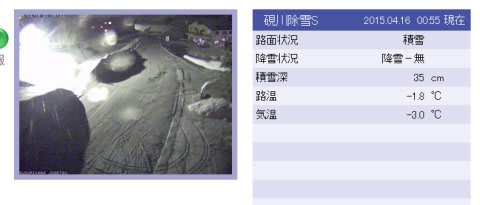
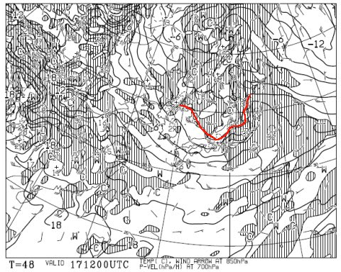
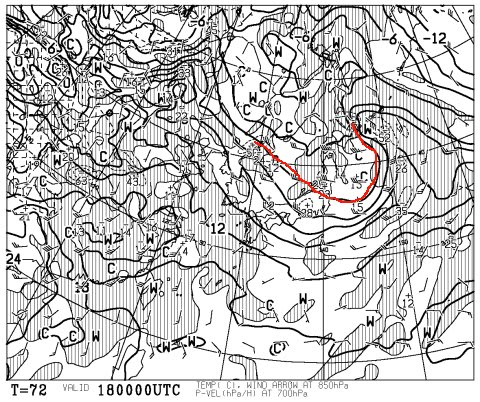
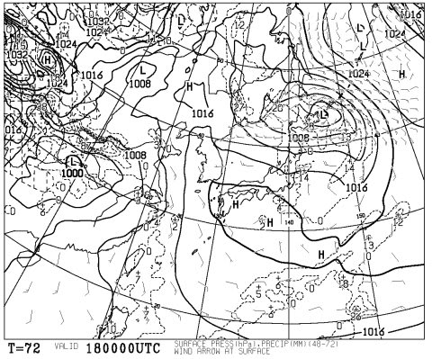
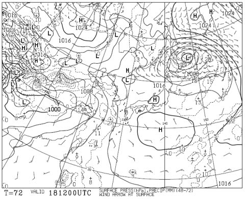
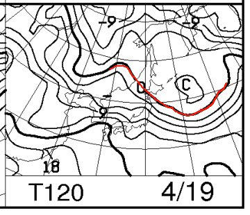
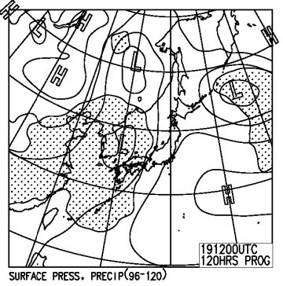

# まだ終わらんよ！今週末の志賀高原の天気は…天気は良さそう．土曜は冷えて日曜は温まるかな？

📅 投稿日時: 2015-04-16 01:26:05

🏷️ カテゴリ: [スキー天気予想](c6554f5c3c106093b511a8daae23757e8.md)

水曜の志賀高原は雨が降ったりやんだり

だったみたいですが…

ふむ．

なんだか．

今は，雪が積もってるみたいですね～

…まぁ，また明日は気温が上がるので．

すぐ溶けちゃうと思いますが…

って感じで．

もう，桜も散ったというのに．

私の志賀高原通いが続く限り，

まだまだ続く，志賀高原の天気予想．

えー．

今週末の天気は，と…

ふむ．ふむ．

あー．

なんだか，金曜の夜は，結構冷えますよっ！

こんな感じで，久しぶりに850hpaの0℃線が志賀高原まで

かかってますね～．

これは，金曜の夜から土曜の朝にかけて，しっかり冷えて．

チラチラと雪が舞いそうな感じ．

うーん．

でも．

積もるほどじゃないかな～．

で．

土曜の朝の850hpa気温は…

ふーむ．

まだ，0℃線は志賀高原近辺に残ってくれてますね～．

これは，土曜朝は冷え冷え！

早朝は，しっかり冷えたバーンになりそう…

午前中，結構遅めの時間まで，雪はそんなに緩まずに

済みそうかな？

土曜朝9時の予想地上天気図はこんな感じなので…

まぁ，早朝の時間帯は雪がちらつくかもしれないけど．

低気圧が東に去っていくので，9時くらいまでには雪も止みそう．

そして，夜9時の地上天気図はこんな感じで，高気圧に

覆われているので…

土曜は昼に向かって雲も減り，

午後は晴れていく感じかな～．

この日は，昼間もそれほど気温が上がらず．

なんだか，いいコンディションで滑れそうな感じですね～（期待）．

で．

日曜の850hpa図は，だ．

うーむ．志賀には+9℃線が近づいてるなぁ…

地上天気図は，こんな感じで高気圧に覆われてるので…

まぁ，日曜は基本的に晴れかな～．

朝は放射冷却で冷えるかもしれないけど．

昼間は気温が上がる，晴天のポカポカ春スキー日和．

雪はちょっと荒れそうな予感…

ってことで．

まとめると．

土曜：朝早いうちは小雪がちらついているか？

　早朝のゲレンデは，しっかり締まった，固い雪．

　固く締まった下地の上に，前日から降った雪がうっすら

　乗っている感じかな～．

　午前9時過ぎくらいには雪も止み，昼に向かって雲も切れていく．

　午後は晴れていくかな～．

　気温はそれほど上がらず，午前10時過ぎまで，結構締まり気味の

　ゲレンデを滑れるかな？

　昼間も最高気温はそんなに上がらなさそうなので．

　ザブザブドボドボの雪にはならず．

　比較的フラットな雪を滑れるかな～．

　この時期としては，比較的恵まれた一日になりそう．

日曜：朝から晴れ．早朝は放射冷却で冷えて，結構締まったバーンが滑れるか．

　ただ，早朝営業のうちから気温が上がり，

　日差しも強いので，朝早いうちから緩んでいきそう…

　9時ごろには，もう結構ユルユルの雪になるかな．

　昼間は気温が暑いくらいに上がり，雪もかなり緩んで，

　人が多いゲレンデは荒れた感じになっていきそう…

　夕方に向かって，雲が増えていきそうだけど．

　まぁ，暖かい太陽のもと滑れる，典型的なポカポカ

　春スキー日和と考えれば許せるか．

って感じで．

4月中旬と考えれば，土曜は比較的恵まれたコンディションに

なるかな～．

日曜も晴れそうだから．そこそこ楽しめる週末になってくれそうな予感…
