# 今週末，1月14，15日の志賀高原スキー場の天気は…14日は激冷えエンドレスパウダー供給デー！15日も積もるよ！

📅 投稿日時: 2017-01-12 03:15:35

はいはいはいはい．

予告したように，今週は激冷えウィークですよ～！！！

本日の志賀高原．

朝までに20cmほど積雪があったようですよ～！！

でも．

一昨日の記事で，

　　　＃志賀もそこそこ積もるけど，今のところ

　　　＃豪雪ってほどは降らなさそうな感じ

と書いた通り．

西風が続くので．

本日11日の昼間から明日13日までは．

せいぜい一日10～20cm程度の積雪に

留まりそうですけど…

…いや．

でも．

来ますよ．

今週末はっ！！！

まず，

週末の前の天気ですが…

12日の850hpa気温を見てみると．

うむ．水色の-6℃線が志賀に掛かっており．

まぁまぁの冷え込みですが．

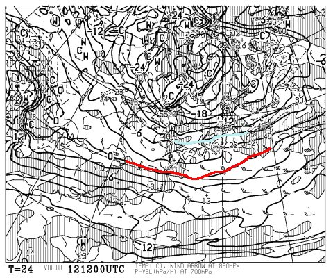

…しかし．

12日の地上天気図はこんな感じで．

JPCZによる降水域が，赤い矢印の方向，

かなり東向きにたなびいてます…

これは，かなりの西風ですね～．

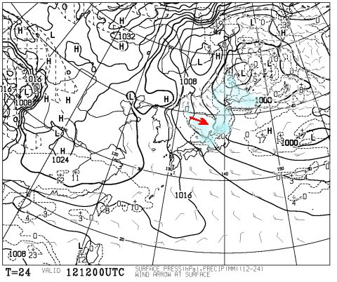

ってことで．

かなりの西風なので，北アルプスで雪雲が

ブロックされてしまい，

志賀高原に雪雲が届かないパターン．

…でも．

500hpa図を見ると．

赤く印したそこそこの雪が降る目安，-30℃線が

志賀高原に掛かっていますので…

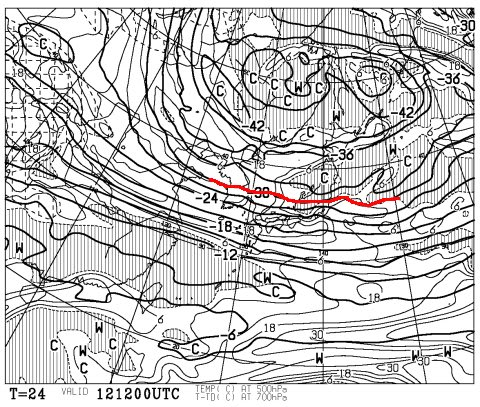

これだと，根性のある雪雲が，北アルプスを

超えて志賀高原に達するレベル．

だもんで．

志賀に雪が積もらない西風とはいえ，

うっすらと積もる程度には雪が降ります．

…あー．

日本海側はドサドサ降りますね．

で．

13日の金曜日ですが．

この日の850hpa図は，水色の-9℃線が志賀に掛かっているので．

志賀高原は，昼間でも-10℃を上回ることはなさそうな

激冷えですね～！

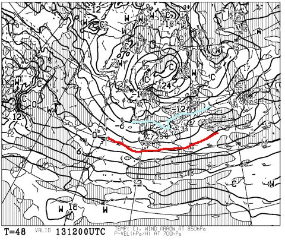

そして，地上天気図は．

うーむ．

この日も志賀高原近辺は西風パターン…

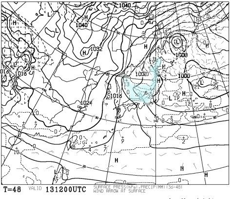

でも．

12日と同じく，500hpaの-30℃以下の寒気が入っているので．

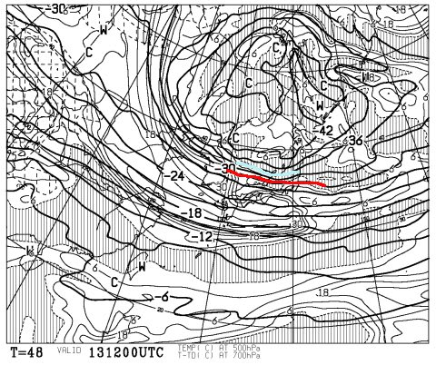

この日も根性のある雪雲が北アルプスを越えて．

志賀高原に雪を降らせます…

そして．

14日の土曜日．

850hpa図を見ると…

をををっ！！！

なんとっ！！！

水色で示したのは-12℃線！

これは…志賀高原，昼間でも-15℃クラスの激冷えってこと？？？

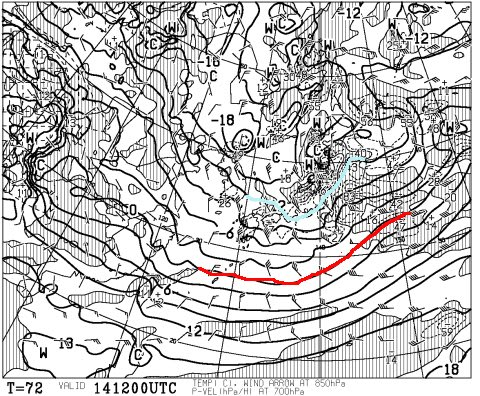

そして．500hpa図は…

ををを！

大雪の目安，水色で記した-36℃線が！！

-36℃線が志賀高原に！！

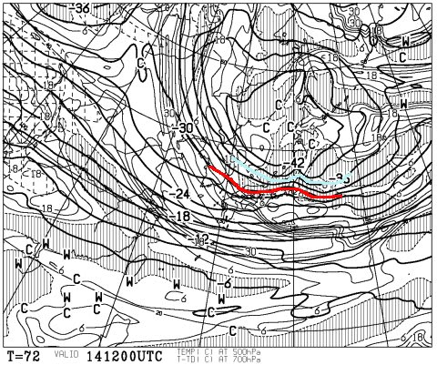

…これは，降る．

激烈に，降る．

…震える手で，地上天気図を見てみますが…

うををを！！

なんていう縦縞密度！

本州に等圧線が6本もかかっている！

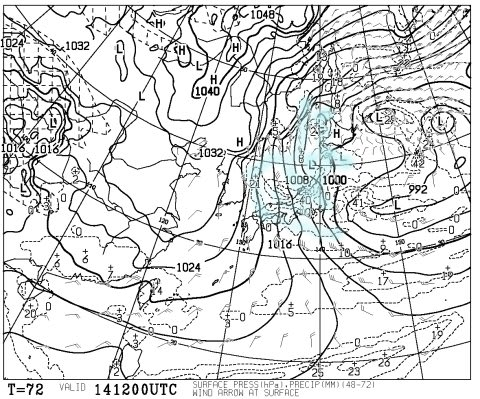

そして．

日本付近を拡大すると…

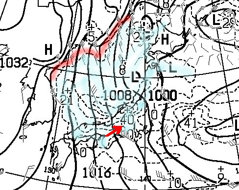

水色の降水域．

ほとんど日本海全域を覆ってます．

赤く印した大陸の海岸線からわずかに

離れた位置から，雪雲の吹き出しが始まってます！！！

…専門的に言うと，離岸距離が異常に小さい

寒気の吹き出しの雲がでてるので…

これは，かなりの大雪になるサイン！

そして，赤矢印で記した，40という数字．

これは，降水量40mm．雪なら40cmの積雪を

意味しているので…

積もる．

この日は，積もる．

で．

日曜15日．

この日も850hpa気温は水色の-9℃線が志賀高原に掛かり，

朝は-13℃くらいまで冷え込みそう！

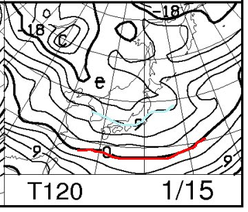

そして，地上天気図も，

しっかり縦縞をキープ！

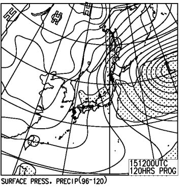

14日ほどではないけど，この日も一日中積雪がありそう…

ということで．

まとめると．

12，13日：結構冷えるけど，志賀はそんなに積もらない．せいぜい1日10cm程度？

　でも，日本海側は結構積もる．志賀の天気は終日曇り～雪がちらつく．

　時折ごく短い時間太陽が射すタイミングも．

　13日の午後か夜あたりから…激烈に降り始める

14日（土）：朝はすごいパウダー！！激冷えパウダーが

　かなり積もっている．

　高速は群馬県あたりからもうチェーン規制が入りそう…

　移動にいつもより時間がかかることを覚悟！

　志賀の登り坂は当然本格積雪路．

　今の様子だと，久しぶりの太ももパフ期待！

　ってか，ひたすら一日降り続ける．

　エンドレスパウダー供給デー．

　昼間も積もるので，ゲレンデはもう一日パフパフ．

　新雪が嫌いな人は滑らない方が吉．

　むちゃくちゃ冷える．終日-15℃クラス．

　風がそこそこあるので，体感温度はもっと寒く感じるかも…

　死ぬほど寒いので注意！

　ゴンドラは減速運転になるかも？でも，運休するほどじゃない．

15日（日）：この日も終日降り続ける．朝はまた結構なパウダー！

　気温は朝は-13℃くらい？14日より冷え込みは緩むが，

　でもむちゃくちゃ寒い．

　終日雪がちらつく．時折強く降る．

　土曜ほどじゃないけど，昼間もゲレンデに雪がうっすら積もっていく．

　午後はモフモフ荒れ荒れバーンに．

って感じでしょうか…

何にしろ，こんな感じで一週間，平年より低い気温が続き．

14日は，このグラフの下に突き抜けそうな低温に…

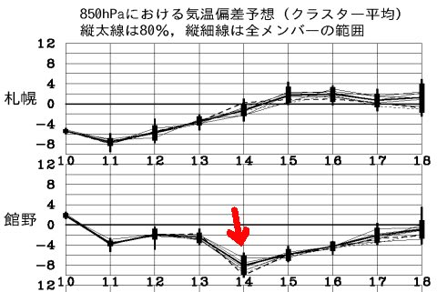

去年の，グラフの上を何度も突き抜けた異常高温と

逆ですよ～！！

だもんで．

14，15日．

ともにパウダー大期待！

ファットスキーを持っている方，

久しぶりの本領発揮ですよ～！！！

## 💬 コメント一覧

### 💬 コメント by (かず)
**タイトル**: 返信ありがとうございます
**投稿日**: 2017-01-12 17:53:03

今日朝一　第一からスタートしました　新雪5cm程度

また重めの雪で急遽フッ素でなんとか対応です　おそらく一番暇な週なのでゲレンデの荒れは少なかったです　明日も不発なので月曜まで滑るのがベストっぽいですね

### 💬 コメント by (いか)
**タイトル**: Unknown
**投稿日**: 2017-01-12 23:36:58

待ちに待ったドカ雪ですね！私のホーム八方もやっとこさ下部リフトが動き出すのではないかと期待しています。

そして、ファットの出番ですね！今シーズン、4日のうち2日ゆるファットを登板させているのですが、ついに本気ファットの出番になりそうです(^ ^) ぜひ、これを機にファットの購入をご検討くださいませ〜(もう選手権開催済みだったりして…)

### 💬 コメント by (Skier_S)
**タイトル**: 今はそこそこ積もってるようですが…
**投稿日**: 2017-01-13 03:06:13

＞かずさま

あれ？？5cmですか！

うーむ．

少なくとも10cmは積もると踏んでいたのですが…

13日の夜からは降るはずです．

ただ，13日から15日までも，

ちょっと湿数0の空気が志賀高原に

入っているので．

もしかすると，重めの新雪かもしれません…

まぁ，気温が-15度だから，軽い雪になってくれるかな？

＞いかさま

来そうですよ～！

2シーズンぶりの，週末ディープパウダー！

日本海側スキー場は，「もう要らん！」っていうくらい

雪が降るはずです…

まだ，ファットは買ってませんが．

…今回のパウダーで，

もしかすると私の物欲回路が刺激されるかもしれません（笑）

