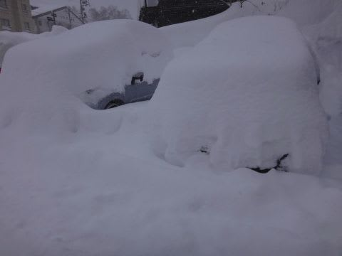

# 2月12日，日曜の志賀高原速報レポート…今シーズン一番のディープパウダーだったよ！！埋もれるかと思った…

📅 投稿日時: 2017-02-13 01:16:13

えー．

今日もしっかりラストリフトまで滑ったあと．

車を発掘したりいろいろあって．

帰宅がちょいと遅めだったので…

日曜夜定番の，速報モードです…

えー．

昨日は，あまり積雪が無く．

土曜の夜は，ナイター中もほとんど降ってなったんですが．

…深夜からいきなり激しく降り始め．

…今朝は，すごいことになってました…

…なに？？

一晩で車が前衛芸術化するほど積もってますよ！？？？

…うーむ．

ここまで降る予想じゃなかったけど…

＃また，天気予想外したか…（ちょい涙）

とりあえず．

朝は焼額に登ったところ…

うはーーーー！！

オリンピックコース，朝から腰パフの，

強烈ディープパウダーっ！！！！

これはすごいよっ！！

…ただし．

あまりにもディープすぎ…

さらにちょい重めだったので．

朝イチの踏まれてないうちは，

スタックして進まなくなっちゃう雪で．

…うむ．

これはまるで．

ゴキブリホイホイに掴まったかのように，

大量の人がもがいてました…（含む私（笑））

で．

この日は激しく雪が降ったり…

時折やんで，日が射したり…

…という天気．←ここは予想を当ててるよ！！積雪量は外したけど，

天気は当てたからっ！！！…と，主張してみる

午後まで雪質は良かったけど．

でも，午後はかなりバンピーな感じになってたかな…

そして．

夕方には，またすさまじく激しく降りはじめ…

夕方は，また圧雪コースもパフパフ化

し始めてました～！

だもんで．

今日ほどは深くないだろうけど．

明日の朝も，ブーツ～スネパフくらいの新雪かな～．

とりあえず．

また明日詳細レポートします～！←これで十分詳細な気がするが…

## 💬 コメント一覧

### 💬 コメント by (かず)
**タイトル**: 帰ると言っといて
**投稿日**: 2017-02-13 04:33:45

15時以降良かったですね　第3で16時30まで滑りました笑　予報どうり夜はやんでしまいましたが　負傷した腕が痛くて目が覚めました　今日は視界が良さよさそうなので脇を楽しんできます

### 💬 コメント by (れお)
**タイトル**: 楽しかったです♪
**投稿日**: 2017-02-13 11:26:05

朝イチ、オリンピックコース凄かったですね!!

私も、ホイホイされちゃいました(笑)

昨日はSさんと一緒にたくさん滑れて楽しかったです。

ありがとうございました～!!

最後の方も一緒にと思って、一ゴンぐるぐるしてみたのですが、お目にかかれず...　残念～

よろしければ、また次の機会もお願いします!!

今度は、共に太板でパウダーを楽しみましょう～(^▽^)

### 💬 コメント by (megalith)
**タイトル**: たかがワイパーされどワイパー
**投稿日**: 2017-02-13 13:30:02

ご無沙汰しています。

一つ気になったことがありましたので・・・・

ワイパーですが、夜露天で駐車される場合は、できれぱ上げておいたほうがよろしいかと思います。

翌朝濡れたガラス面が凍り、溶かさないと動かなくなるので、そのまま動かすとワイパーのモーターに負担がかかり、最悪モーターが壊れます。

また、雪の重みでワイパー取り付けフレームが曲がる恐れがあります。

例としてですが、自分のところでは雪に含まれる水分が志賀高原より多いので、大雪が降った朝はワイパーを支えるフレームが曲がってしまう悲劇がたまに起きて、まるごと交換ということもあります。(交換費用そこそこ高いです。(ディーラー談)

ワイパーが上がらない車種の場合は、ワイパーを浮かせて置くだけでも良いです。

またワイパー自体は冬用ワイパーに交換されていますよね？

通常のワイパーの場合、ワイパーのフレームの隙間に雪が付着したり、デフロフやワイパー凍結防止用熱線で溶けたものが走行中の空気による温度差でワイパーの隙間内で氷となり、それがだんだん大きくなりワイパーのフレームが圧迫変形してガラス面からワイパーが離れてしまい、前が見えなくなり非常に危険です。

その為走行中何度も停車して氷を落とす必要があります。

そのため冬用ワイパーはフレーム全体をゴムで覆い、作動させたとき雪の重みの負荷を考慮して若干短めになっています。

また冬用ワイパーは雪があまり降らない地域では売っていませんので、積雪地域の自動車部品販売店(オートバックスやイエローハット等)か、地元のホームセンターやガソリンスタンドで買うか、amazon等インターネットで買うしかありません。

そして車種・年式によって取付金具の形状が違ったり、適応する長さが違いますので、必ずメーカーの取り付け一覧表を確認の上購入することをおすすめします。(ただし1本あたりの値段が結構高いですのでご注意を(^_^;))

なお、自分の経験から言いますとフロントワイパーは変形しますが、リヤワイパーは今まで変形したことありませんので、交換される場合は最低でもフロントワイパー2本は変えて下さい。

ぜひ安全運転でスキーをお楽しみ下さい。(^^)

### 💬 コメント by (megalith)
**タイトル**: 追記
**投稿日**: 2017-02-13 13:38:08

リヤワイパーも夜雪が振り、露天の場合はできれば上げておくこともおすすめします。

リヤワイパーも雪の重みで取付フレームが壊れることがあります。(^_^;)

### 💬 コメント by (いか)
**タイトル**: The Day!!
**投稿日**: 2017-02-13 21:35:01

おー、志賀はとんでもないことになってたんですね。今年はそちら側の降雪量が多いように思います(^^)

こちら白馬はそこそこ冷えていましたので、軽いパウダーでした！30cmほどだったですが、私の板（センター122)では底付きなしの高速コンディションでした(^^)v

ぜひ、(第7回大会を経て)太板の世界へお越しくださいまし！

### 💬 コメント by (Skier_S)
**タイトル**: すごいパウダーでしたね…！！
**投稿日**: 2017-02-14 02:57:16

＞かずさま

日曜は，15時以降も良かったですよね～！

で，今日の志賀高原はいかがでしたでしょうか？？

＞れおさま

昨日はありがとうございました～！

…私の物欲を刺激し続けていただき，

ありがとうございます（笑）

太板，いいですね～…

午後も1ゴン回してたんですけど…

タイミングですかね…？？

また次に志賀高原にお越しの際は，

一緒に滑りましょう！

＞megalithさま

おお！

お久しぶりです！

…ワイパーのアドバイスありがとうございます．

日曜詳細レポートの最後の写真を

見ていただいたら分かると思うのですが…

さすがにこの日はワイパー立ててました（笑）．

で．

ウインターブレードですが．

ご存知とは思うのですが，BRレガシィは

アイサイト部分がちゃんと拭き取れるよう，

短いウインターブレードの利用がNGのようで．

「ちゃんとスバル標準ウインターブレード

使わないと，アイサイト動作保証しないぞ！」

って感じのようですが…

RBオデッセイの時は，安い部品量販店の

ウインターブレードを買っていたのですが．

megalithさんは純正使ってますか？？

### 💬 コメント by (Unknown)
**タイトル**: megalith
**投稿日**: 2017-02-14 08:36:22

自分が買ったときディーラーに問い合わせしたら・・・・(^_^;)

デ「純正ウインターワイパーはまだ出ていません。ただウインターワイパーを使用すると雪がガラスに残りアイサイトが誤動作する可能性があるので保証できないんです。(^_^;)

自「えっ？メーカーでもまだ用意していないとは・・・・(^_^;)まぁどうせ冬季はアイサイトは危なくてあまり使えないからまぁいいか。(^_^;)」

でしたので、社外品を買いました。(^_^;)

今は社外品でも対応品があるのかな？・・・・

こちらではワイパーが壊れた車をごくたまにですが見ます。(^_^;)

特に少し前の軽トラック(衝突安全規格が変更になる前のものが多いです)のフロントガラス面は雪を支えるのがほぼワイパーだけなので、何回も雪を支えているうちに曲がったり根本が壊れてポッキリと折れたり。

軽乗用車の場合はフロントワイパーは気をつけていても、リヤワイパーを忘れていて気がついたらポッキリと根本から丈下がっていているのに気がつかないで走らせている車も見かけました。(^_^;)

軽だけではなく、一般車もありうることですので気をつけたほうがよろしいかと思います。

### 💬 コメント by (Skier_S)
**タイトル**: megalithさま
**投稿日**: 2017-02-15 01:45:29

あ，社外品使ってらっしゃるんですね（＾＾

ワイパー使用中も，アイサイトは

無事動きますでしょうか…

問題ないようなら，私も安い社外品を

買ってみようかと思います（笑）．

いろいろ情報ありがとうございました～！！

### 💬 コメント by (megalith)
**タイトル**: Unknown
**投稿日**: 2017-02-15 21:47:35

とりあえずは雨の日も通常の雪が降る状態でもウインターワイパー使用中でもアイサイトは動きますよ。(^^)

ただ降雪が激しい場合は、ワイパーが短い分純正よりは動作が停止する確率は高いと思いますが、なにぶん純正は自分は使ったことがないので・・・・(^_^;)

ご参考になれば・・・・

### 💬 コメント by (Skier_S)
**タイトル**: megalithさま
**投稿日**: 2017-02-16 06:38:58

大丈夫そうなら，安い社外品を買おうかな（笑）

情報ありがとうございました～！！

