# 5月2日の志賀高原は…今日も冷えひえ，チョー快適な一日

📅 投稿日時: 2013-05-02 20:01:31

なんだか．

ここ数日，同じようなフレーズが続いているので，読者の皆さんも飽きてるのでは…

って気がするんですが．

…でも．

今日も，良かったのだ！！！！

これが今朝のゴンドラからの景色ですが…

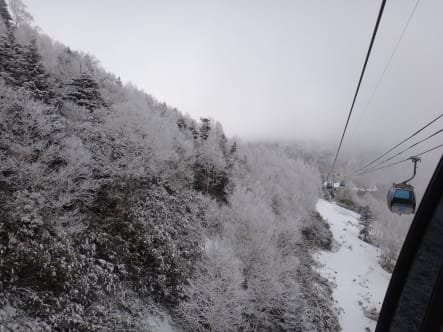

…

…えーっと．今日って5月なんですけど？？？

で．

早朝の状況が．

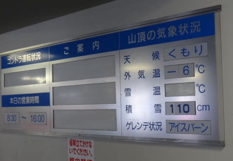

マイナス6度って…今日は5月なんですけど？？

ゲレンデはシマシマっ！

昨日からの積雪が，1-2cmほどうっすらと乗っています．

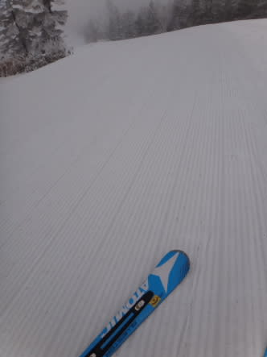

下地の雪は硬いけど，ビリビリ膝に来る硬さではなく，すごく気持ちよくエッジが食い込む，

超スーパーエキストラゴールデンデリシャスハイスピード大回りバーンですっ！！

うはーーーっ！

これは．

これは．

幸せだ～っ！！

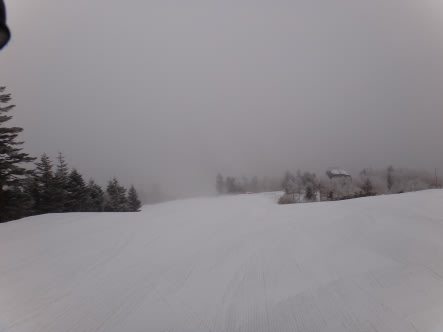

早朝営業終了の8時半でも，まったくバーンが緩みません．

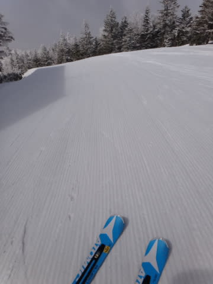

9時になってもまだ氷点下…

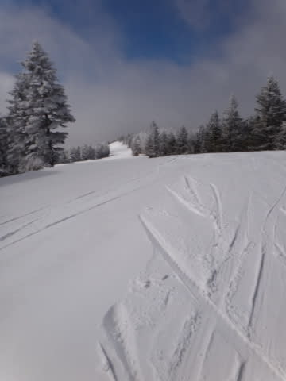

9時半になっても，まだ人が少ないのでシマシマが残ってます…

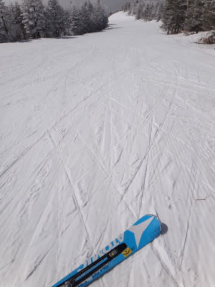

…ホントにいったい，今日は何月だ？？？

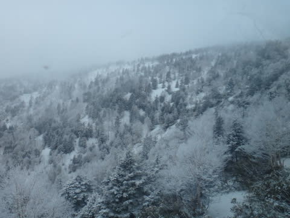

そして．

今日は（今日も？）人がおらず，がらがら！

どのくらいガラガラかというと…

今日，ゴンドラ30本近く滑ったうち，コース上で人を見た回数は半分以下では？？

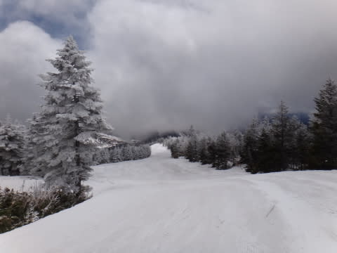

コース上，まったく人がいません．

ちょうど良くエッジがかかるハイスピードバーンを，

「アナタだけのためにご準備いたしました．ご自由におすべりください」

って状態！

…まるで，技術選スタートのような，好きなラインとり放題，トップスピード出したい放題…

…トップシーズンより良いかも？？？

ありえないGoodコンディションが11時過ぎまで続きましたが，

さすが12時ちょい前になると，さすがにコースの一部の雪が緩み始めました…

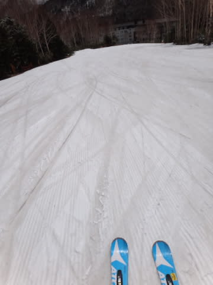

でも，5月のお昼で気温が0度をわずかに上回る程度で．

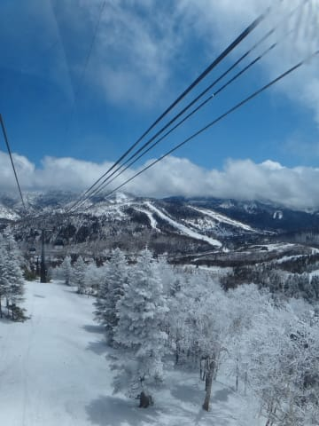

…これが5月の12時過ぎのゲレンデとは思えない…

そうだ！きっと今日は，3月の，あのありえない激暑だった週末と入れ替わっているに違いない！←違うって

で．今日，どのくらいがらがらだったかというと．

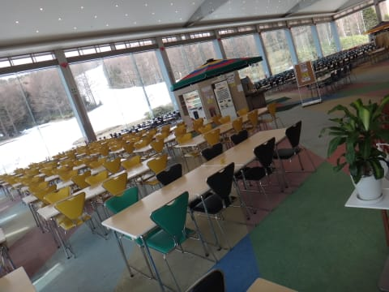

12時半の焼額のレストラン，他にお客さんがいなくて貸切だったんですが…

ちょっと経営的にはマズくない？？

んで．

午後2時過ぎには．

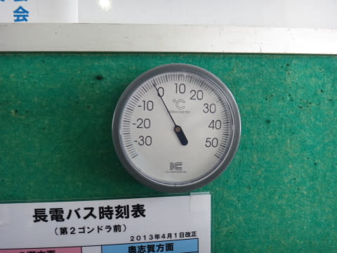

また気温が氷点下に…

さらに，雪が降り始めたんですが．

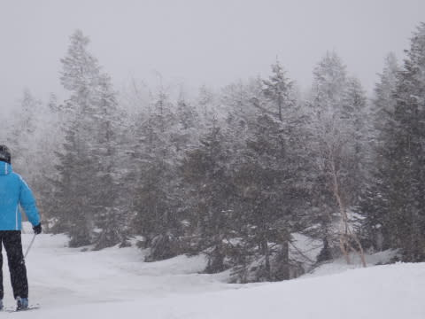

えーっと．

今日はやっぱり3月だったっけ？

ゲレンデの雪はしっかり硬くなっていきます．

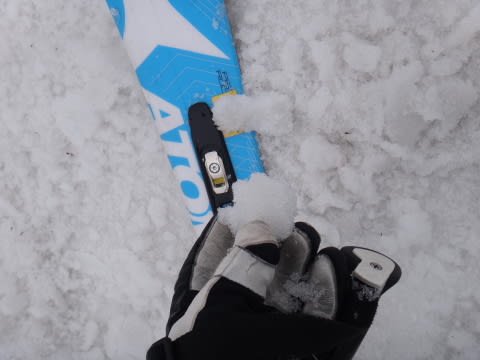

それほどひどくは荒れてないけど，ちょっとゴロゴロとした

感じに固まってしまい，少し滑りにくかった場所も…

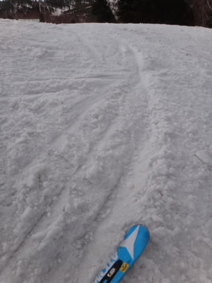

でも．

でも．

5月でこんなにいい状況で滑れて．

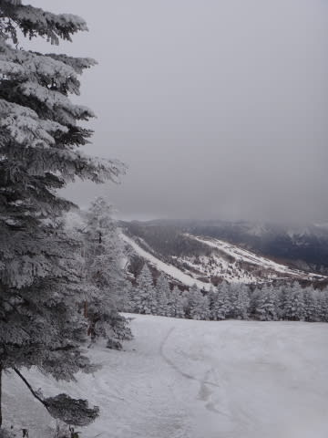

今日も幸せな一日だったのでした…

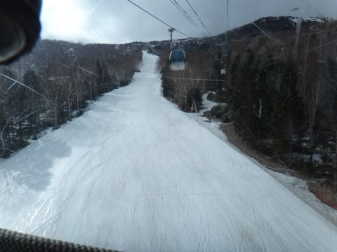

(ゴンドラストップ時でこんな感じ)

追記：4連休，3日は終日そこそこの冷え．4日から暖まり始め，

　　5，6日は例年並くらいの気温でしょう…

　　3日終日と，4日の朝まではそこそこぼちぼちの雪ですが，

　　(3日昼間はかなりやわらかい雪にはなるけど）

　　4日午前以降，天気もよく日差しも強いので，

　　板に張り付くざぶざぶ雪になっちゃいそう…

　　基本的に，4日とも晴れますよ～．

ちなみに，今日の一の瀬ダイヤモンドはこんな感じ

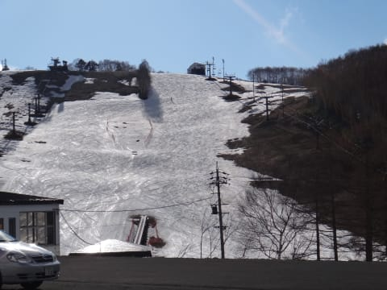

…4連休，最後まで持つかどうか微妙な感じ…．

一の瀬ファミリーはこんな感じで．

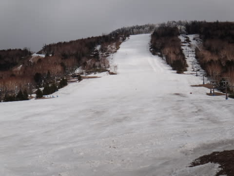

こっちは4連休最終日まで，余裕でもちそうですね～．

## 💬 コメント一覧

### 💬 コメント by (komu)
**タイトル**: Unknown
**投稿日**: 2013-05-03 03:45:54

連日お付き合いきただきありがとうございました。本当に最高のコンディションでしたね。これも日頃の行いでしょう。(￣^￣)

GW後半も楽しんでくださいね。

### 💬 コメント by (Skier_S)
**タイトル**: komuさま
**投稿日**: 2013-05-03 19:10:20

こちらこそ，お付き合いありがとうございました～

超めぐまれた2日間でしたね！

今日も，先日ほどではないけど比較的よかったですよ～

また，ご一緒しましょう！

### 💬 コメント by (komu)
**タイトル**: Unknown
**投稿日**: 2013-05-03 19:42:49

今日も良かったですか…

こちらは横浜のパレードを見に行きました。暑くて昨日との温度差でストレスゲージがマックスになり…

明日は志賀高原行く事にしました＼(^o^)／

はU+2048（；゜０゜）猿志賀病に感染したかも…

### 💬 コメント by (Skier_S)
**タイトル**: komuさま
**投稿日**: 2013-05-03 20:24:45

いやー

サル志賀病，発病しましたか（笑） ．

今日は良かったとはいえ，昨日ほどではなかったので…

でも，明日は早朝は最高のコンディションでしょうが，

残念ながら，昼前にはストップスノーになってしまう，

平均的GWのコンディションになるかと思われ…

先日のあの幸せコンディションは，「夢だった」と思い込んで

お越しになられることをお勧めします(汗） ．

