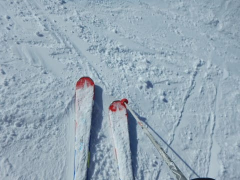
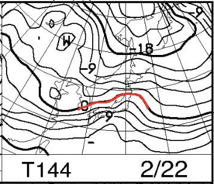

# 2019/2/17(日)の志賀高原，速報モード…予想通りの午前曇り，午後は晴れの天気．冷え冷え雪質最高の，恵まれた一日！

📅 投稿日時: 2019-02-18 01:18:05

🏷️ カテゴリ: [2019スキー滑走日記](c3e4496fc0fb7f9c17ff21214a35b1ace.md)

ってなことで．

本日も，リフト営業終了までしっかり滑り．

帰宅したら，もう日付が変わる頃な

わけで（涙）．

そうです．

本日も，日曜深夜恒例の速報モードにて．

今日の志賀高原の状況をお送りします…

えー．

まず．

リフト営業開始前はそこそこの

雪降りだった本日．

あさイチのゲレンデは，圧雪の上に

5cmほどの軽い雪が乗った，

いいコンディションでスタート！

午前中は大体曇り空だったものの．

ゴンドラ営業開始直後から，

雲が時折薄くなり，うっすら日も射す

タイミングもあり…

そして，予想通り．

昼前には，時折青空がのぞくように

なってきて…

ふはははは！

予想通り，午後には見事に

晴れました～！！！

晴れたのに，気温は冷え冷えで．

雪質は最高！！

いや…シアワセ…

晴天でのスキー，最高…

午後は，急斜面はところどころ

凸凹になってたところもあったけど．

急斜面以外は夕方までフラットで．

リフトストップまで，グッドコンディションな

一日を堪能できたのでした…

あぁ…

今日は良かったなぁ…

毎週こんな週末だったらいいのに…

…だがしかし．

20日，水曜朝の天気図を見ると…

ううむ？？

そして…

…ダメだ（涙）

このBlog読者なら，この天気図の

ヤバさが分かるはず．

…ヤバい．

これは，ヤバいよ！！

…さらに．

うげげ！？？？

…これは．

水曜夜と，金曜夜．

ダブルで液体攻撃を食らうのかっ！？？？（涙）

…来週，25日以降は，さらに気温が上がりそう…

来週火曜，26日の850hpaの0℃線を見ると．

（このBlogではめったに使わない，[FEAS24](http://www.jma.go.jp/jp/metcht/pdf/kosou/feas524_00.pdf)という天気図．[ここ](http://www.jma.go.jp/jp/metcht/suuchi.html)からたどれます）

はうぁ…

ダメだ．

0℃線が，東北地方北部まで上がってる…（泣）

もしかしたら．

冷え冷え晴天の，最高の週末は．

今シーズンは，これでほぼ

打ち止めなのかもしれない…（泣）

…いや．

そんなことは無い！

これからこのBlog読者全員の

総力を集めた，

「冷え冷え踊りver.2019…

　2月下旬はヤバそうだけど，

　3月に入ると激冷えになり，

　GWまで冷え冷えをもたらす

　熱烈な踊り」

によって．

3月以降はGWまでずっと氷点下が続き，

冷え冷え最高の雪が続くはず

なのだっ！！←だから，そうなったらもう異常気象だから

## 💬 コメント一覧

### 💬 コメント by (大阪のS)
**タイトル**: Unknown
**投稿日**: 2019-02-18 07:04:45

３年ほど前から、毎朝ブログ拝見しています。昨日は初めてお話をさせていただきましたが、初対面の相手でも気さくに応対してくださるSさんの人柄に、感謝感激でした。本当にありがとうございました。

いただいたステッカー、どこに貼ろうか思案中です。

### 💬 コメント by (tomorrow)
**タイトル**: Unknown
**投稿日**: 2019-02-18 08:18:56

こんにちは。

日曜日、最高でした！

楽しすぎて身体が悲鳴をあげています。

第1ゴンドラ前でしっかりと手を合わせておきました。

そういえば、帰りに宿のロビーで恐ろしい会話がされていました。

・ゲレンデで車のキーを落とした。自宅からスペアキーを持ってきてもらうから急遽もう一泊。

・エンジンがかからない（ディーゼル車）燃料が凍ったみたい。

人ごとながら肝を冷やします。

今週末は野沢温泉に行きます。

雨が降りませんようにと祈るばかりです。

### 💬 コメント by (そら)
**タイトル**: Unknown
**投稿日**: 2019-02-18 12:23:26

日曜に1ゴンで、お話しさせていただきました、上が水色のウエア着ていた者です。何度かお見かけしていたのですが、やっとご挨拶が出来ました！

ありがとうございました。

いつも小学3年生の娘と一緒にヤケビに通っており、昨日はちょうど娘がトイレ休憩していて、スキーヤーSさんにお会い出来なかったのすごく残念がっておりました。

ステッカーもありがとうございました。早速貼らさせていただきます。

またお会いするの楽しみにしてます！！

### 💬 コメント by (若杉勲71)
**タイトル**: Unknown
**投稿日**: 2019-02-18 15:58:09

志賀高原情報

本月曜日の志賀はレインボーの時刻までずっと、締まってとても滑りやすくお日様との対話も楽しめる最高の日でした。

でも、レインボー（２時）の帰路、高天原0ど、蓮池4ど、上林6ど。道路に川ができて流れてる。川なら鮎がいないのか。４月はどうなるんだ。などとぶつぶつつぶやきながら、春の暖かい日差しに包まれて、ビールが待つ湯田中に帰ったのでありました。滑り方のイロハがわかりかけた今年は、頭から鮎が吹っ飛んで、スキー一色に染まっていく自分に、大満足しています。sさんのおよそ人間では無理であるはずの強行軍が、今ではとてもよく理解できます。

### 💬 コメント by (michi)
**タイトル**: Unknown
**投稿日**: 2019-02-18 17:59:13

2日間お疲れ様でした。

土曜は最高の圧雪で昨日は遠足ととても楽しかったですね。Sさんとゆっくり食事なんて根曲りの時以来でしょうか（爆）

とりあえず今週、液体が降らないことを祈るばかりです。

また宜しくお願いします。

### 💬 コメント by (しんちゃん)
**タイトル**: 例の踊りを踊り続けています
**投稿日**: 2019-02-18 23:23:34

冷え冷え踊りver.2019を踊り続けています(笑)

今週、ヤケビには液体が降りませぬように・・・

そしてＧＷまで雪がもちますように・・・

情報です。

2/24（日）21:00～ＢＳフジで「私をスキーに連れてって」が放映されるようです。あれから31年経つんですね。

あのときはヤケビにもあふれるぐらい客も雪もリフトもありましたね(^^;

### 💬 コメント by (Goku)
**タイトル**: なんてこった！
**投稿日**: 2019-02-18 23:41:45

あ～なんてこった！

あんな素晴らしいコンディションがまた雨で台無しになるのか・・・

それはそうと、２日間お疲れさまでした～♪

今回の集団遠足で、子供たち遠足が病みつきになるのではないでしょうか！

実は大人も楽しめましたよね。

またやりましょう！

### 💬 コメント by (もりや)
**タイトル**: Unknown
**投稿日**: 2019-02-19 00:41:56

昨日はお世話になりました！10人での遠足凄く楽しかったです(笑)子供達も普段と違うコースを滑って凄く楽しかったようで、病みつきになりそうです。子供達5人でテーブルを囲んでワイワイしながらの昼食も楽しかったらしく、また皆んなで遠足しようとの事です。来月の子供の日は、また遠足ですかねぇ(笑)

### 💬 コメント by (Skier_S)
**タイトル**: 今週末もいいコンディションが続きますように…
**投稿日**: 2019-02-19 02:12:44

＞大阪のSさま

コメントありがとうございます！

最後の駐車場でまたお会いできましたね(笑)．

銀のお札は，道具を買い替えたなどで

新しいのが必要な場合は，またお会いした時に

追加でお渡しできますので，いろんなものに

貼ってやってください～！

＞tomorrowさま

うわ…

ゲレンデに鍵を落とすのはたまりませんね…

そして．

軽油が凍るのも，ディーゼル乗りの恐怖ですよね…

でも，日曜は最高でしたね！

今週末は野沢ですか．

楽しんできてください～！

…でも，やっぱり志賀がいいですよ，と言っておく(笑)．

＞そらさま

コメントありがとうございます！

娘さんとお会いできなくて残念でした…

ちょうど焼額を脱出する時だったので，

タイミングが悪かったですね…（残念）

普段なら，あのままもう一度1ゴンに乗るのですが…

また，志賀にお越しの際は娘さんにもお会いしたいです．

娘さんに，よろしくお伝えください～！

＞若杉さま

これから水曜朝まで，気温が高い日が続きます…（涙）

火曜はもっと気温が上がりますよ（泣）．

しかし，若杉さんの頭から鮎が吹き飛ぶとは，

よっぽどのスキーに対する目覚めがあったのでしょうか！？？？

＞michiさま

2日間，お世話になりました～！

日曜は楽しすぎましたね．

今週末もいいコンディションが続いて欲しいものです…

とりあえず，火曜夜～水曜の雨がひどくならず，金曜夜が雨じゃなく雪になるように．

踊りましょう！

＞しんちゃんさま

わたスキ，もう31年も経つんですか…

確か，昭和最後の年に第2ゴンドラ，第1，2，3高速，第4ロマンスが同時に完成したという，

すごいバブリーな時期だったので．

わたスキは，ちょうどその直後だったんですね…

今はもうその当時の半分しかリフトが残ってませんね…（涙）

第3ロマンスと第1高速，復活してほしい…

＞Gokuさま

2日間お疲れ様でした～！！

日曜は子守り（？）ありがとうございました！

でも，コンディションも良く，楽しい一日でしたね．

この好コンディションが今週末も続くよう…

踊りましょう！

＞もりやさま

10人の大人数だと，普通は大人だけでも結構待ったり

するところ．

今回は小学校1年生を含め，全員がほぼ同じペースという，

