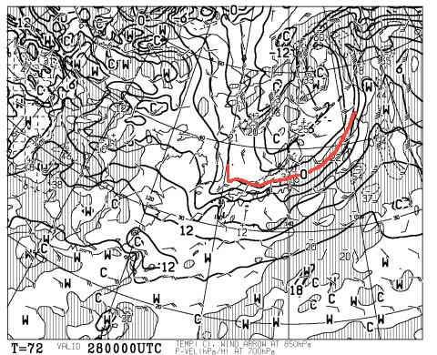
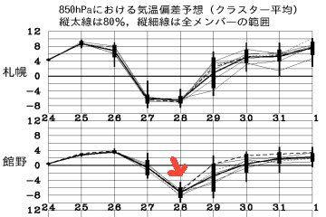
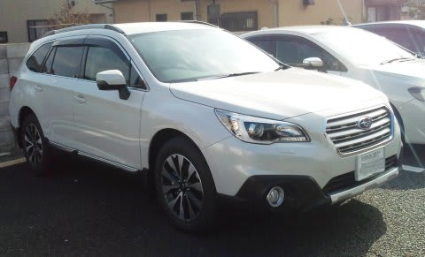
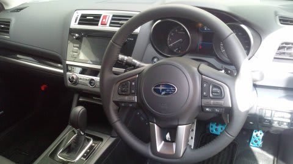

# 昨日発表の新型レガシィに乗ってみた…レポートは後日！

📅 投稿日時: 2014-10-25 23:38:42

🏷️ カテゴリ: [日記](cc4b5682fb7b8b144980957a978653fb0.md)

ということで．

予告通り，

明日，イエティに行くわけですが．

…なんだか．

明日のイエティ．

…雨になるかも…（涙）

まー，今のところ．

降っても「ぽつぽつ」程度だろうなぁ，

とは思ってますが．

少なくとも，太陽は拝めなさそう…

まぁ，多少曇ったり降ったりした方が，

空いていていいに違いない！！！

と．

むりやりポジティブシンキングをしてみる．

あー．

そうそう．

天気と言えば．

28日の天気図をみたところ…

ふむむ！！

な，なんと！

10月なのに，850hpaの0度線が，信州まで

降りてきてるよ！！！！

これは…

27日夜から28日にかけては，日本中のスキー場で

積雪の便りが聞けそうですよっ！！！！

特に，北海道．

これは…吹雪レベルかも…．

かなり積もりそうな気配…

…でも．

こんな感じで，28日は平年比-8度と，異常に冷えますが．

29日からは，もう平年通りに戻っちゃいます．

寒いのは，一日だけです．

雪も，あっという間に融けちゃいます…

過剰な期待はしないほうが身のためです（笑）

…ってことで．

さてさて．

本題をば．

昨日，24日発表だった，新型レガシィ．

今日から試乗開始だった試乗車．

本日朝イチ，開店時にスバルに行ってきて．

第1号で乗ってきました～

乗ってきたのは，アウトバックの高いほうの

グレードのやつでしたけど．

「うちのディーラーで，Sさんが

　新型レガシィに試乗するお客さん第1号です」

と，乗り込んだピカピカの運転席．

…見た目も乗った感じも．

BRレガシィと比べ，結構な高級車になりましたね～

詳細は後日レポートしますけど．

コーナーをガシガシ攻める車ではなく．

高速を超安定してロングクルーズする車，

って感じかな．

ステアリングの触感，各部の操作感を含む

タッチ＆フィールに，高度な作りこみを感じました…

（この作りこみ感や足のブッシュの感じなど，

トヨタ車的になったかも…）

室内の広さは，後席の広さを含めて，

私が乗っているBRレガシィとほぼ同じ感じ．

…外の見た目は，BRレガシィより

かなりデカいんですけどね～．

ってことで．

また，詳細なレポートは後日…

では，明日イエティに行ってきます～

＃雨が降らなきゃいいな…（願）
