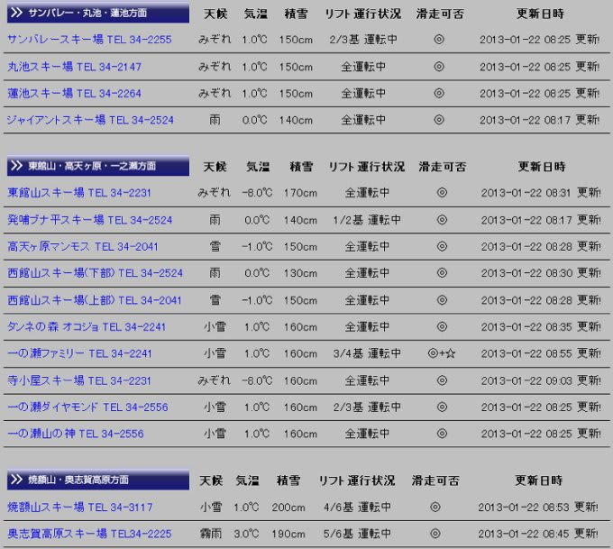
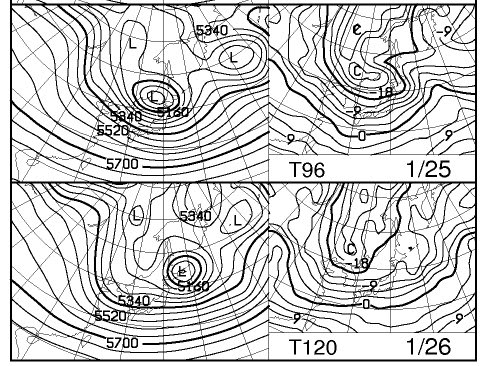
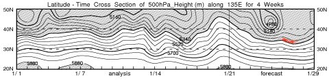
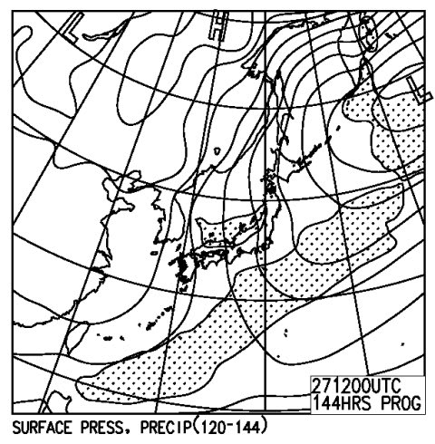
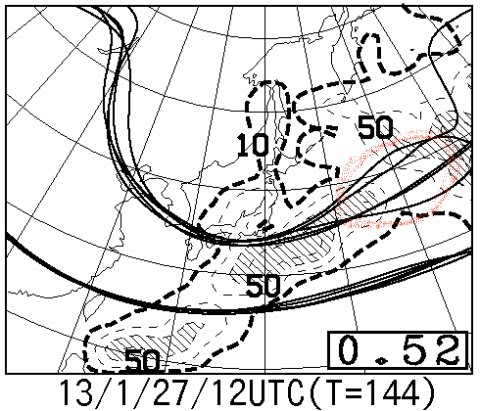

# 定例！今週末の志賀高原の天気は…？

📅 投稿日時: 2013-01-23 01:10:44

あー．

なんだか．昨日．

…志賀でも昼前に雨が降るかも…

って書いたのが，残念ながらあたっちゃったみたいで…

今朝の志賀高原は，こんな感じで…

かなりのエリアで雨かみぞれ(涙)．

い，祈りが足りなかったか…

せっかく，この週末は冷えていい雪が降って，ゲレンデ状況が改善したと思ったのにっ！

また，アイスバーンに戻っちゃうのか？？

…ってことで．

緑の板のインプレッションを待っている人も多いかと思いますが．

とりあえず．

今日のところは，今週末の天気予想をしてみましょうか…

まずは，いつものようにFXXN519を見てみましょうかね～．

…うむ？

これは．

ひ，冷える．

週末前の金曜日，25日から．

冷えるよっ！

信州に，850hpaでマイナス9度以下のかなり冷たい空気が入ってます…

それ以前に，25日．

北海道の西にある，500hpa4980mって…これは，かなり強烈．

そして．

週末の，26，27日にかけて．

網掛け部分の5400mの等高度線．

赤くマークした部分が，北緯35度より南に下がってます…

これは，かなりの雪が期待できるところ．

さらに…

27日の地上天気図は，見事な縦縞．

降りそうですね～っ！！

ってことで．

このまま行けば．

…あくまで，このまま行けば．

週末は，パウダー祭りか…？？

で．

FZCX50を見ると…

27日は，スプレッドが0.52と比較的大きな値なので．

まだ，この日の予想の精度がそれほど高くない印象を受けますが．

基本的に，クラスタ平均間がばらついているのは，赤く記した日本の東側部分．

日本がすっぽりトラフに囲まれるって予想は，ばらついてません．

…

ってことは．

おそらく．

26，27日の週末は．

超冷えて，がんがん積もるパウダー祭りになりそう…

…ただし．

寒いし天気が悪いし視界は悪いでしょう．

そして，昼間ももさもさ雪が積もる一日になるかと思います…

でも．

パウダー好きにとっては，待ちに待った週末になりそうな予感ですっ！！！

＃明後日にもう一度，直前予想をアップする予定．
