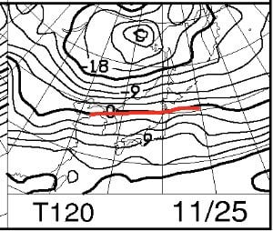
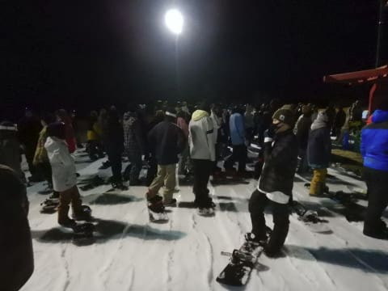

# 2020/11/21(土)のイエティのゲレンデ状況速報…3連休にしてはリフト待ち5分程度とそれほど混まず，暖かい一日だったよ

📅 投稿日時: 2020-11-22 03:25:44

🏷️ カテゴリ: [2021スキー滑走日記](c2b0fc073d6357d3b786f6ca655147f7d.md)

やはり．

横手は21日土曜日は，朝のうち何とか

人工降雪機が動かせたようですが…

予想通り，午後はほとんど降雪機が動かせず，

22日の営業は諦めたようです…（涙）

（[横手山スキー場ホームページ](https://yokoteyama2307.com/news/11202/)より）

とりあえず，横手山は23日のオープンを

目指すと言ってますが…

熊の湯も全然無理っぽいし．

うーん．やっぱりこの3連休でのオープンは

厳しそうな予感…

念のため，改めて最新の22日の850hpa

気温図を確認しておくと．

…志賀には水色の+6℃線がかかるレベル（泣）

連休中日の22日は，とても人工降雪機が

動かせると思えません(涙）

21日の夜のうちの冷え込みで，

多少人工雪が打てるかもしれませんが，

22日の昼間の人工降雪は無理．

23日のオープンは期待しない方が

良さそうです…（泣）

そして，23日の850hpa気温図は…

この日は，何とか赤い0℃線が，

志賀近辺まで下りて来てくれてます！

これなら…標高が高い志賀高原，

昼間もギリギリ人工降雪機が

動かせそうです！

そして，3連休明けの24日の

850hpa気温図をみると…

この日も，何とかぎりぎり志賀高原に0℃線が

かかっているので．

標高が高い横手は，24日も終日人工雪が

打てるかな？

ということなので．

横手山は連休最終日，23日の人工降雪で

ギリギリ24日にオープンできる可能性も

あるかも…？？

このまま行ってくれれば，何とか

24日の降雪で，25日にはオープンして

くれそうな感じ．

でも，熊の湯はあと1日か2日の降雪で

オープンは厳しいかな…？

その後，25日は…

うむ．志賀高原には，+6℃線が近づいている

くらいなので，この日は人工降雪は無理(涙）．

そして，26日も…

+3℃線が志賀より北にあるようなので，

このままだと人工降雪は難しいか…

で，27日は．

うーむ．ちょっとは志賀に赤い0℃線が

近づいてますが．

まだ志賀は+3℃線が近いレベルなので，

人工降雪は打てても夜だけ．

昼間はこの予想図が正しければ，人工降雪は

無理でしょう．

やっと28日になって，赤い0℃線が

志賀高原まで下がってきます．

28日以降は冷え込みそうです！！

ということで．

22日：人工降雪無理・天然雪無し．

23日：昼間も人工降雪可能！朝うっすら天然雪あり

24日：昼間も人工降雪できそう．天然雪無し

25日：人工降雪無理

26，27日：夜なんとか人工降雪可能か．

　昼間は人工降雪ギリギリ可能かどうか…

　標高が低いところは無理．天然雪無し

28日：冷える．人工降雪終日OK！天然雪もちょっとありそう

…と，今の天気図を基に予想できるのですが．

ただ，下の図の水色矢印に示したように

27日前後は予想ばらつきが大きいので．

もしかすると26，27日も冷えて，

人工降雪が打てる可能性にかすかに

期待が…←予想より気温が上がる可能性もあるけど

というより．

冷える．

私が温まれホカホカ踊りの踊り手を抹消するので，

冷えると信じようっ！！！

てなことで，本題へ．

本日も朝からYetiで滑ってきました～！

…今日も帰宅が夜遅く．

いろいろやっているとこんな時間に

なっちゃったので，速報モードにて…

えー．

まず．

あさイチは晴れ！

そして…バーンはいい感じで硫安が効いた，

今シーズン一番に締まったいいバーン！

3連休というのに，朝の30分ほどは

人も少なく，いい感じで飛ばせます！

けど…

やっぱりいつも通り，10時ごろには

人があふれる廊下ゲレンデになっちゃい

ました（涙）

でも，金曜の雨＆高温にもめげず，

ゲレンデは先週よりわずかに幅も

広がり，穴が開いているところも

全然なかったのがすごい！

リフト待ちは，クワッドとペアの2本とも

動いてくれたので，クワッドリフトは平均的に

この程度，5分待ちくらいの感じで．

ペアリフトは待ち0だったので，

…3連休としてはそれほど激込み

リフト待ちじゃなく，かなり

恵まれてたんじゃないかな？

…まぁ，リフト待ちは少ないけど．

コース上は…

ちょっと快適というには，人口密度が

高すぎたかも…

今日の気温は結構高く，昼間はウェアの

ジャケットを着てると暑く感じる時も

あるほどで，

日が当たっている時は，板の滑りがちょっと

悪めだったのも惜しい感じ…

ってことで．

冷えて雪が良くなるだろうことを期待し，

ナイターもちょっと参戦しましたが…

さすが3連休，ナイターも人口密度が

高いんですが…(涙）

昼間同等か，それ以上のリフト待ち

だったので，早々に退散しました…

とりあえず，いつも通り，Yetiレポート定番の

コース状況の動画を最後につけておきます．

午後1時半ごろの動画ですね…

明日は3連休中日だから，

もっと混むんだろうなぁ…

## 💬 コメント一覧

### 💬 コメント by (かず)
**タイトル**: Unknown
**投稿日**: 2020-11-22 18:26:19

シーズン直前なので完全自粛で自宅Bです なんかGOTOバタバタですね…地域別になんてなったら余計に長野集中で悲惨な状況になりそうで恐ろしい…

もうシーズン前に完全中止が安心ですよ

### 💬 コメント by (Skier_S)
**タイトル**: ＞かずさま
**投稿日**: 2020-11-22 23:49:29

GoToバタバタですね…

とりあえず，GoTo見直しもいろいろ影響がありそうですが，

また移動が禁止されないかどうかの方が心配です…

