# 気象庁3か月予報が出たよ！…え！？ラニーニャが終わりかなり強いエルニーニョに！？？次のスキーシーズンは暖冬なのか？

📅 投稿日時: 2023-08-01 02:20:49

ということで．

皆さんお待ちかねの，気象庁の

全般季節予報支援資料３か月予報

が，7月25日に発表になりました～！！←いや，皆さんお待ちかねって…

そんな資料があることすら知らない人がほとんどだから…

まぁ，スキーシーズンにほぼ関係のない

8，9，10月の長期予想ですが，

私にとって10月下旬は，もうスキーシーズンが

始まる時期でもありますし．

資料をしっかり読み解けば，シーズンに

突入する11月以降どうなりそうかわかるかも…

ということで，今回はこの3か月予報資料，

[FCXX93](https://www.sunny-spot.net/chart/FCXX93.pdf)を，ざっくり読み解いてみました…！

…ただ，夏の天気がよくわからない私には，

上手く説明できない不思議な予想だったの

ですが…

まぁ，ぶっちゃけまとめていうと．

ラニーニャが終わって，エルニーニョに突入している

ということですね．

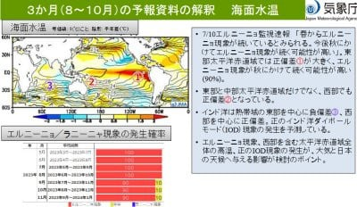

上のページの下のほうのグラフを

拡大してみると．

昨年はラニーニャが続いていたけど，

今年の3月からはすでにエルニーニョに

切り替わって，グラフはエルニーニョを

示す真っ赤に染まっており．

今年の3月から来年の1月まで，

エルニーニョが継続する確率が

90～100％と，来年までエルニーニョが

続くことが確実

…という予想でした…

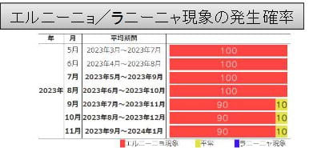

この下のグラフで，

水色領域がラニーニャ，赤色の領域が

エルニーニョなんですが…

赤く丸をした今年の1月にはすでに

ラニーニャが終わり，3月から4月には

エルニーニョに突入していたようです…

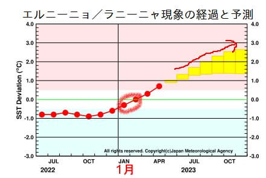

えー．

ご存じの方も多いと思いますが．

エルニーニョの6～8月の東日本．

平年より気温が低くなる確率が45％で，

エルニーニョは冷夏となることが多く…

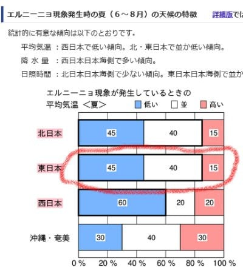

（以下，気象庁 [エルニーニョ/ラニーニャ現象に関する知識 > エルニーニョ現象発生時の天候の特徴](https://www.data.jma.go.jp/cpd/data/elnino/learning/tenkou/nihon1.html)　ページより）

そして，エルニーニョの冬は．

平年より高温になる確率が42％で，

例年より暖冬になる可能性が高いという．

エルニーニョとは，スキーヤー殺しの

気象条件です…！（涙）

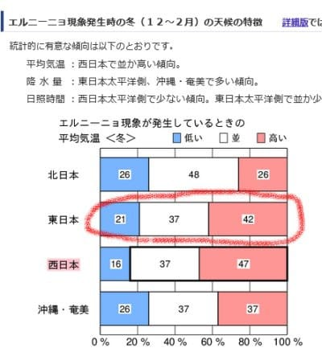

そう…

最近のエルニーニョで思い出すのは．

悪い意味での伝説となった2016シーズン．

過去のエルニーニョ・ラニーニャの

状況を見ると．

2015年夏は，エルニーニョ監視海域(ペルー沖)の

海水温度が平年比＋3℃まで上がった，歴史上

ほとんどないような強烈なエルニーニョ

だったわけで…

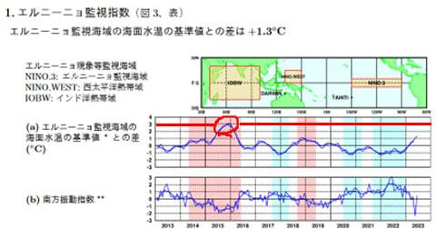

（以下，気象庁　[エルニーニョ/ラニーニャ現象に関するデータ > 監視指数](https://www.data.jma.go.jp/cpd/data/elnino/index/dattab.html)　ページより）

その次の冬の2016シーズンは，

志賀高原でも40年以上ぶりという

激烈な雪不足により．

正月休みでもゲレンデは全面オープンに

ならず…

（2015/12/30の焼額オリンピックコース）

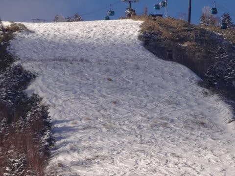

そして，4月20日過ぎには，すでに一ノ瀬

ファミリーがこんな状態になっていたという，

史上最低のシーズン．

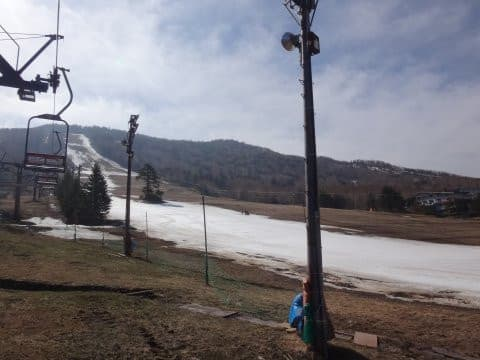

これからのエルニーニョ予測の，

右側上の矢印に書いたように…

予想の最大値付近で遷移したら，

2016シーズンを思い出させる，

平年比＋3℃近い温度になっちゃうんですが…！！！

とはいえ．

この夏の予報は，エルニーニョにしては不思議な

予想になってます．

本来ならエルニーニョって，下の図に示すように

冷夏になるはずが．

この3か月予報を見ると．

なぜか平年より気温が高くなる

傾向の予想になってますね…？

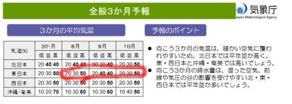

なんでだろ…？

と，いろいろ資料を読み解いてみたところ…

え？？

この夏の200hpa速度ポテンシャル．

発散傾向の中心が太平洋の西岸，

インドネシア近辺なんですが！？？

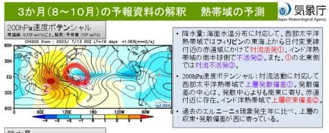

いや．

専門的に言えば…

対流活発(上昇気流＝雲がいっぱい発生する)になる

ところが発散傾向（気象庁では速度ポテンシャル「マイナス」と定義)，

下降気流が発生して地上で高気圧になるところが

収束傾向（気象庁では速度ポテンシャル「プラス」と定義）

なので．

下の図にあるように，本来エルニーニョの

年は，インドネシア付近より太平洋中心に

寄った，もう少し東寄りに対流活発領域が

できるはずで．

インドネシア付近に水色の対流活発

領域があるってのは，エルニーニョ特有の

気象状態が表れていないってことなんですが…？？

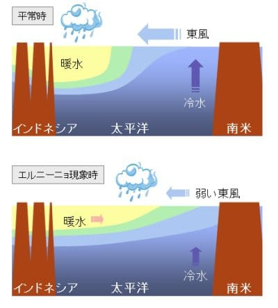

（気象庁　[エルニーニョ/ラニーニャ現象に関する知識 > エルニーニョ/ラニーニャ現象とは](https://www.data.jma.go.jp/cpd/data/elnino/learning/faq/whatiselnino.html)　ページより）

右側の説明文にも，赤線で書いたように．

過去のエルニーニョに比べて，収束・

発散偏差が西に寄ってるって書いてあるし…

これ，エルニーニョ時の気象現象と違うよ！？？

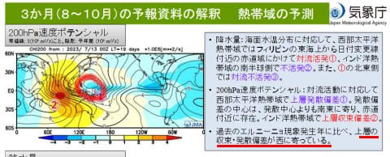

うーん．

エルニーニョは，日本の南東に対流活発→低圧域が

できるので，日本の東海上の暑い太平洋高気圧が

日本付近まで延びるのを妨げて，冷夏に

なるんですが…

今年は，例年のエルニーニョの冷夏と違って，

対流活発域が西にずれるので，太平洋高気圧の

西への張り出しが強く，日本付近まで

伸びるので，夏の気温が上がる予想みたいです…

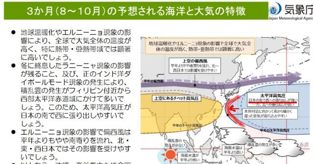

ってなことは．

この夏は，エルニーニョなのに，例年と違って

暑い夏になっちゃうということは…

エルニーニョの冬は本来なら暖冬になる

傾向のはずだけど…

この冬は，例年のエルニーニョの予想と違って，

寒い冬になるのかも…！！！（期待）

いや．

エルニーニョなのに，例年と違って

酷暑にやられた上に，

冬だけ例年通りの暖冬になったりしたら

暴れる．

それも，例年に比べて＋3℃という，

2016シーズンに近いエルニーニョに

なりそうな予想通り，

40年に一度クラスの暖冬が，わずか8年で

やってきたら，全力で暴れる．

次の冬は，スキー場殺しの暖冬に

なりませんように…（全身全霊での祈願）

## 💬 コメント一覧

### 💬 コメント by (huyuko)
**タイトル**: Unknown
**投稿日**: 2023-08-07 12:08:54

天気情報をわかりやすくご説明いただき、ありがとうございました。普通のエルニーニョとは違うということですね。気温自体はどちらでもいいですが、積雪量が多くしっかり寒気が居座って、寒暖の差が少ない冬になることを祈るばかりです。

山歩きをハイスピードでする体力はないのすが、軽くてグリップのよい靴の情報は参考になります。これからもよろしくお願いします。

### 💬 コメント by (Skier_S)
**タイトル**: ＞huyukoさま
**投稿日**: 2023-08-09 04:23:00

コメント回答遅れました～！

コメントありがとうございます．

今年のエルニーニョは，ちょっといつものエルニーニョとは違ってますね…

冬もいつもと違って，スキー場にたっぷり雪が積もるいい冬になることを祈るばかりです．

またこれからもいろんな情報載せていきますので，今後もご愛読のほどお願いします～！

