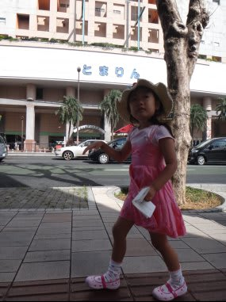
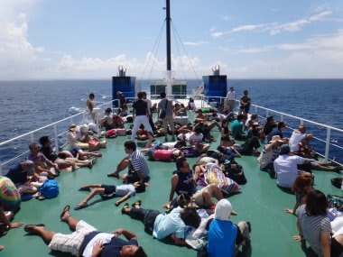
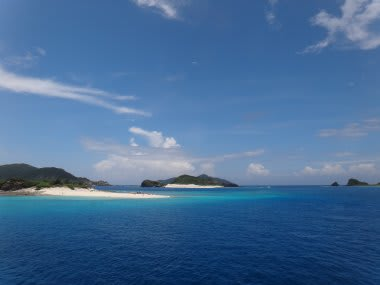
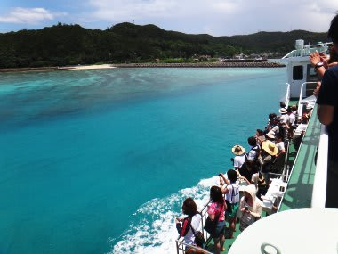
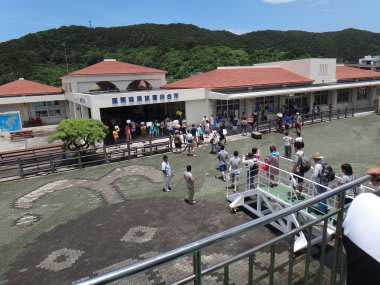
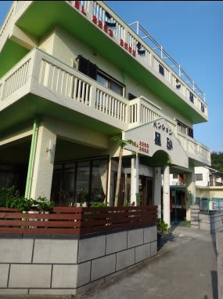
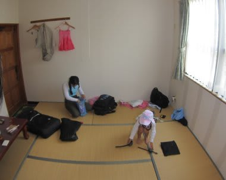

# 2012年7月　子連れ座間味ダイビング旅行記2　慶良間へ

📅 投稿日時: 2012-07-28 00:55:00

そして．

旅行2日目の朝…

今日も天気は晴天．

絶好のダイビング日和になりそうですな．

座間味に向かうため．ホテル目の前の泊港から，

朝10時発のフェリーに乗り込むわけですが．

乗り物好きの娘は「お船！お船！」

…ウキウキでございます．

さすが3連休だけあって，出港30分前の9時半に乗船したのにすごい激込み！

娘と妻は座れたけど，私は満席で座れなかったので，

トップデッキへ．

トップデッキはこんな感じで．

座れなかった人たちがあふれてて．

…なんだか，端的に言うとあれですか．「難民船」って感じなんですけど．

こんな中，1時間半，炎天下を揺られていくと…

慶良間諸島が見えてきましたね～．

うーむ．

南の島に来たぞというテンションup!

…娘は乗船時間，ほとんど寝てたみたいですね．

船酔いとかもせず，ホントに旅行連れて行くのに楽な娘だこと…

んで．

12時に座間味港へ到着！

フェリーを降りて，宿へ向かいます．

今年も，座間味でお世話になるのは，港から徒歩2分ほどの，

ペンション星砂さん．

[去年はバス・トイレつきの部屋だった](e04d95a72d23adb38fa8af62838909106.md)けど．

今年は単なる和室にしてみました．

もう，娘も一人でトイレに行けるし，トイレつきの

部屋じゃなくても良くなりました．

バス・トイレなしの和室なら2食付6500円と安いので，これで十分！

ホントに，子連れ旅行がだんだん楽になっていく…

で．

午後1時半にダイビングへ出発なので，あわてて那覇で買い込んだ

お弁当をかきこんで，ダイビング機材やら水中カメラの準備やらを

済ませ，娘を水着に着替えさせ…

いざ，本題の慶良間の海へ！
