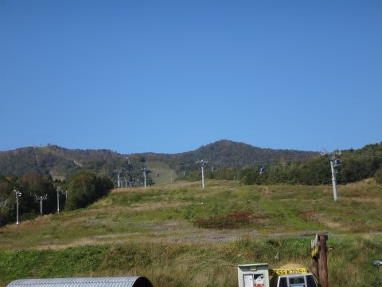
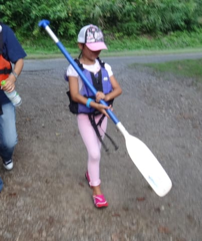
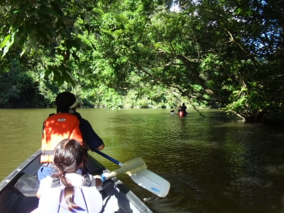

# ファミリーキャンプとやらをやってみた，…千葉県ACフルーツ村　その4

📅 投稿日時: 2015-09-25 02:48:02

🏷️ カテゴリ: [登山・旅行](c1d637a11a25b457ac978d197adbdafc5.md)

あー．

シルバーウィークも終わっちゃいましたが．

このシルバーウィーク．

懲りずに，またこんなようなところを巡ってきました．

あー．

…この写真だけでどこだかわかる人がいたら，

その人は超能力者か，常識をかなり逸脱したマニアですね（笑）．

読者の人でどこだか分かった人がいたらコメントください．

正解者へのプレゼントとして，思いっきり褒め称えてあげます←それだけか！

…しかし，最近は旅行記を書く以上のペースで

いろんなところに行ってる気が…

まだ，去年のパラオの旅行記も途中だし．

フィリピン・モアルボアルの旅行記も書いてないし．

んで．今回の，このシルバーウィーク旅行なわけだ．

…でも，今回．

そんなに面白いネタもないので，

この旅行記を書くとお金がもらえるとか，

スキーがうまくなるとか（なぜ？？），

直木賞がもらえるとか（なんのこっちゃ？），

何か，そういう強烈なモチベーションが

無いと，書かない気がする…

って，シルバーウィークから復帰の報告の後は．

引き続き，ファミリーキャンプ報告へ，Go!

----

ということで．

タープとテントの設営にひと段落着いたら．

もう，午後2時前ですね～．

今回のキャンプ場へのチェックイン時．

午後2時からのカヤックツアーを申し込んでおいたので．

いざ，カヤックツアーへ…

このカヤックツアー，川沿いにあるこのキャンプ場の

売りの一つで．

カヤック1艘，1時間1500円でレンタルして

自然を満喫できるというのが魅力！

…一人1500円じゃないですよ．

1艘1500円．

結構お安い…っ！！

とりあえず，2時にフロントで受付すると…

ライフベストとパドルを渡されます．

パドルをもって，川辺に下りると．

キャンプ場の管理人さんから，簡単な説明を受けますが…

ふむふむ．

ガイドは無しで，好き勝手に行っていいのね…

で．おすすめコースは，ここから下流に20分ちょっと漕ぐと

橋が見えるから，そこで戻ってくれば大体1時間コースなのか…

うむ．

北関東の豪雨の直後だったので，水は多いなぁ…

木が水に浸かってるよ．

んでは，カヤックツアーへしゅっぱーつ！！

川自体は，こんな感じで．

ダム湖の上流の端に当たるところなので．

流れは全くなく．

川…というより，すごく細長い湖だな，こりゃ…

流れに逆らって漕いだりする必要はなく，

子連れには最高のカヤックコースじゃなかろうか？？

…水がもう少しきれいだったら最高だけど．

でも，木の枝が張り出した下をゆっくり通ったり…

水面に映る山々の景色を眺めつつ．

周りにほとんど人工物の見えない，

喧騒から全く切り離された，静かな川面を．

ゆっくりと漂えるのは，ゼイタクと言えよう…

うむ．

これだけで，このキャンプ場を選ぶ甲斐はあったというもの！！

さらに，ガイドもなく，自分の好きなペースでのんびりと

進んでいけるので．

…これは，子連れに最高だな…

ってことで．

家族3人の共同作業で水面を進むこと，1時間．

キャンプ場へ戻ってきました…

あっという間の1時間．

いやー．予想以上に満足！

娘も「また乗りたい～！明日も乗りたい～！」

ってことで．

意外と楽しかった，カヤックツアーだったのでした．

## 💬 コメント一覧

### 💬 コメント by (マニア)
**タイトル**: Unknown
**投稿日**: 2015-09-25 07:54:49

はじめまして。　1枚目が富良野DH第3リフト、2枚目は、北の峰のボトムで、北の峰ゴンドラと北の峰第1高速リフトだとおもいます。

### 💬 コメント by (Skier_S)
**タイトル**: マニアさま
**投稿日**: 2015-09-26 01:47:58

うぎゃーーっ！！

昔，富良野スキー場でしばらく働いていて，

軽く100日以上は滑っているはずの私でも，

この写真だけでDH第3リフトと判別できないというのに…！！

北の峰も，結構難しいアングルだな～，

と思ってたのに…．

これだけの写真で，DH第3リフトと北の峰ボトム，

正確に当てるとはっ！！！

大正解，大正解ですっ！！！

まさか，こんなにあっさり正解する人が出ようとは…

一体，マニアさんは何者でしょうかっ！？？？

もう，絶賛．約束通り，褒め称えさせていただきます．

素晴らしいっ！！

間違いなく，常軌を逸したマニアですっ！！

私が太鼓判を押しますっ！！

普通の人ではありません！！

（…ホメてるのか？これ？）

