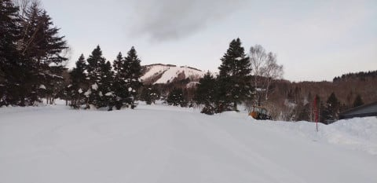
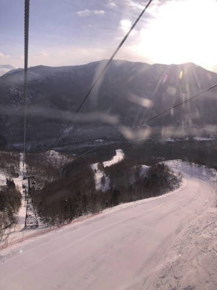
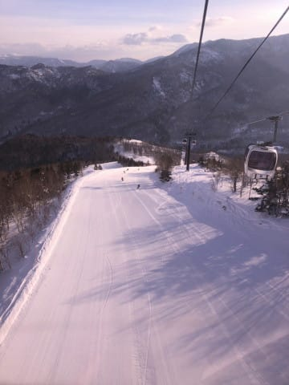
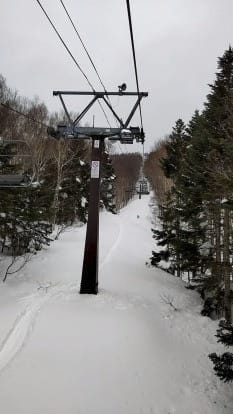
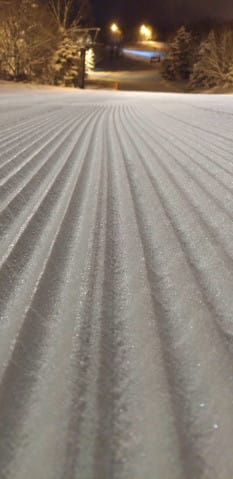

# 2021/1/16(土)の志賀高原スキー場，特派員レポート…朝は晴れ，昼前から重い雪…ナイターは最高だったみたい

📅 投稿日時: 2021-01-17 03:49:26

ということで．

スキーに行かない週末の本日．

午後2時過ぎまで寝ていたSkier_Sです．

さらにその後昼寝までしてしまい，

睡眠時間は十分確保できましたが．

一日が寝ていて終わってしまった…

…スキーをしないと，ストレスフルな仕事に

耐えられない気がする今日この頃．

皆様いかがお過ごしでしょうか．

ということで．

本日も，志賀高原の優秀な特派員から

レポート＆写真が送られてきましたが．

果たして，

今日の志賀高原は槍とミサイルが降ったのか？

見てみましょうか…

…

…晴れだよ(涙）

ってか，私の本来の予想では，朝のうちは晴れ．

そちらの予想が当たったようで，

朝は硬めのいい感じのシマシマだった

ようです…

ただ，晴れていたのは朝のうちだけ．

午後から降る予想だった雪．

意外と午前中から降り始めたようで…

昼過ぎはかなり湿った雪．

午後も雪降りの感じだったようです…

ただ，本日も無事ヤケビナイターは営業

していたようで．

ナイターはいい感じだったみたいです…！！

ぐはぁ…！

このシマシマ．

滑れた人がうらやましい…！！

で．

かなりの西風になってきたので，志賀高原は

意外と明日，日曜の朝までにそれほどの

積雪はなさそうで．

明日の朝は積雪10cmちょっとくらいかな～．

でも，圧雪ゲレンデはいい感じの柔らか

シマシマ圧雪になりそう！

あぁ…滑りたい…

早く緊急事態宣言が解除されることを

全身全霊を込めて祈ってます…

## 💬 コメント一覧

### 💬 コメント by (レインボー73)
**タイトル**: Unknown
**投稿日**: 2021-01-17 12:37:41

日曜日の志賀高原情報

湯田中在住の私に、ヤケビ泊の友人から10cmしか積もらなかったとの、悲報が！　ガーン！

胸弾まして用意しといた太板をしまって、、、

ヤケビブルーとは程遠い曇り空のヤケビへ。

雪は柔らかいながらも、やっぱりヤケビの技術は凄い。シマシマの白樺、カラマツ、イーストを満喫。20000mの友人らと合流して、ゴートゥ銀嶺。

今日のお昼は、ざる蕎麦800円、唐揚げ定食1100円、唐揚げ単品800円、生ビール500円。しかもgo to eat 対応。2割引なので、生ビール中が400円で呑めちゃう。今シーズン44日目で３度目の昼ビール。幸せです。

### 💬 コメント by (ヒータロゥ)
**タイトル**: Unknown
**投稿日**: 2021-01-17 18:37:39

土曜日に参戦しましたが、平日か？と思うくらいガラガラでした。こんな様子ではスキー産業ヤバいです。かといってコロナの拡大防止はしないといけないし本当に悩ましい。

まずは２月７日までに感染が下火になって、緊急事態宣言が終わり、普通にスキーできることを願うばかりです。

### 💬 コメント by (レインボー73)
**タイトル**: Unknown
**投稿日**: 2021-01-17 18:49:47

日曜日の志賀高原情報

昼食後、端にパウダーが残る西館を二本滑り、ゴンドラ経由で雪質を求めて標高の高い寺子屋へ。ここが本日のベスト。

エス様だつたらよだれをたらたら流しながら悶絶してしまいそうな快適バーン。みんな時間を忘れて滑り狂いました。そして気づくといつしか定刻レインボー超え。やめられっこない状況でした。

帰路のファミリーは霧で視界最悪。でも、ヤケビに戻ると、、やっぱりヤケビ！　カラマツも荒れていない。人が少ないから雪面が荒れないのですね。

そうして結局１時間の残業をしてしまう幸せな一日を過ごせたレインボーなのでした。

### 💬 コメント by (ほっぽ)
**タイトル**: 1/17志賀高原
**投稿日**: 2021-01-18 00:04:42

Ｓさん

今週は年１回のロンバケで２４日までスキーです。

今日から志賀高原に参戦、８時の奥ゴンからスタートしてベルグでいちごタルト食べて戻ってきました。

最後の最後に15:30の１ゴンに乗り遅れるという人生最大の危機に遭遇したものの「瞬間移動」で16:00終了の奥ゴンに2本乗ることが出来ました。

明日から週末も奥ゴン8:30営業開始、寺小屋、タンネは平日休業と厳しい状況が続きますが、ヒトリストなので殆ど誰ともしゃべらず、人の少ない時間帯にランチして、感染しない、させないを徹底して１週間過ごします。

本日の滑走レポートはblogにアップしておきました。

http://hoppo.officialblog.jp/

### 💬 コメント by (Skier_S)
**タイトル**: 23，24の週末はヤバそう！
**投稿日**: 2021-01-18 01:43:46

＞レインボー73さま

残念ながら新雪はそれほど積もらなかったようですが，

今日も志賀高原は良かったのですね…

寺子屋，滑ってみたかった…

最近，残業が多くないですか？（笑）

＞ヒータロゥさま

特派員写真見てもガラガラなんですが，やはりかなりヤバい感じ

なんですね…

昨シーズンもスキーシーズンを狙ったように感染拡大していきましたが，

なんとかシーズン中に落ち着いて欲しいです…（祈）

＞ほっぽさま

24日までスキーですか！

いいなぁ…

24日，微妙な天気になりそうですが．

それまでは何とかいいコンディションで滑れると思いますよ~！

