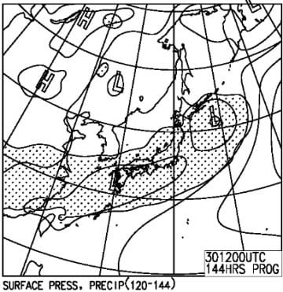
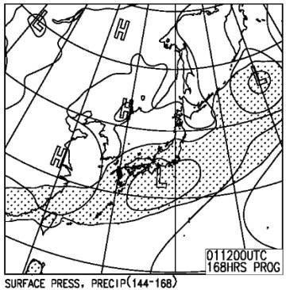
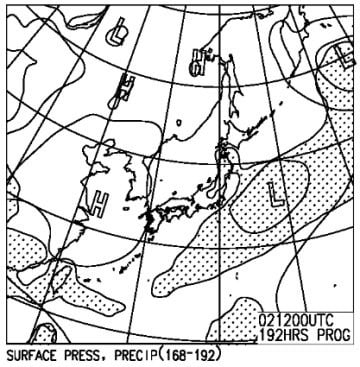

# GW前半の志賀高原の天気予想！…27日は雪！？？28日は冷えていい感じ．29～1日は曇りで暖かめかな．

📅 投稿日時: 2019-04-26 02:49:04

ということで．

先日は帰宅後すぐに意識を失ってしまったため．

遅くなってしまいましたが．

そう．今週末からゴールデンウィーク．

皆様お待ちかねの，GWの天気予想，

行ってみよう！！

…の前に．

焼額山のHPを見てみると．

うむ？？

オリンピックコース，半分だけ

ゲレンデ整備？？

（[焼額山FB](https://www.facebook.com/yakebitaiyama/posts/2144244519004216)より）

一体，どういうこと？？

…と，思っていたところ．

志賀高原特派員より送られてきた

写真を見ると…

うげげげげ～！！

なんじゃこりゃ～っ！！！！

オリンピックコースの斜面変化部分．

コース半分，土が出てきちゃってるん

ですが…！（激涙）

ということで．

オリンピックコース．

明日，金曜日から，完全に非圧雪に

なるようです…（涙）

（[焼額山HP](http://www2.princehotels.co.jp/ski/shiga/)より）

まぁ．

しかし．

昨シーズンは，オリンピックコースは

3月末にクローズになり．

4月14日の段階でこんな感じだったことを

考えれば．

（去年の4/14のオリンピックコース)

GW直前まで，日当たりのいいオリンピックコースが

滑れたというだけでも，かなり恵まれた

シーズンだったのかと…

ってことで．

本題のGWの天気予想です！

…まず．

GW前日，26日金曜日の地上天気図を

見ると…

うーむ．志賀高原に降水域が

かかってますね…

そして．

この日の850hpa気温図は．

ああ…

残念ながら，赤い0℃線は志賀高原より北．

志賀には+3℃線がかかっているレベル．

…だもんで．

この日は雨になりそうですね（涙）

…しかし．

26日の地上天気図で予想されている，

このポコッと出っ張った低気圧．

ホントにこんな低気圧が発生するのかな？

こいつが発生しなければ，

もう少し気温が冷えそうなんだけど…

で．

27日の850hpa気温図を見ると．

なんだこりゃ～！！！

0℃線は南に下がり…

志賀高原には，水色の-3℃線が

かかってます！！

そして，地上天気図を見ると…

降水域が志賀高原にかかってますよ！

…これは．

27日は朝に積雪があり．

終日氷点下で，雪がぱらつくという．

「今は冬か？」

って天気になりそうです…！

そして．

GW2日目，28日の850hpa気温図は…

この日も，朝は0℃線は志賀にかかっているので．

朝はしっかり氷点下でスタート！

そして，地上天気図は高気圧に

覆われているので．

この日は終日晴れそうな気配…！

冷え冷えの晴れなので，朝は

最高なのでは！？？

だけれども．

GW3日目，29日になると…

うーむ．850hpaの0℃線は北海道まで

上がっちゃいますね（涙）

地上天気図は…

降水域が予想されている網掛けが，

ギリギリ志賀にかかるかどうかという

感じなので．

微妙ですが，朝は晴れてるか

もしれないけど．

じき雲が増えていく感じでしょうか…

まぁ，リフト営業中は降ることは無さそうな感じ．

そして．

30日以降ですが…

850hpa気温図を見ると．

もう，赤い0℃線は北海道の北．

+6℃線が志賀高原に近づいてきている

レベルなので．

まぁ，平年並みの気温の日々が続きそう．

ちょっと30日だけ，+9℃線が志賀に

かかっているので．30日は気温が上がりそうかな～．

そして．

地上天気図を見ると…

ええ？？

なんだか3日間とも．

降水域が志賀高原にかかっているように

見えるんですが…っ！？？

志賀高原，雨が降る可能性が…（涙）

ただ．

FZCX50の，降水頻度分布を見てみると．

30日は…

太い点線の10％と，赤く印した30％の

間に志賀高原が入っているので．

雨が降る確率は，せいぜい10～30％

雨になる確率は，そんなに高くなさそう…

で．

31日を見てみると．

赤い30％の線と，網掛けになっている50％の

間に志賀高原が入っているので．

雨が降る確率は，30～50％．

ちょっと確率が高そうですが…

でも，

低気圧が南よりのコースを取れば，

雨は降らないかと…

南寄りのコースを通るのか．

北よりのコースを通るのか．

ここはまだ予想ばらつきがある領域

なので．

まだ，令和初日の5/1．

雨になるかどうか…

断言できない状況です．

ってな感じなので．

まとめると．

27日（土）：前日夜から冷えて雪になり，

　朝は凍結路面＋積雪なので，運転に注意！

　スタッドレスを履かないで志賀に行くのは

　自殺行為なので，気を付けてください…

　早朝はうっすら積雪が圧雪されて，

　とても4月下旬とは思えないコンディション！

　気温も朝は-5℃以下と寒く，昼間も氷点下で

　雪が降り続けて寒いので，

　暖かい格好をしていきましょう！

　気温が低いので，バーンの下地は硬く．

　急斜面ではじきに上の雪がはがされ，

　ガチガチバーンがでてくるけど，

　緩斜面は柔らかい雪で滑れそう…！

　午後は硬い雪と降り積もるモサモサ雪が

　混ざった，ちょっと荒れ気味のバーンに

　なっていきそうだけど．

　でも，この時期としては貴重な冷え冷え雪を

　楽しめ，もうすぐ5月と思えない一日に

　なりそう…

28日（日）：早朝はかなり冷えそう！-3℃くらいかな？

　朝は雲が多めかもしれないけど．

　昼前にはすっきり晴れそう！

　朝は硬めに締まった，ハイスピードバーン！

　おそらく，午前10時過ぎまくらいまでは，山頂は

　氷点下でいてくれそうなので．

　日差しの当たるバーンでも，昼ごろまでは

　いい感じのバーンコンディションをキープしそう．

　午後は晴れて，気温も+3～5℃くらいまで上がって

　いきそうだけど．

　日が当たらない北側バーンは，夕方近くまで

　締まり気味のバーンコンディションをキープ

　してくれるか…

　とりあえず．

　この日の午前中は，GWとしてはかなり恵まれた

　コンディションになりそう…

29日（月）：朝早くは晴れてるかな．

　早朝は締まり気味のいいコンディションだけど，

　通常営業のころまでに雪は緩むか…

　ただ，晴れるのは朝早くのうちだけで．

　午前中から雲が増えていきそうなので．

　昼間の気温は+5℃以上に上がりそうだけど．

　日差しが無いから，午前中はそれほどひどく

　雪は緩まないか…

　でも，午後はかなり重い雪になっていきそう．

　午後は完全曇り．

　運が悪ければ…この日は夜は雨（涙）

　おそらく降らないと信じたい．

30日（火）：朝から曇り空．

　早朝から気温は高く，雪は緩め．

　午前中から気温がぐんぐん上がり

　最高気温は+10℃くらいになりそう．

　曇り空で日差しは無いけど．

　気温が高いので，ずっしり重い

　春の雪になっていく．

　この日は，すごい運が悪いと昼間に雨が

　降りそう（泣）

　でも…降らないと信じる．

　私が降らないように全力で祈るので．

　降らないはず！（ホントか？）

1日（水）：この日も朝から終日曇り．

　早朝はわずかに表面が締まり気味か

　もしれないけど．すぐに緩んでいく．

　昼間の最高気温は+7～8℃くらいまで

　あがるか…

　運が悪く，低気圧がちょっと北寄りを

　通ると…

　この日は昼間に雨がパラつくかも（涙）

　昼間は当然，春の重い雪．

2日（木）：このあたりは予想精度が低いけど…

　おそらく曇り．

　気温も平年並みなので，朝からプラス気温．

　早朝はわずかに表面が締まり気味．

　じきに緩んでいく．

　昼間は完全に重い雪に．

　たぶん，雨は降らずに済みそう．

　夕方は天気が回復し，晴れていくかも．

…ってな感じですが．

まだ，30日以降の予想は精度が低いです…

うーん．

30日，1日と．

雨にならなければいいんだけど…

まぁ．

27，28日はかなりコンディション

良さそうだし．

それ以降も，せいぜい平年並みで．

異常な高温になることもなさそうだし．

このGWは．

志賀高原は，雪の心配なく，

たっぷり楽しめそうですよ～！！

## 💬 コメント一覧

### 💬 コメント by (naoちゃんねる)
**タイトル**: Unknown
**投稿日**: 2019-04-26 08:12:41

GWの志賀高原の天気を気にしている、150000000分の１の読者です。

いやーまたしてもワイルドな時間の更新ですね…(笑)

さて、私はGWもいつも通りの仕事の流れの中なので、前半は29日の早朝からお昼過ぎまでしか行けません…(涙)

28日はものすごく良さそうですね…３月後半の時点で分かっていれば有休で休んだのですが…💨

このGW、良いゲレンデになりますよう、娘と共に冷え冷え・薄雲れ薄雲れ躍りを踊っておきます！←なんだそれ

### 💬 コメント by (NorthFox)
**タイトル**: 選手権その後
**投稿日**: 2019-04-26 21:32:25

私の物欲選手権のその後について報告します。

神田詣は既に終えてまして、板の在庫や値段を確認しつつ何も買わずに帰宅できました。見事に勝利です。

ところが直後に事態は急転しまして。

長野の仲間から「白馬の○○○という店に試乗会で使ったDEMO alphaが、△△△円で売っていたよ」とのLINEが入りましだ。「程度はとても良かった」とも。

お買得価格だけど、LimitedではなくTI plusとかでは？と翌日お店に電話したところ、

今期モデルのalpha TI Limitedで166cm。価格はチューンナップ費込み、税込みである事が判明。

魅力的な条件に動揺しつつ一旦電話を切りましたが仕事は手につかず。

板をホイホイと買って良いものか、と悩みましたが、Skier_S様の物欲選手権での戦いっぷりを思い出し、ここは買っていいよねと自分を納得させ購入の電話を入れてしまいました。。。

こういう巡り合わせって有るんですね。来シーズンが楽しみです。

板は明日、横手で滑った後引き取ります。

長文失礼しました。

### 💬 コメント by (Skier_S)
**タイトル**: 明日から志賀高原！
**投稿日**: 2019-04-26 22:01:11

＞naoちゃんねるさま

いつもながらワイルドな生活時間です（笑）．

で．

次の参戦は29日ですか…

28日に滑れないのはちょっと残念ですが．

29日はうちの娘と滑ってますので，

また早朝でお会いしましょう！

＞NorthFoxさま

あら．

試乗板上がり，お買い上げですか！

かなりお買い得なお値段だったようで，

ここは買っていいところでしょう（笑）．

また来シーズンが楽しみですね！

…次はブーツ行かないんですか？

（物欲沼に引きずり込もうとしている）

### 💬 コメント by (Northfox)
**タイトル**: 実は．．．
**投稿日**: 2019-04-28 01:05:45

S様。

買い物へのお墨付きありがとうございます。

で、ブーツですか。。

言いにくいのですが、（小声で）実は今シーズン既にブーツでも選手権が勃発しまして負けているんですよ。

この状況をどうやって脱すればよいのやら．．．

### 💬 コメント by (Skier_S)
**タイトル**: ＞Northfoxさま
**投稿日**: 2019-04-28 23:34:49

あら．

ブーツも負けてましたか(笑)．

ようこそ物欲の世界へ…

脱する必要はないです．

あとはもっと深くはまっていけばいいだけですよ…(笑)

