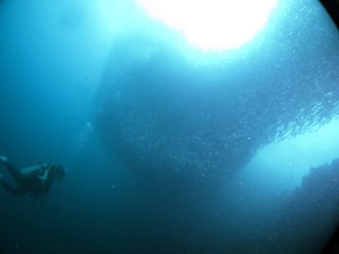
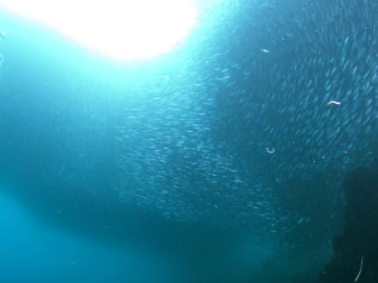

# 2015年8月　子連れでモアルボアルでダイビングその19…モアルボアルのイワシはすごい！一見の価値あり！

📅 投稿日時: 2016-07-17 02:19:07

🏷️ カテゴリ: [ダイビング日記](ce3a7a8d424d112fce83ee85c81a0e344.md)

ということで．

3連休で出かけてますが…

本日は，またダイビング日記，続くのだ…

----

ということで．

エントリー直後に目の前に現れた…

イワシの群れっ！！

近づいてみると…

ものすごい数のイワシっ！！

こういうのが，はるか遠くまで…

見渡す限り，続いてます！

どはー！

すごいよ！！！

ちょっと離れてみると…

いや…川のように連なってます．

もう，

なんだこりゃーっ！！！

って感じで…

言葉を失う．

これ．

すごいわ…

そして．

このイワシの群れの下に入って…

エアを吐いてみる，と．

そうすると，エアを避けるように

イワシの群れが動きます…

おもしれーっ！！

で，

エアが通り過ぎると，またもとの形に

戻ってくる，と．

だもんで，ダイバーの上には，こんな風に

群れに穴が開いてます…

もう，このダイナミックに動く群れと

言ったら…！

言葉を失います…

いや．

この感動は，説明のしようがない．

これは…

一見の価値あり．

すごいよ～っ！！！

## 💬 コメント一覧

### 💬 コメント by (マルハバ)
**タイトル**: これはスゴイですね！
**投稿日**: 2016-07-17 07:25:07

ジンベエやマンタとは違った意味での「超大物」ですね！

これにカスミやロウニンがアタックをかけてる場面にでも出会えたら、まさに「ナショナルジオグラフィックの世界」でしょうね♪

### 💬 コメント by (Skier_S)
**タイトル**: マルハバさま
**投稿日**: 2016-07-17 13:10:07

これは，実物見たら

かなりのインパクトがありますよ～！

何度かアジがアタックかけてましたが，

そのたびに群れがザザザっと動くのが

見応えありました…

とりあえず，一見の価値あり！ですよ～っ！！

