# 2025/2/23(日)，3連休中日の志賀高原スキー場詳細レポート！…晴れ間が多い穏やかな天気で雪も良く，リフトは3連休の中日にしてはガラガラ！

📅 投稿日時: 2025-02-25 02:13:47

🏷️ カテゴリ: [2025スキー滑走日記](cacd3fbf84d4a679ee61a5894c3f95e14.md)

ということで．

3連休最終日の本日…

志賀高原で滑らず，家で悶々と仕事を

していた，Skier_Sです．

あぁ…滑りたかった…

なぜ休みなのに，仕事しなくちゃならん

のだ…（泣）

とりあえず．

私が滑れないので，槍でもみそ汁でも

なんでも降ってくれてもいいよ…って

くらいの気分でいた，本日の志賀高原．

朝はかなりの雪降りで，20cmくらい

積もっていたようですが…

昼頃から晴れ間も見え，冷え冷えで

いい雪質だったようです…

あぁ…滑りたかった…（泣）

ただ．

焼額山は，故障した第2高速リフトの

営業再開がいつになるか，まだ未定の

状態（泣）

第2高速リフト乗り場から第2ゴンドラ・

第1ゴンドラ方面へ無料送迎を，

数台のバスでひたすらピストン輸送

する体制で続けているようで…

一ノ瀬から第2高速乗り場へ滑り込めば，

そこからバスで第2ゴンドラへ移動

して，焼額・奥志賀方面を滑ることが

できます…！

なるべく早く故障が直ってほしいけど，

もう，第2ゴンドラや第2高速も，35年

以上前の設備だから…

いろいろぶっ壊れても仕方ない状態ですね（泣）

新しい設備に架け替えるのが理想だろうけど，

そんな投資余力はないんだろうなぁ…

誰か私に100億円くれたら，焼額の全ての

リフトとゴンドラを最新型に架け替えるん

だけどなぁ…

だれか100億円くれる人がいるようなら，

私に連絡ください…！！

ということで，本題へ．

3連休中日の志賀高原焼額山スキー場の

詳細レポートです！

…まず．

いつも通り8時半の営業開始前に，

焼額第1ゴンドラの列に並ぶわけですが…

ゴンドラ待ちの列は駐車場まで届くほどで．

今シーズン最高の待ち行列じゃないかな？

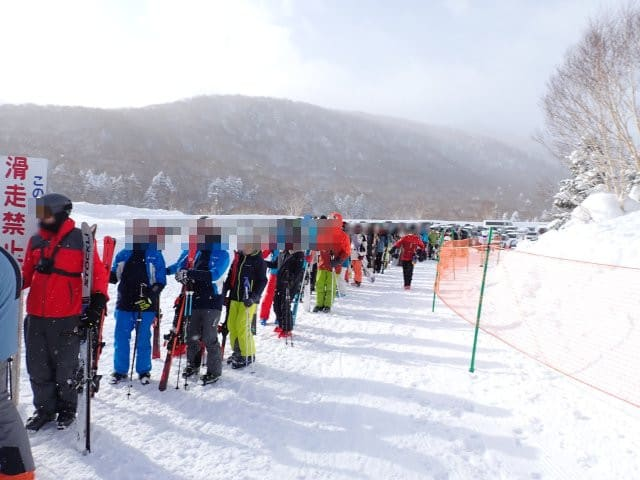

ただ，これだけ長い列でも，営業開始して

列の最後の人が乗るまで10分以下

だったので…

8人乗りのゴンドラの輸送力は高い！

…ってなわけで．

山頂に出ると…

気温は-12℃をちょい下回るくらい．

うーん．-15℃の予想をちょっと

外したな…（泣）

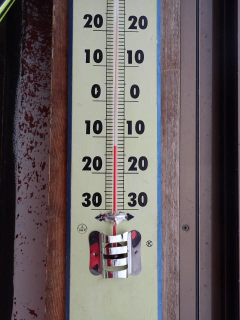

そして，山頂の天気は薄曇り．

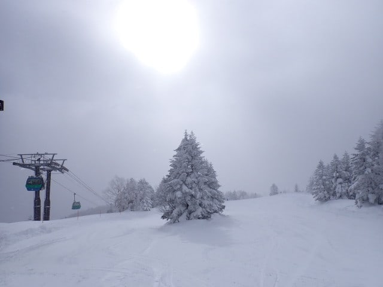

降雪は昨晩10cmほど積もった感じで，

圧雪の後にさらに1cmほど積もったのか．

朝イチのバーンはシマシマがうっすら

新雪で隠れる程度のバーンで，

下地の圧雪は柔らかめながらも

しっかりエッジが噛んで，滑りやすい

バーン！！

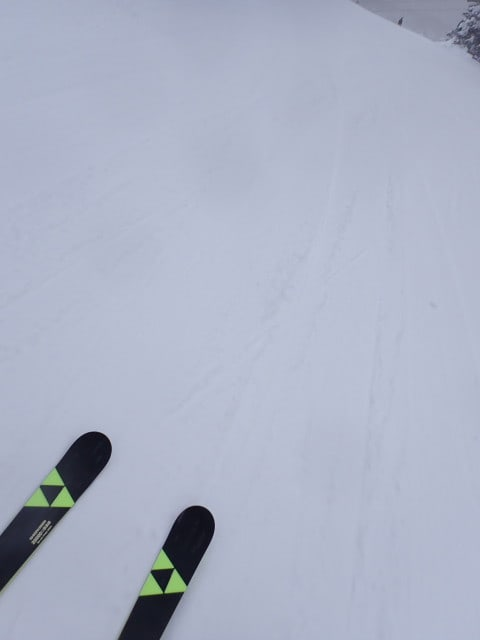

そして，営業開始後しばらくで，

だんだん空が明るくなっていき…

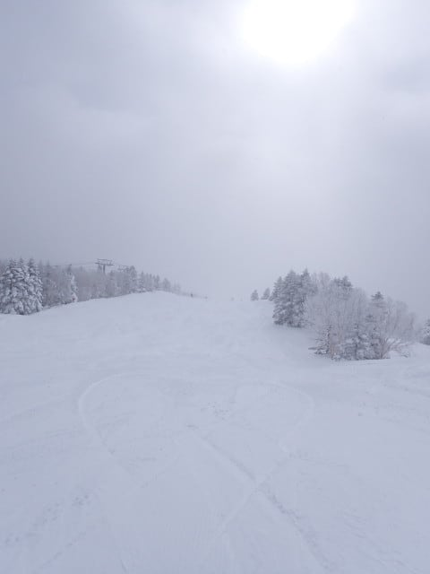

9時ごろには，しっかり日が射して

来ましたよ…！？？

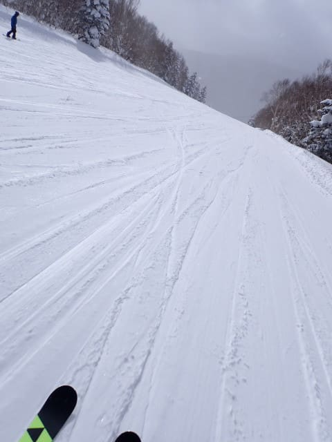

日が射して，雪面が良く見えるように

なってきて．

朝の3本ほどは，人も少なかったこともあり．

かなり快適に滑れました～！

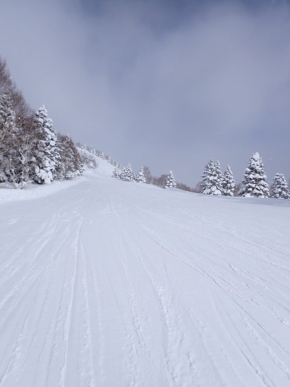

夕方圧雪のオリンピックコースは，

昨日の夜の10cmの積雪が乗っていて．

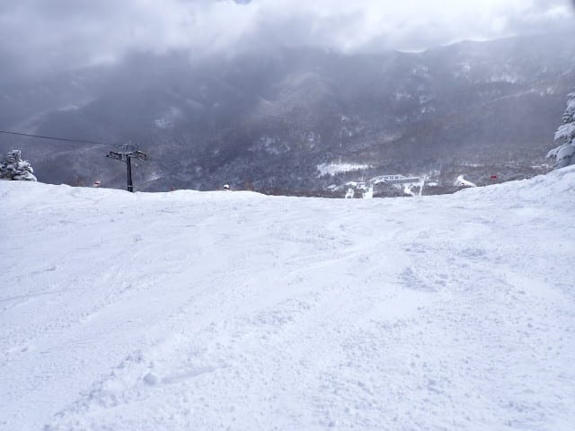

硬めの下地の上にモサモサ雪が乗った，

すぐに凸凹荒れ荒れになりそうな

バーン状況でした…

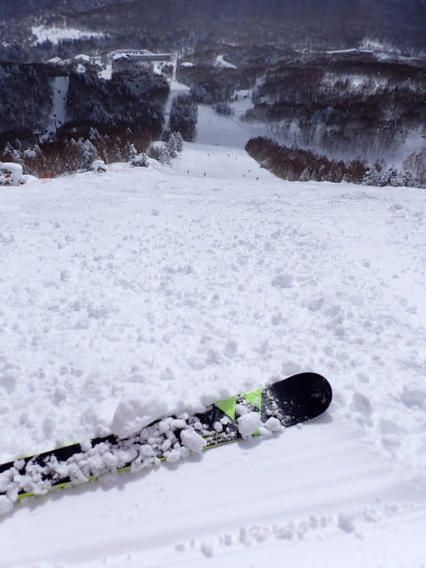

でも．

朝圧雪のGSコースやパノラマ・サウスコースは

下地がしっかりしていてかなり滑りやすいなぁ…

と，気持ちよく滑っていたけど．

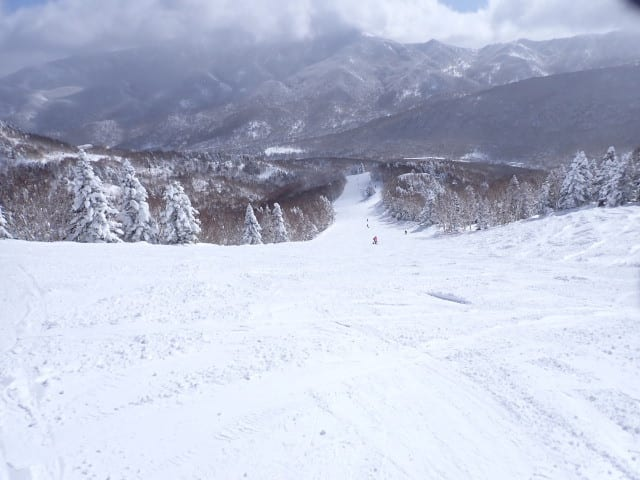

9時半ごろには，ゲレンデの人がちょっと

増えはじめてきましたね…

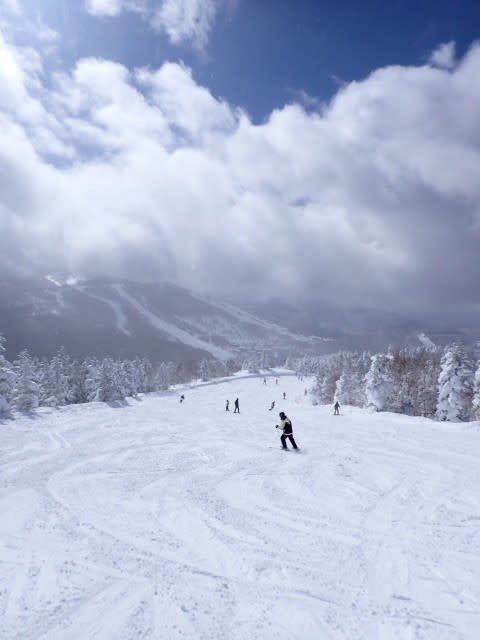

ゴンドラ待ちは，朝10時ごろに一瞬だけ

ピークでこの程度まで行きましたが．

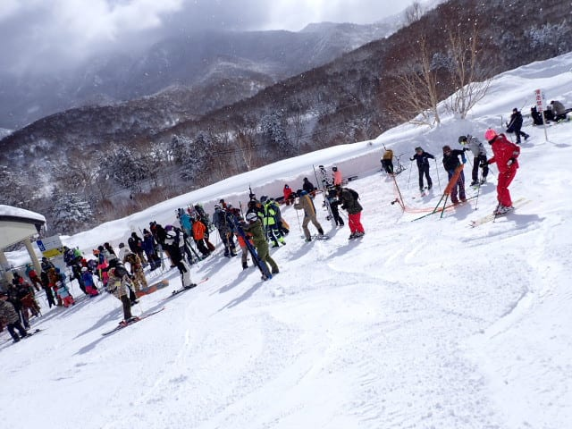

第2高速リフトが今日も故障が直らず，

運休だったので…

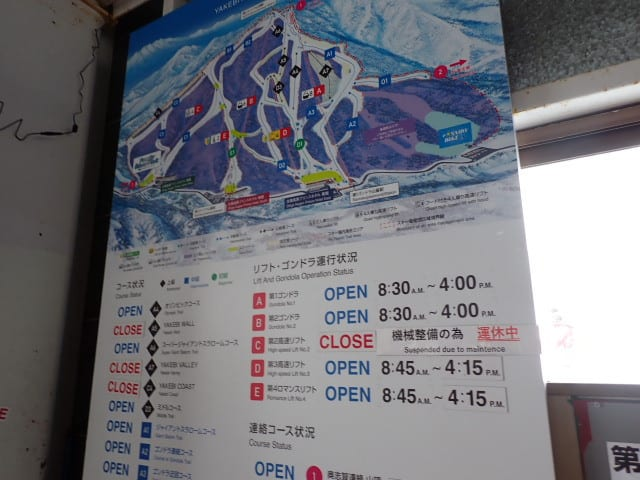

一ノ瀬方面から人が流れてこず．

いつもなら10時以降にゴンドラ待ちの

ピークが来るはずのところが．

さっきのピークからむしろ人が減って．

午前中は大体このくらいのゴンドラ

待ちで済みました…

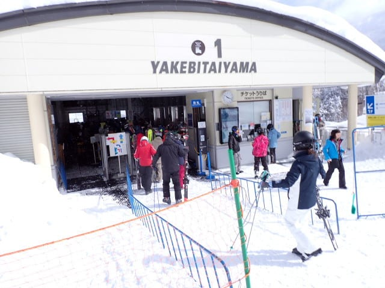

でも．

ゴンドラは混んでないけど．

第2高速が運休していて，白樺・

唐松・ブナコースが閉鎖されていたので…

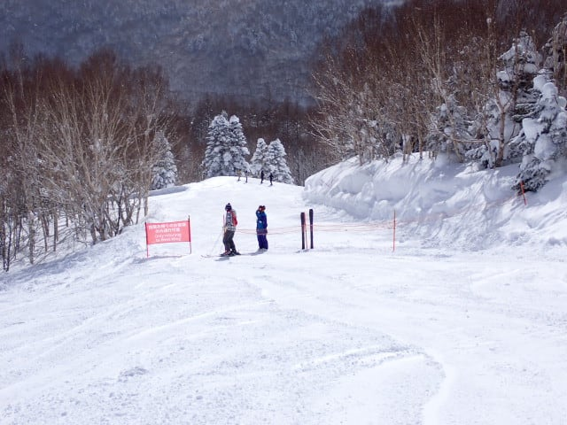

滑れるコースが減って，

パノラマーサウスコースの人口密度は

ちょっと高めで…

ゴンドラ待ちは短くても，コース上の

人が結構多く…

好きなラインをとることができず，

ちょっと快感度が低め…

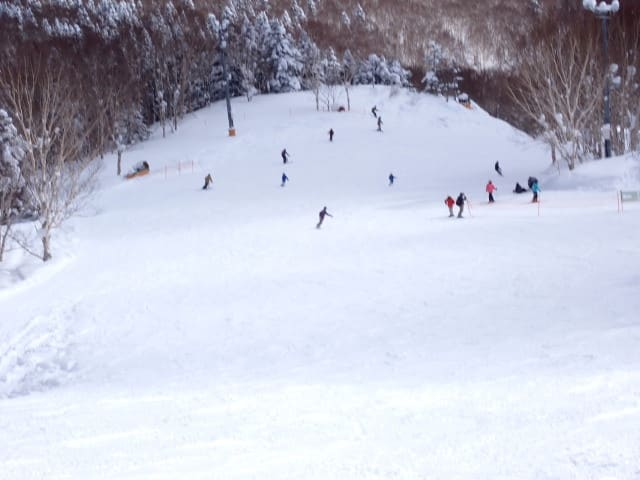

第2高速が動いてないからか．

第3高速の列はいつもよりちょっと長め

でしたね…

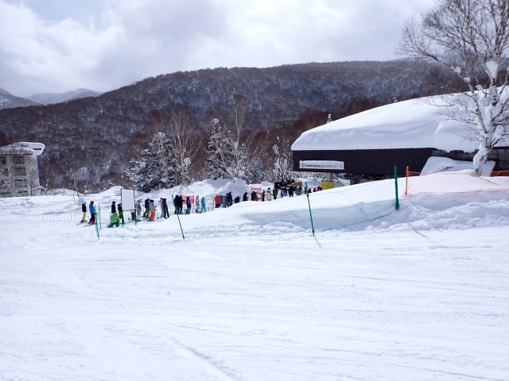

でも．

やっぱり一ノ瀬から人が流れてこない分，

ゴンドラは昼休み時間の11時過ぎから

1時過ぎくらいはこの程度まで，

人が減っていて．

ゴンドラはガラガラ！！！

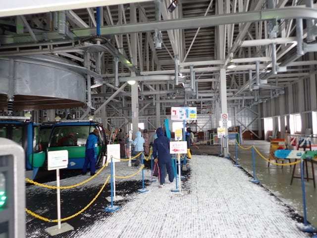

ただ，いつもの日曜ならこのまま午後は

ガラガラのままのところ…

さすが3連休の中日．

午後になったから帰る…という人は少な

かったようで．

昼休みを過ぎると，またちょっと第1ゴンドラ

待ちの人が増えてきました…

まぁ，それでも3連休の中日と考えれば

かなり列は短いですけどね！！

で．

唐松と白樺コースが滑れない分，

GSコースやパノラマコースに人が

あふれて…

GSコースの人口密度が，午後になっても

かなり高め．

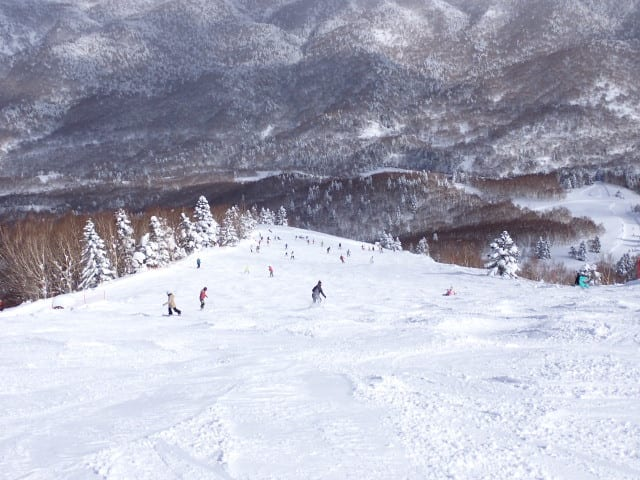

うーん．

ここしばらく，ここまで人が多いGSコースは

見たことが無い感じ…（涙）

そして，人が多いので，バーンもちょっと

凸凹してきましたね…

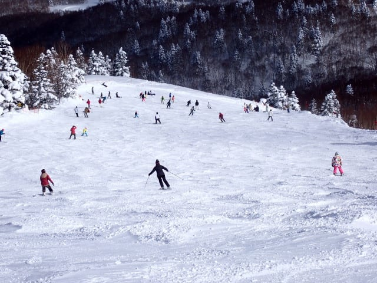

天気は終日晴れていたわけではなく，

時折曇ったり，雪が降ったりという感じ

でしたが．

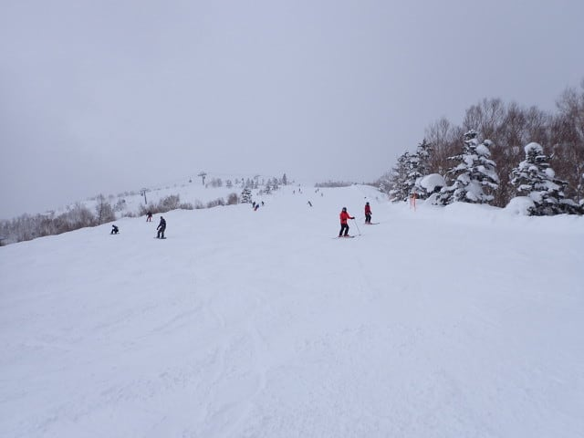

空が曇ると，ちょっとバーンの凸凹が

見にくいし，その上人が多いので滑り

にくかった…

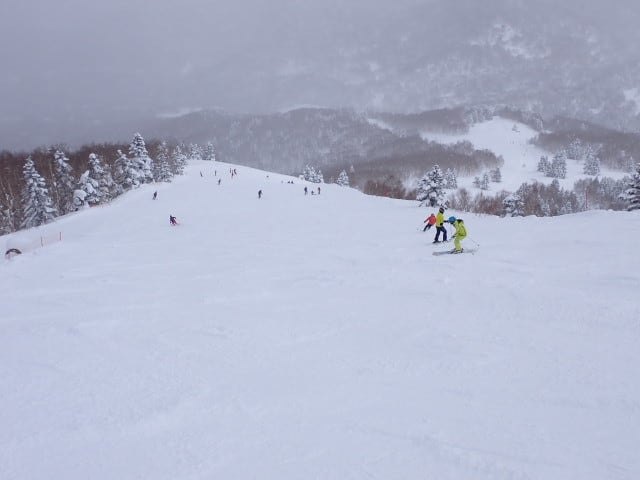

パノラマコースも，夕方になっても

そんなに人が減らず．

人口密度は営業終了時間近くまで，

常に高めだった感じ…

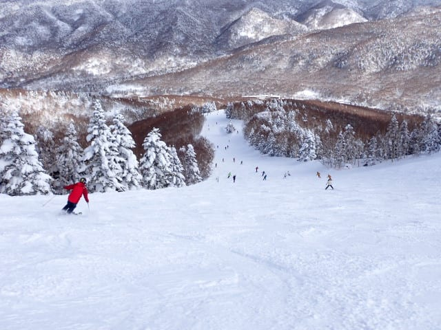

第3高速のイーストコースも，

営業終了近い時間でこれだけ人が

いるんだから…

ゴンドラ・リフト待ちはそこまででも

無かったけど，最後まで滑る人が

多くて，人口密度は焼額としては

ちょい高めだったイメージ…

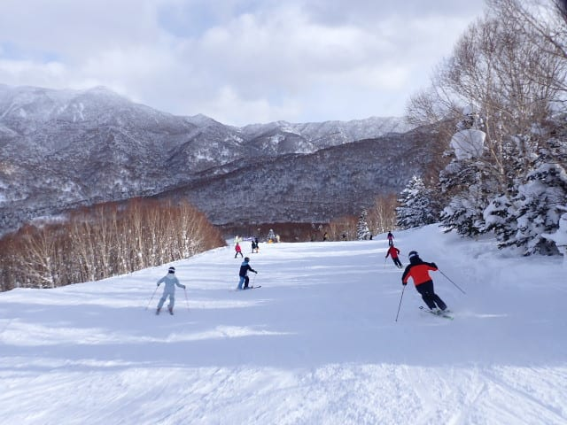

とはいえ．

これだけ広くて，これだけいい雪のコース．

この程度で人口密度が高めといったら，

怒られちゃうかな…？？

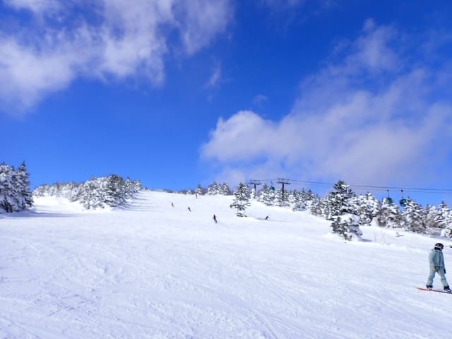

あと，10cmの新雪が蹴散らされて

荒れ荒れになったオリンピックコースは

人気が無くてガラガラでした～！

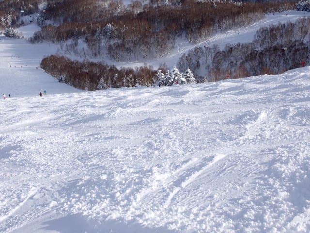

午後のオリンピックコースはコブ斜面

でしたが…

そこまで深いコブじゃなかったので，

頑張れば大回りできるレベル（かなり

飛ばされるけど（笑））

でも，人気が無くてここは人口密度が

低かったですよ～！

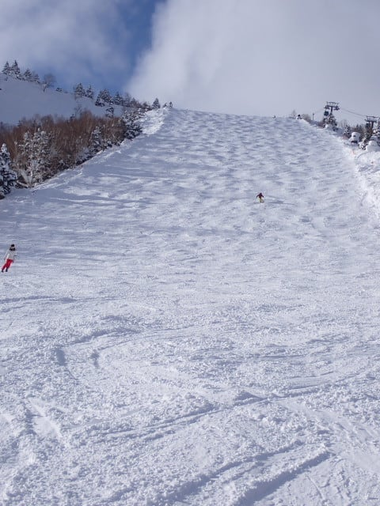

…ただ…

人口密度が比較的高めで，雪が柔らか

かった本日．

オリンピックコースと違い，朝に圧雪して

ほとんど新雪が乗ってなかったコースでも，

斜度があるコースは午後には凸凹になって

いき…

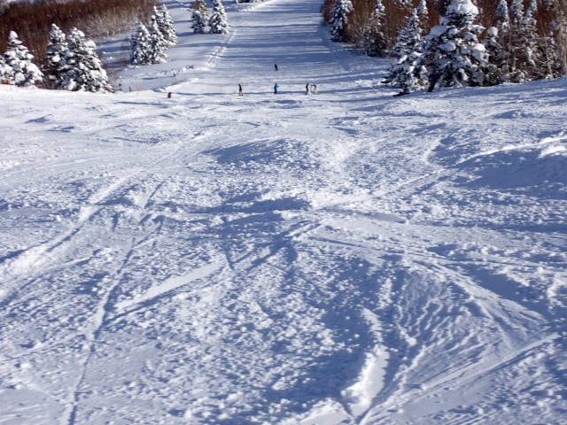

営業終了のころには，コース全面

荒れたバーンになってしまいました（涙）

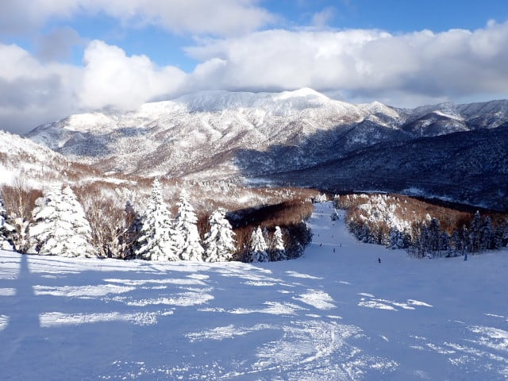

とはいえ．

今日は晴れ間も多く．

昼間も気温が上がらず雪質は

良いままで…

バーンは凸凹とはいえ，柔らかい

軽い雪だったので，春先の重い雪の

凸凹に比べれば，ずっと滑りやすく，

シアワセな一日でした～！！

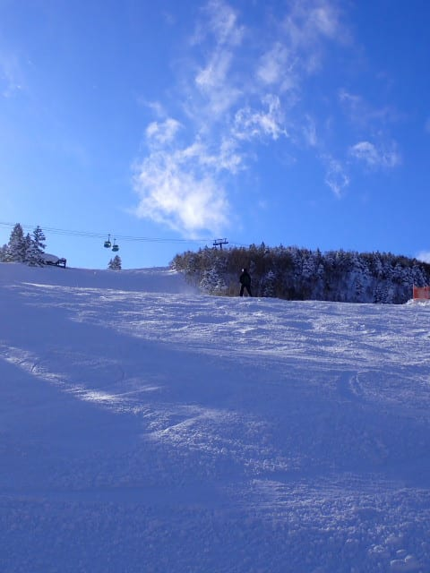

…ということで．

この日も営業終了まで，しっかり

滑り倒したのでした…

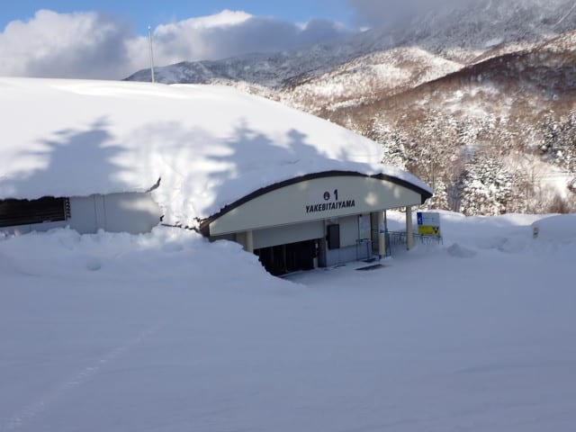

…ホントはこの日，ナイターを滑ってから

帰りたかったけど．

帰りの運転中に死にそうだし．

ちょっと家庭の事情で早く帰らねばならず．

泣く泣くナイターをあきらめて，通常営業が

終了したタイミングで，素直に帰宅

したのでした…

しかし．

27日以降，3月5日ごろまでかなりの

高温になりそうな予報なんですが…！？？

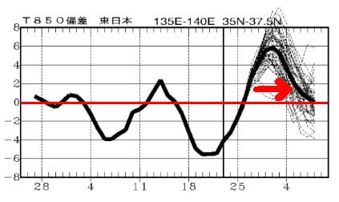

これだと…

3月1，2日の週末は，一気に雪が緩んで

しまいそうな気配（泣）

次の週末は，これまでの最高冷え冷え雪

では滑れない覚悟をしておいた方が

良さそうです…（涙）

…しかし．

2月20日ごろは平年比-6℃，

3月2日ごろは平年比+6℃って…

1週間ちょいで12℃も気温が上がるの，

極端すぎない？？？

## 💬 コメント一覧

### 💬 コメント by (アツシ)
**タイトル**: Unknown
**投稿日**: 2025-02-25 12:46:43

この３連休は、22と23の２日間、家族で白馬で滑ってました。22日はハクノリコルチナでしたが、空いてて快適でした。ところが23日は朝、少々出遅れたのはありましたが、まずさのさかに行くも駐車場満車で入れず。鹿島槍に行きましたがリフト券買うのに約１時間並び、リフトも常に10〜20分待ちという混雑ぶりでした。ゲレンデも人だらけで、とてもじゃないけどスピード出せる状況じゃない感じでした。

長らく志賀に行けてません。2/8〜11に焼額4日間滑って以来、2/15〜16は法事のため休み、2/22〜23は白馬、3/1は子どもの卒業式、3/2は仕事、3/8にやっと志賀に行ける予定です。

### 💬 コメント by (レインボー77)
**タイトル**: Unknown
**投稿日**: 2025-02-25 23:49:44

火曜日の志賀高原情報

愛猫の最期を看取るために帰宅してました。10日間もスキーしてません。今日はやる気に満ちていたのですが、暑すぎて、昼を食べて終了でした。明日からは老体を守るよろいはやめよう。

二高が宙吊り事件の影響でしばらくは運休。白樺も唐松も滑れないので、ヤケビにずっととどまってはおられません。

まずはニゴンからパノラマ経由で一ゴンへ。これは5点満点。オリンピックはアイスの上に新雪10。ストップしそうでなんか怖い。朝一なら最高だろうけど3点。GSは雪は最高だけど混んでたので4点。

三高はきれいな圧雪で5点。奥志賀三高はいつも気持ちいい老人保養所で5点。ダウンヒルは可もなく不可もなしで4点。太陽の光が強すぎて春スキーの雰囲気。汗をかいてしまったので、やっぱり早あがりしてしまいました。

### 💬 コメント by (Skier_S)
**タイトル**: 今週末に向けてガンガン気温が上がるよ
**投稿日**: 2025-02-26 02:13:02

＞アツシさま

3連休，やっぱり混んだんですね…

焼額はゲレンデの人口密度は多めだったものの，第2高速の故障が効いて，

思ったほどゴンドラは混まなかったですよ~！

私も次の志賀高原は3月8日の予定です．

＞レインボー77さま

志賀高原復帰，お帰りなさい！！！

今日はやっぱり暑かったのですね…

水曜も同じくらいの気温，そして木曜以降はさらに気温が上がり，

週末は5月並みの気温になります…

日曜まで雨は降らなさそうなので，そこが救いですが．

日曜夜からヤバいかも…

とりあえず，今週末は完全春スキーの雪になっちゃうと覚悟しておいた方がよさそうです（涙）

