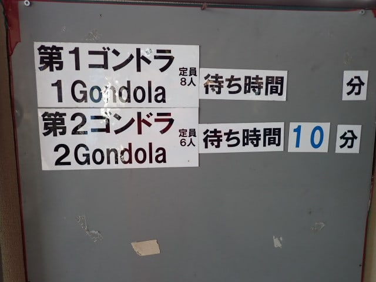
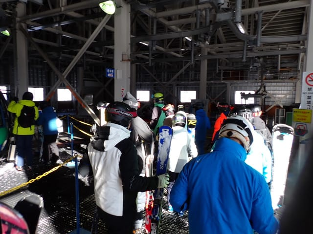

# 2024/12/30(月)の志賀高原スキー場は…終日晴天！冷え冷え最高雪で思ったほど混まないシーズン最高の1日！！

📅 投稿日時: 2024-12-30 23:13:09

ということで．

本日も志賀高原で滑っていたわけですが…

いやーーー．

今日は最高の一日でした…！！

まず．

本日は，朝から雲一つないすっきり

晴天でスタートです！！

昨晩は夜中まで20㎝くらい積もりましたが，

深夜には止み，朝に晴れるという最高

パターン！

で．天気が良かったからか…

朝8:30営業開始前の焼額第1ゴンドラ，

今シーズン最長の営業開始待ちの列で，

駐車場近くまで伸びてます…

今日は混むのかな…？？

ってなことで．

8:30営業開始の第1ゴンドラで山頂へ

行くと…

朝イチの山頂の気温は-10℃と，予想より

3度ほど低めの冷え冷え！

だもんで…

昨晩積もった20cmが圧雪された柔らか

シルキーなトップシーズン雪に覆われた

シマシマゲレンデを，晴天の下滑れる

という，最高のコンディションですよ…！！！

コース脇では，昨晩積もった軽い新雪を

蹴散らしながら滑れるし…

圧雪コース上は，トップシーズンらしい

柔らかめのお上品なシマシマバーン！！

ちょっと柔らかすぎてスピードが乗らない

感じだけど…

このトップシーズンならではの柔らか

シマシマ圧雪を，晴天で滑れるのは…

雪が降った翌日がカラッと晴天になる

という，めったにないチャンスに巡り

合わないと味わえないシアワセで．

多分シーズンでもそんなに回数は

ないですよ…！！

あぁ…

シアワセ…

間違いなく今シーズン一番シアワセ…

そうだよ．

こういう日に滑りたくてスキーしてるん

だよ…！！

と言いたくなるような感じで．

最高雪質シマシマ・すっきり快晴・ガラガラ

という，シアワセの3拍子がすべて揃った，

きわめて恵まれた朝でした…！

ただ…さすがに年末年始休み．

このシアワセは長く続かず．

9時過ぎにはだんだんゲレンデの人口

密度が上がり始め…

9時半前にはリフトも混み始め．

ゴンドラも，焼額第2ゴンドラは朝10時

前に早くも10分待ち（泣）

第1ゴンドラは朝10時の段階ではそこまで

ひどい待ちではなかったけど，ゲートから

外に出るくらいに並び始めてました（涙）

コース上の人も多くなって，人を避け

ながら滑らないといけない状況になって

来たこともあり…

今日は焼額の呪いが解けたようなので．

奥志賀へワーーーープ！！

…今シーズン初の焼額脱出だったのですが．

奥志賀への移動がちょっと遅かったのか，

奥志賀も9時50分過ぎには，ゲートの外まで

ゴンドラ待ちの長い列が伸びてたし…

普段はそこまで混まない，奥志賀の第3高速

もゲートの外にさらに伸びるくらい列が

ついていたので．

雪はよかったけど，奥志賀もすぐに脱出！

…そして，やってきました一ノ瀬方面！

ただ，一ノ瀬ファミリークワッドに

のってみたところ，ここも2－3分以上

待ち（泣）

ここまで混んでも，第3クワッド

動かしてくれないのが悲しい…

一ノ瀬山頂からの景色は快晴で

すごく良かったけど．

正面バーンも朝10時過ぎの段階で

早くもボコボコになってきてたので…

一ノ瀬は一瞬で通り過ぎて，

高天ヶ原へ抜けましたが．

…高天ヶ原スキー場，どうやら夕方に

圧雪するらしく…

昨日の夜に降った雪が圧雪されず

ボコボコに蹴散らされた，悲しい

凸凹バーン（涙）

だもんで，高天ヶ原もそのまま通過して，

高天ヶ原のてっぺんから東舘山→ブナ平と

滑り降りていきますが…

雪着きが悪い東舘山．普段ならトップ

シーズンでも石ころが出ている時が

あるけど．

今日は全く石ころが出ておらず．

今シーズンの雪の多さがわかります…

でも．

雪はいっぱい積もっているのはいいけど．

昨日の夜の雪が柔らかすぎるからか，

西舘山もかなりの凸凹だったし．

ジャイアントも見ての通り凸凹で…

はるか遠く，流れ流れてサンバレー

までやってきましたが．

サンバレーは年末年始休みと思えない

ほど，リフトは飛び乗り状態で

ガラガラだったし．

バーンも朝にきれいに圧雪がかけてあり，

人も少ないからかそこまで荒れておらず，

割とよかったかも…

ただ．

サンバレーから戻るとき．

ブナ平ゴンドラや東舘山ゴンドラは

10分近く並んでました…

さすが年末年始休…

今日はもう焼額からの遠征ついでに，

寺小屋まで足を延ばしましたが．

寺小屋リフトも，午後2時を過ぎた

頃にはもうそんなに混んでなかったけど…

ただ，やっぱり雪が柔らかかった本日，

バーンはかなり荒れてました（涙）

とはいえ．

今日は朝からずっと快晴の一日で．

寺小屋からの景色は良かったですよ～！！

ってな感じで．

焼額の呪いのがなかなか解けない

私にとって，サンバレーまで

遠征するなんて，シーズン1回あるか

ないかというレアな一日だった

わけですが…

午後3時半には焼額に戻ってきました～！

焼額も結構ボコボコだったけど．

ほかのスキー場に比べるとボコボコ

度合いがちょっとマシに感じたのは，

私の焼額に対する思いこみの強さ

かな…？？

ってなことで．

今日は長時間焼額を離れるという

大変珍しい一日でしたが…

凸凹はあったものの，終日晴天の

いい雪質で滑れた一日で．

かなり満足して，いつも通り日が暮れる

16時のラストリフトまで滑り倒したの

でした…

いやーー．

今日はいい一日だった！！

だけど．

残念ながら晴れ間は今日まで．

大みそかの明日は，朝のうち一瞬

日が射すかもしれないけど，

曇りのち昼頃から雪の一日です…

ただ，低気圧の通過が予想より早まり，

1月1日は雪降りの予想だったところ，

雪は朝のうちに止んで，午後は晴れて

いくかも…！！？？

## 💬 コメント一覧

### 💬 コメント by (ふく)
**タイトル**: 全リフト制覇
**投稿日**: 2024-12-31 08:09:08

むかし、1シーズンに志賀高原の全リフト乗るとTシャツをプレゼントする企画があったと思います。Skier_S//さんなら1日で制覇できますか？あのTシャツもらいましたか？

### 💬 コメント by (地元民（偽）)
**タイトル**: 上林周辺がヤバい
**投稿日**: 2024-12-31 08:24:59

今朝のスケートリンクヒルクライム参戦を見合わせた地元民（偽）です。

志賀高原のボトルネック、上林周辺がヤバいです。

地獄谷野猿公苑は「頼むからこれ以上来ないで！」って言ってます。

https://jigokudani-yaenkoen.co.jp/20241228-2286

「アイスバーンが怖いから、雪が緩んだ日中に降りよう」

なんて考え、第一カーブを曲がった先の光景です。

昼間の上林チェーンベースには、待機中のタクシーと観光バスが溢れています。

インバウンドの集団が路上を徘徊しています。澗満滝カーブ周辺の猿のようです。

上林の脇道からは右だけ見て左を見ない強引な合流があります。

上林駐車場の周辺のレンタカー（わ・れナンバー）の割合が異常です。

日の出前から日没後までゲレンデをグルグルしているＳ様にはほぼ無関係ですが、

Ｓ様推しの方々の参考になれば幸いです。

### 💬 コメント by (くま)
**タイトル**: Unknown
**投稿日**: 2024-12-31 16:52:57

オリンピックコースっていつ頃圧雪されてますか？

明日パウダー食えそうなコース教えてください

### 💬 コメント by (Skier_S)
**タイトル**: 皆さんよいお年を…
**投稿日**: 2024-12-31 20:21:54

＞ふくさま

ありましたね～．志賀高原全山チャレンジ…

私は滑りたいときに滑りたいところを滑る派だし，昔はリフトも多く

しょうもないコースをスタンプだけのために滑るのはいやなので，

実はスタンプラリーやったことはないです…

混んでなければ2日でぎりぎり回り切れるかな～…

3日あれば余裕でクリアできるでしょうか．

＞地元民（偽）さま

私は志賀高原の上り路は何とも思わないのですが，案れてない人は

怖いでしょうね…特にレンタカーとかで普段車を運転してない人が

志賀の道を走るのは厳しいでしょうね…

皆さん運転お気をつけて…！

＞くまさま

オリンピックコースは夕方圧雪です．

パウダー行けるのはオリンピックコース，SGSの落ち込みのちょっとだけ，

GSコースのゴンドラをくぐったあたりからしばらくの非圧雪側．

あとは明日ヤケビウォールとヤケビバレーがオープンするようなので，

そのあたりでしょうか…

ヤケビウォールとバレーのオープン時間は安全確認後のオープンなので，

オープン時間を確認して，オープン前にスタンバイしておくのが吉です．

