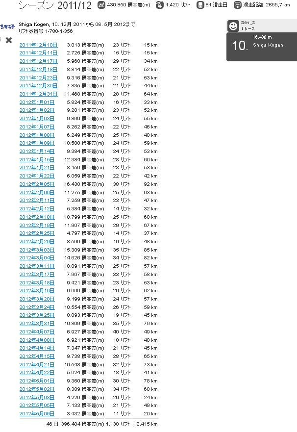
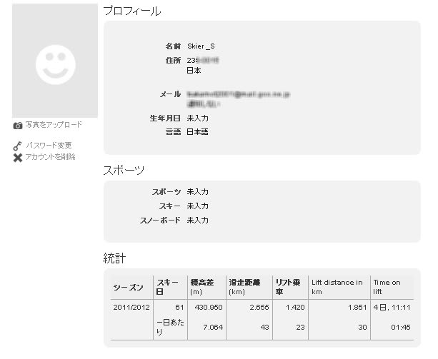

# 今シーズン，志賀高原でどれだけ滑ったのかな？？

📅 投稿日時: 2012-05-23 00:00:57

🏷️ カテゴリ: [スキー雑談](c1f9d2cb7478308da16419928ea3945e9.md)

という感じで．

今シーズンのスキー自体はまだ終わってないんですけど．

一応，志賀高原でのスキーはもう終わったので．

[前回](e980c23b24939a374b74c3e0c03402b86.md)に続いて，今シーズンの私のSkilineのおさらいの2回目でも

行ってみましょうか…

この画像の一番上の部分．

今シーズンの志賀高原での滑走標高差，

430,950m．

…430kmですか．

…意外と滑ってますね．

リフト乗車本数は…

1.420本ですか．予想より多いなぁ…

でも．ナイターのチケット情報を投入し忘れていたのが

3日ほどあるので．

それを考えると，ほぼ1500本くらい乗ってるはず．

…うち500本以上が焼額第1ゴンドラ（笑）．

偏ってますね～．

んで．

61 滑走日

ってなってますが．

これは，早朝やナイターを滑っても1日と

カウントされてしまうので．

昼間+ナイターと滑ると2日とカウントされてしまってます．

実際は，この表の一番下にあるように46日が正解．

…志賀だけで46日滑ってるのか…

滑走距離: 2655,7km

…ひとシーズンかけて2700km弱か…

うちの車の1ヶ月の走行距離より少ないなぁ．

意外と少ない．

まぁ，一日平均60km程度と考えると，

子供と一緒に滑った日が多いわりには

がんばってるのかな～．

一覧でどどどっと出てるのが

昼間に滑った滑走日＆滑走標高差ですが．

その下のトータルでは2415km．

ナイターでは300km程度しか滑ってないのかー．

んで．

予想外だったのがこいつ．

この一番右下にある，Time on liftですが…

リフトに乗っていた時間が，4日と11時間？？？？

なんじゃこりゃぁ．

まるまる4日間以上の時間を，リフト上で

すごしていたのかっ！

一日8時間ずつに割ると，まるまる13日以上

リフトに乗り続けている勘定になるなぁ…これ．

ということで．

私はシーズン中，かなりの時間をリフトの上で

すごしていることに気づかされた，Skilineの

結果だったのでした…
