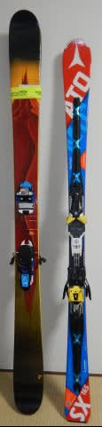
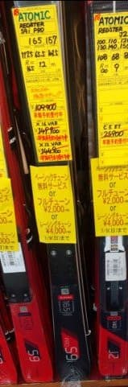
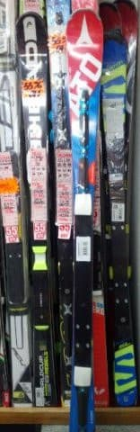
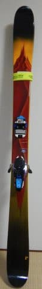
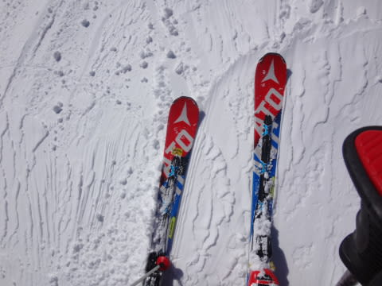
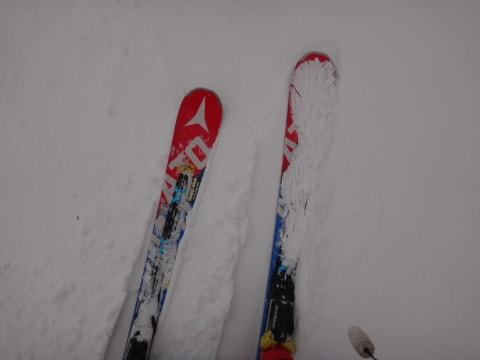
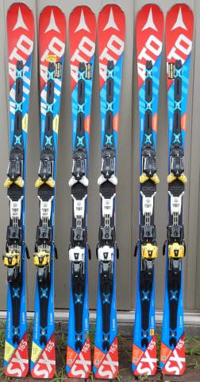
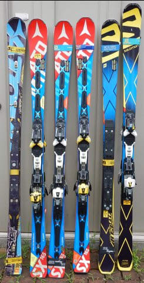

# 第7回物欲選手権，後日談

📅 投稿日時: 2017-11-24 00:01:02

ってなわけで．

本日はスキーに行けませんでしたが．

[熊の湯のレポート](red.ap.teacup.com/gokurakuskier/793.html)を見ると．

朝からガスで，ちょいと厳しめのコンディション

だったようですね…

　午後はパラパラと雪が降り続ける．

　標高が高いスキー場は，ガスが出るかも…

…と予想しましたが．

午前中から予想以上に濃い目の

ガスだったようで…

天気予想，半分当てましたが．

ガスが出るタイミング外したか…（ちょっと残念）

…でも．

でも．

私は明日，仕事が休みになったので．

ふはははははははは．

かぐらに行ってくるのだ！

明日は，今日のようにガスったり雨になったり

しないはずなのだ！！

では，行ってきます～！

…って．

これだけじゃ寂しいので．

本日は，ちょっと物欲選手権のフォロー記事をば…

----

というわけで．

今回の物欲選手権．

皆さんの予想通り（というか，予想を上回る？）

大敗してしまったわけですが．

…いや，神田に行く前は．

とりあえず無償交換かどうか確認して．

無償交換ならそれでよし，

交換不可能なら，シーズン途中の安くなったころに，

ATOMIC S9i PROを買おうか…

と，思っていたのですが．

限定販売のS9i PROは高いし．

（定価144,000+税=15.5万円っ！！）

さらに，安くなる時期まで売れ残ってくれるか

微妙だったし．

そのうえ，この板は試乗してないので，

SXの後継機になりうるか不明だったし．

だとしたら．

私の大好きな'17 SXが，まだ在庫があるうちに．

ビンディング無しだったらS9i PROの半額以下でGetできるんだし．

これを買うべきか…？？．

修理可否の結果を聞いた時に，'17 SXの在庫が

無くなってて．

シーズン途中に買おうと思っていた，S9i PROまで

売り切れで無くなってたら．

今履いている'17 SXを今シーズンいっぱい

履くことになり．

そんなことになったら，

絶対後悔するに違いない

という，わけのわからない強迫観念で，

ついつい買ってしまった，'17 SX．

そして，太板も．

SXを買う前にチラチラ見ていたら，

3万円台でLINEの板がビンディング込みで

売っていたので．

'17 SXを買って，S9i PROを買うよりは

ずっと安く上がったんだから．

これも買っていいよね…

と，太板までついつい買ってしまったのでした…

うーむ．

神田，やっぱり危険な街です．

なぜこの街は，ここまでスキーヤーの理性を失わせるのか…（涙）．

そうそう．

結局，修理見積もりに出した，剥離した'16SXが

どうなったかというと．

滑走面＆エッジが剥離し，隙間から入った水で

コア材が腐食しているため，修理不能

ということでATOMICから

戻ってきました…

ATOMICに，'16も'17も，SXの在庫が無いみたいで．

交換もできないということ．

うーむ．

この板を履いて2か月経った頃から．

板にワクシングをするときに．

「妙に滑走面が波打ってきたなぁ…」

と思っていたのですが．

それを見た志賀大御所の某氏に．

「それって，コアに水が入った時に起きる現象だよ…！」

と指摘されていて．

今から考えると，あの時から目立たないながらも

剥離が起きていたのかも…！！！

うーむ．

'16SX．

1シーズンもたずに，

「[かつてSXだった何か](e27e2a7149d362e76794896614d0f18f3.md)」

に成り下がってしまったけど．

それは，コアに水が入って腐食してからだったのか…！！

…と．

今になって納得．

しかし，根性無し過ぎじゃないか！？？

ATOMICのSXは！…←それでもまたSX買っちゃったでしょ

ということで．

残念ながら'16 SXはお亡くなりになっちゃいましたが．

破損した板もATOMICから戻ってきたので，

我が家はなんだかすごいことに…

インパクトあるな～．この絵．

これなんかも，私の趣味が偏っていることが

良く分かる写真ですね…（笑）

## 💬 コメント一覧

### 💬 コメント by (Unknown)
**タイトル**: Unknown
**投稿日**: 2017-11-24 01:04:12

購入日起算2年保証の商品を正規販売店で購入したのに返金処理もないんですか？

早い者勝ち在庫限り交換を保証と言うなら人気機種は買えないですね。

### 💬 コメント by (Skier_S)
**タイトル**: Unknownさま
**投稿日**: 2017-11-25 09:07:08

すみません。コメント回答遅れました…

でも、実は私の板、よく買って2年すぎてたのでした

2シーズン前、雪不足でほとんど新しい板で滑らなかったので忘れてましたが…

まあ、保証が切れたけど運がよければ安く新モデル

譲ってもらえないかな、

という程度で行ったので…

でも、修理不能証明もらったので、私としてはこれでOKですわらい

