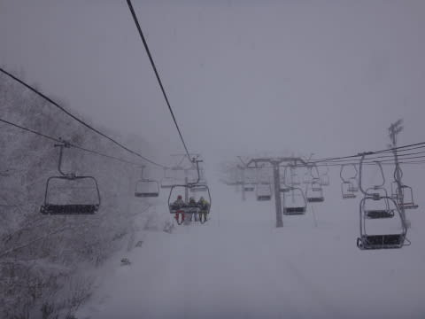

# 1月14日，土曜の志賀高原は…激寒の終日パフパフパウダーデー！…雪はちょっと重かったけど（涙）

📅 投稿日時: 2017-01-15 00:19:20

🏷️ カテゴリ: [2017スキー滑走日記](c7d777cecfc91bdf0fa464ad62c6d49ab.md)

本日．

ふははは．

予告通りのパウダーデーでしたっ！

…ちょっと雪は重かったけど

いやーー．

ホントに，今日は終日激冷えパウダーデーでした！！

まず．

今朝．

今日はなぜか，いつもの焼額ではなく，

一の瀬スタートだったのですが…

朝から前が見えないくらいのすごい雪が降り続いてますよ…

リフトで山頂に着くまでの間に，

搬器にかなり積もるほどの激しい積雪！

そして，朝いちばんリフトで山頂に出て…

（一目散に正面ゲレンデに飛び出す，今日朝いちばんの

　先頭搬器に乗った，気合の入ったみなさん）

コースに飛び込むと．

うはーーーー！

予想通りの太ももパフだぁ！

昨シーズン，ほとんど経験できなかった

太ももパフ！！

…でも．

しかし．

すごい重い雪なんですが…（涙）

一見気持ちよさそうに見えますが．

一の瀬正面バーンの急斜面でも，

かなりのブレーキがかかる，重い雪（涙）

なぜ，気温が激冷えなのに…

なので．

一の瀬は3本で見切りをつけて．

わが生息地の焼額へ！

焼額は，圧雪コースも上に10cmの雪が乗ってます…

いや，新雪祭り！

焼額の山頂に出ると…

朝9時の山頂の気温は，マイナス14度！

さーむいよ！

そして，オリンピックコースに行くと…

ここも膝～太ももパフ！

予想通り！

パウダー祭りです！！（ここもやっぱり重いけど）

雪は昼間もかなりの勢いで降り積もり続けるので…

昼頃になっても，コースの横のほうは新雪が

残ってます！（重いけど）

いやー．

今シーズン最高の新雪祭り（重いけど）…！

だのに．ゴンドラはガラガラ！！

飛び乗り！

そして…

お昼でも．

気温はマイナス15度のまま！

冷え冷えだよ！！

…ふはははは．

水曜日の予想で．

　　むちゃくちゃ冷える．終日-15℃クラス．

と書いた通り！

ドンピシャ正解です！

昼過ぎまでは，雪が降り続けたので，

圧雪コース上もずっと新雪が続きましたが…

午後3時頃になると，

ちょっと雪も弱まってきたかな…

しかし，今日はかなりガラガラで．

コース上の人は終日少なくて．

久しぶりの新雪パフパフで（重かったけど）

かなり楽しめましたよ～！

…で．

本日昼間だけで．

こんなに積もってました…

昼間だけで，30～40cmくらい積もったのかな？

で．

今日も当然，行くわけですね～．

そう．ナイターです．

ナイター中も，かなり雪が降り続けてます…

おかげで，コース上は…

ナイター前に圧雪したばかりなのに，

5cmの新雪！

ってことで．

すごい寒かったけど．

昼間と違って，かなり軽い新雪を

ナイターで楽しめたのでした～！

…明日朝もパフパフ積もりますよ～！！

明日も朝イチからぱふぱふを楽しむのだ！

## 💬 コメント一覧

### 💬 コメント by (たろ)
**タイトル**: えっ…
**投稿日**: 2017-01-15 01:06:32

初めまして。

いつか、Sさんにお会いしたいと思っている者です。

今日は、まさかの一の瀬スタートだったのですね。私は朝イチクワッドの3列目だったのですが、2列目の三人グループ様の右端がSさんだったのでしょうか。リフトスタートが遅れている時に、焼額への移動を検討されていたような記憶があります。まさかのニアミスだったのかな。

### 💬 コメント by (めいめい)
**タイトル**: またまた発見も･･･
**投稿日**: 2017-01-15 07:47:58

あけましておめでとうございます。

金曜日から入っています。金曜日はかなりマシでしたが昨日スゴかったですね。ファミリーから高天が原へ移動も普段コブ斜面の肩斜で埋まり、退散して奥志賀目指す道中の焼額1ゴン乗り場！降りてこられた徒然さん発見！！も、あまりの搭乗の早さになす術なく･･･。16時ごろダイヤモンドでまさかのニアミス。あっという間にファミリーへ登って行かれました･･･。なんか貴重な生き物を探すようなコメントですみません（笑）本日に期待します！

### 💬 コメント by (Skier_S)
**タイトル**: つぎつぎ目撃情報が…
**投稿日**: 2017-01-15 08:05:39

＞たろさま

…正解です．

大正解です．

それは，間違いなく私です．

あそこには，現在の志賀高原標高差ランキング

トップ6位までのうち，4人が揃ってました…

今日も私は一の瀬スタートですよ～！！

＞めいめいさま

あら！

発見されましたか（笑）

ヤケビゴンドラの搭乗の速さは定評があるので（＾＾；

ゴンドラ乗り場では一瞬のタイミングを逃すと捕まえられないかも…

今日も一日滑ってますので，また見かけたら

声をかけてください～！！

### 💬 コメント by (Goku)
**タイトル**: 雪掻き
**投稿日**: 2017-01-15 12:01:00

結局、今日のスキーは止めて、現在渋温泉で雪掻き中です。

それにしても凄いふりですね。

### 💬 コメント by (はなげ親分)
**タイトル**: 残念ながら…
**投稿日**: 2017-01-15 12:23:00

丸池迄上がって来ましたが、渋滞でピタリととまり15分。雪は凄いし前は見えないし…

（帰れなくなっちゃうんじゃないか）なんて思い、その場でUターンしました（泣）

早く帰って女房の見舞いに行こうっと!!

### 💬 コメント by (しんちゃん)
**タイトル**: ヤケビナイター
**投稿日**: 2017-01-15 13:38:35

昨日、昼間はひどい雪と思って、ナイター狙いでヤケビに行ってみました。

圧雪された上に薄っすらパウダーが乗っていて、最高のバーンコンディションでした。

４ロマ貸し切り状態でぐるぐる。スキーがうまくなったと勘違いしてしまうゲレンデでした。

但し極寒だったため、体は温かかったのですが指先がどこかに行ってしまったのではと思うぐらい手の指先だけがたまらなく冷たかったです(*_*;

### 💬 コメント by (ふく)
**タイトル**: はじめまして
**投稿日**: 2017-01-15 16:59:00

この吹雪の中スキーに出かけるとは！

僕も20代の頃は、この吹雪でも出かけたのですが。

ブログを読んでモチベーションが上がりました。

シーズン券を買ったのでガンガン行きたいと思います。

### 💬 コメント by (いか)
**タイトル**: Unknown
**投稿日**: 2017-01-15 20:11:35

今週末は最高のだーぱう日和でしたね！私も本気ファットを履いてかっ飛んでました。八方は強風で上部が運休がちではあったのですが、朝イチのセントラル（2日とも30-40cm)と今日の運行開始時先頭うさぎ平（もちろん滑っているだけでは計測不能な新雪量）は年になんどもない最高のバーンでした！

### 💬 コメント by (Skier_S)
**タイトル**: 今日はすごい一日だった…
**投稿日**: 2017-01-16 00:44:55

＞Gokuさま

あらー．

今日も滑れなかったのですね…

でも．

今日は午後はすごい降りでした．

遭難するかと思いました…

＞はなげ親分さま

今日は，志賀の登り道路は前が見えず

すごかったみたいですね．

ゲレンデもすごかったです…

おそらく，今日はお見舞いに行って正解

だったとおもいますよ～！！

＞しんちゃんさま

あ，昨日はヤケビナイターだったんですね！

4ロマのナイターは寒かったのではないでしょうか…

私はダイヤナイターでしたが，なかなか楽しめましたよね～！！！

日曜は滑らなかったのですか？？

＞ふくさま

初めまして！

ご愛読ありがとうございます～！！

志賀高原は，50代以上でもすごい人がいっぱい

滑ってますから（笑）

20000mクラブのゴールドメンバーはみんな

すごいですよ．一度ご覧になったら，モチベーション

上がりまくりかもしれません（＾＾；

シーズン券は志賀ですか？？

もし，志賀にお越しの際は，ぜひ20000mクラブ

メンバーを探してみてください．

＞いかさま

こちらも2シーズンぶりのばふばふパウダーを

楽しめました！

…でも．

SXで滑るの，きつかったです…

なんだか．

太い板が欲しくなってきました…

いや．

でも．

買いません．

買わない．

買わないぞ～！！

