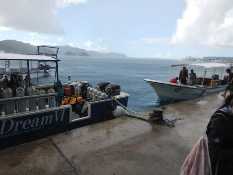

# 2017年8月，小学生の子連れでパラオ再訪！その9…ダイビング2日目スタート！

📅 投稿日時: 2018-09-14 00:51:34

🏷️ カテゴリ: [ダイビング日記](ce3a7a8d424d112fce83ee85c81a0e344.md)

ってな感じで．

実は本日まで，2泊3日ほどで

国内某所へ出張に出ていましたが．

それを感じさせない安定の更新！←なんのこっちゃ

今日は久しぶりの帰宅で，家からの更新です～！←読者にとっては，

家で更新しようが出先で更新しようが変わらないから

ってなことで．

本日もパラオ旅行記の続き．

では，どうぞ～！

---

明けてパラオ滞在2日目…

いやー．今日も晴天！

朝8時にダイビングショップの人がホテルに

迎えに来てくれます…

で．

車で5分ちょいのダイビングショップへ

向かいますが…

なんということか…

ショップに着くころに，なぜかにわか雨に

おそわれてしまったのですが…（涙）

うーむ．

ダイビング中，天気が悪くて日が射さないと

イヤだなぁ…

とりあえず，乗船して．

器材のセットアップを行います．

そして．

どうでもいいですが．

このパラオでも．

レンタルのBCは，激安で購入した私の

BCと全く同じモデル(笑)

向こう側に，私と同じモデルのBCが見えますが．

こんな感じで同じ船にいくつも同じ

BCが並んでいるので．

間違えないようにしないと…

ってことで．

ボートはにわか雨の中出航！

娘は，昨日の夕食時に仲良くなった人たちと

仲良くおしゃべりしていますね…

今回も，みんな子供にやさしい人ばかりで

有り難い限り！

そして．

出航後しばらくすぎると…

をを！！日が射してきました！

天気が悪いと，水中に日が射さず，

写真の出来がイマイチになるので…

晴れて良かった！

…ボートはパラオのきれいな海を突っ切り…

やってきたのは…

今日もブルーコーナー！

…ただ．

流れが微妙らしく．

何度もボートを止めて，

ガイドさんがカレントチェックに出ています…

で，本日．ブルーコーナーのリクエストが多く，

さらにマクロ穴に行きたい…というゲストも

いたようで．

「本日は1本目，2本目ともにブルーコーナーにします！

　流れ的に2本目はマクロ穴に行きます！」

現在は，SLOWの下げ潮．

上げ潮の方がマクロ穴に行きやすいので．

1本目の後は早めのお昼ご飯にして，

流れが変わる2本目にマクロ穴を攻略

するようです…

ってことで．

1本目，2本目がどちらもブルーコーナーなら，

私はどっちを潜ってもいいわけだけど．

うちの妻は，マクロ穴が大好きなので．

2本目は妻に譲って．

1本目は私が潜ることにしますか…．

では，1本目のブルーコーナー，行ってきま～す！

