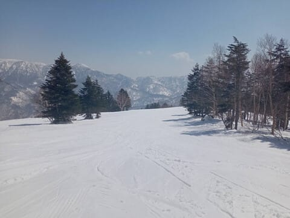
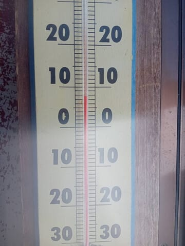

# 特派員によると3月25日(火)の志賀高原スキー場も高温＆晴天．そして本日気象庁の3か月予報が出たけど，4，5月の気温は平年並みよりちょい高め．

📅 投稿日時: 2025-03-26 00:49:43

えー．

1-2月はかなり雪が多かったこともあり，

志賀高原をはじめとするスキー場は，

延長営業するスキー場も

多いようですが…

なんと．

天然雪がほとんどないイエティでも，

今シーズンは営業を約1週間延ばして，

4月6日まで延長営業することに

決まったようです…！！

（[スノーパークイエティホームページ](https://www.yeti-resort.com/)より）

妙高杉ノ原も，3月いっぱいの予定が

4月6日まで営業するみたいだし．

かぐらも5月末まで営業伸びないかな～…

とは言いながら．

最近は気温が高い日が続いていて．

本日の志賀高原からの特派員情報によると…

志賀高原は朝から晴天で，焼額は

雪は完全の春雪だったようです（涙）_

今日も5気温は5月並み，山頂でも昼には

+8℃くらいまで上がっちゃったみたいだし…

ゲレンデはガラガラで，雪は一見

キレイなシマシマに見えますが．

緩んだ春の雪ですね…（泣）

第3高速がシーズンの営業を終了

しちゃったので，SGSコース経由で

イーストコースに行くと昼まで

シマシマが残ってたようです．

しかし，ゲレンデに誰もいない…

緩斜面やSGSコースのコブは，

ストップ雪になっちゃってたみたいで…

うーん．

完全に4月下旬からGWみたいな感じ

ですね（泣）

うーん．

この時期の高温＆晴天は辛い…

とりあえず，高温傾向は今週の金曜まで

続いて．

26日(水)：風強め．朝はゴンドラが動かないか

　減速運転かも？

　朝はわずかに締まり気味かもしれないけど，

　朝から気温は高めで雪は緩む．

　昼間は+7℃くらいまで上がるか．

　天気は雲が多めの晴れ～時々曇り．

27日(木)：晴れのち曇り，気温は高い．

　終日緩んだ雪

28日(金)：ヤバい．高温の雨．

　終日ザーザーぶりではなく，降ったり

　止んだりだろうけど，ときおり強く降る．

という感じかな…

今週はあまりスキーに恵まれた

感じじゃないですね…(泣)

土日は1週間半ぶりに冷えそうなので，

また週末の天気は明日詳細予想

やります～！！

ってな感じで，本題へ．

本日ですが，気象庁から，4，5，6月の

[3か月予報](https://www.sunny-spot.net/chart/FCXX93.pdf)が発表になりました～！

3月は気温が高い日が多かったけど…

果たして4月以降はどうなるのか？？？

と，ドキドキして見てみると…

うううーむ．

すごい高温というわけではなさそうだけど，

どちらかというと高温傾向の3か月に

なりそう…（涙）

でも，まぁスキーに影響する4，5月は

低温30％，平年並み30％，高温40％で，

わずかに高温…ってくらいだから，

昨シーズンに比べればずっとマシ

かな…←普通の人は5月はスキーシーズンではないのだが？？

とりあえず，内容を見てみると…

うーん．

一応，偏西風は日本付近以外では

例年より北上しているけど．

運よく日本付近で南に曲がっているので，

日本付近はほぼ平年並み…ということですか．

1，2，3月の状況に近いですね．

そして，エルニーニョ・ラニーニャの状況を

見ると…

ふーむ．あれだけ冷えた1，2月だったけど．

結果的に1，2月はラニーニャじゃなかったのね…

で，4，5，6月の予報期間ではラニーニャでも

エルニーニョでもない状態の可能性が一番

高そうで．

エルニーニョもラニーニャも，どちらも確率は

高くないけど起こりうる…という状況みたい．

4月の200hPa流線関数を見ると，

見事に日本付近が②のような低気圧性

循環になっていて…

これは，赤矢印のように偏西風が

南下してくれるパターン！

だもんで．日本付近の南側だけ②付近のように，

水色の平年より気温が低いエリアになってます！

ただ，本州中央部の長野付近がちょうど水色と

オレンジ色の境目の，平年並みくらいの

気温なので…東北などがオレンジの領域に

入っていることもあり，東日本は平年より

気温が高めの可能性がわずかに高い予想だったの

かな．

…しかし．

上の図の②付近のエリア以外は北半球のほとんど

すべてが，赤からオレンジで示される平年より

気温が高いエリアなので…

ジェット気流の日本付近の南下が無ければ，

おそらくすごい高温になってたんだろうな…

で．

同じように，5月の200hPa流線関数を見てみると…

弱いながらも，5月も日本付近は②のように

うっすら水色の低気圧線循環に覆われて

ますね…！！

4月と同じように，偏西風が日本付近で

南下するパターンです！！

だもんで，850hPa気温を見ると．

5月も②に示す日本の南側のエリアは，

平年より低めの予想になってるけど…

でも，長野近辺はぎりぎり平年より高い

オレンジのエリアに入ちゃってますね…

でも，まぁ．

これなら長野付近はほぼ平年並みの感じかな…

ってなことで．

4，5月は激冷えになることはなさそう

だけど．

今シーズンは雪が多かったので，平年並み

くらいでいてくれればまぁ春シーズンは

楽しめそうだし．

激烈高温にならないだけ，例年より

いい感じの春シーズンを過ごせそうな

感じでしょうか…

しかし．

振り返ってみると．

この3月は平年並みの気温…ということ

みたいだけど．

こんな感じで極端に高温と低温が

繰り返される，人間ヒートショックテスト

みたいな感じだったわけで．

これを平均して「平年並み」だったわけで．

一概に平年並みといっても，変動が少ない

平年並みなのか，激烈ジェットコースター

気温で平年並みなのか．

そこが気になる…

## 💬 コメント一覧

### 💬 コメント by (レインボー77)
**タイトル**: Unknown
**投稿日**: 2025-03-26 12:44:32

水曜日の志賀高原情報

やっとかめの焼額。朝イチの白樺はやや硬めの快適バーンだったけど、一本滑るごとに緩んでいく。今日は友達に大回りのレッスンを受けたんだけど、踏み込め踏み込めっていうのを、間違って理解してたことがわかって大収穫。今期はこれで終了するけど、来期が楽しみで仕方なくなりました。副院長さんの「スキーを初めて48年、進歩なし」のご金言が胸にしみます。私にとってスキーほど難しいものはなく、スキーほど面白いものもありません。

エス様、夏は福井の山小屋でお待ちします。来期も生き延びられたらよろしくお願いいたします。

### 💬 コメント by (Skier_S)
**タイトル**: ＞レインボー77さま
**投稿日**: 2025-03-27 00:35:11

今日はゴンドラが風でヤバいかと思ったけど，無事動いたんですね…

そして黄砂もそれほどではなく，ストップ雪にはならなかったのでしょうか…

今シーズンを締めるには少々早い気もしますが，とりあえず今シーズンはお疲れ様でした！

また福井の山小屋伺います．よろしくお願いします。

