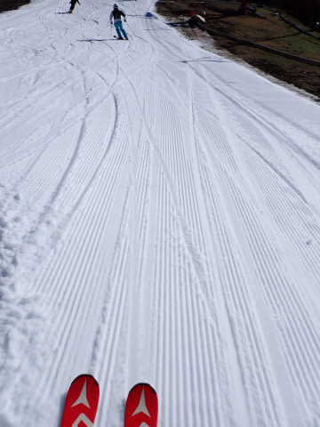
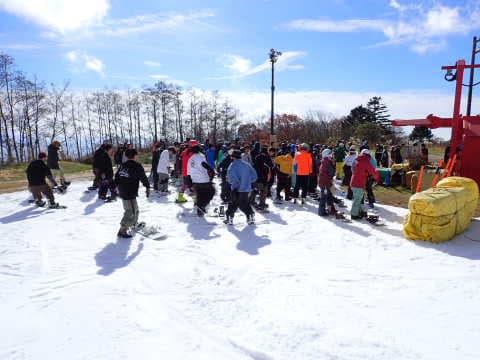

# 2022/11/6(日)のイエティ詳細レポート！…コースはオープン時の倍以上に広がったし，雪の厚みは十分だけど，コースは混むよ

📅 投稿日時: 2022-11-08 01:24:11

なんと．

横手山．

すごいことに…

11月9日のオープンが決定したようです…！！！！！！

（[横手山ホームページ](https://yokoteyama2307.com/news/18690/)より）

ゲレンデは圧雪整備が入り，幅10mほど

確保できたようですが…

ただ，オープン予定の9日からは気温が

上がって，しばらくは人工降雪機が

動かせないだろうから…

ゲレンデ，何日間もつかな…

次に冷え込むのは14日の月曜日くらいに

なりそうなので．

うーん．

12日の週末までもたない可能性が…

しかし．

人工降雪のみで11月9日にオープンってのは

すごい．

凄すぎる！！

日本の人工降雪でのスキー場オープンの

最早記録であることは間違いないですね…

狭山のオープンが11月19日に決まった

ようだけど，まさか狭山より横手山が

先にオープンするとは…！！

（[狭山スキー場ツイッター](https://twitter.com/Sayama_ski/status/1588442818783383552)より）

ってなことで，本題へ．

日曜に行ってきたイエティの詳細レポート

です！！

えー．

まず．

この日も朝9時のオープン前にYeti に

到着しましたが．

既に第2駐車場はオープン前からほぼ

いっぱい車が入っていて．

…今日は混みそう…

実際，朝9時のゲートオープン前には

かなりの列が並んでいて…

後ろを振り返ると，駐車場の入り口まで

繋がりそうな列の長さだったので．

間違いなく，今日は混みそうな予感…（涙）

ってなことで，

予定通りの9時にゲートオープン！

朝イチのシマシマゲレンデへ！！

あさイチは，バーンはちょっと柔らかめの

板が潜る感じの雪質だったけど．

人が少なくて快適！！！

いや…今日はこれから混むこと確実だから，

今のうちに気持ちよく滑っておこう！！

と，人が少ないバーンを滑れたのも，

わずか3本ほど．

9時半過ぎには，コース上の人もかなり

増えてきてしまい…

クワッドリフトの待ちもかなり

長くなってしまいました（泣）

でも，9:45にはペアリフトが動き出し，

リフト2本体制へ！

いつもなら，板を脱いで歩いて行かないと

乗り降りできないペアリフトに行く人は

それほど多くなくて，待ち0だけど．

今日は混んでいたので，結構ペアリフトに

行く人も多く…

ペア＋クワッドで人が送り込まれるように

なったコース上の人口密度は，

さらに高まったのでした（泣）

ただ，この日の平均的リフト待ちは

この程度で，クワッドが5分ほど．

そして，今日はペアにも待ちがあるほど

でしたが．

それでも，ペアの最大待ちはこのくらい．

ほとんどが待ちなしで乗れたので，

リフト待ち自体はまだマシな方かと．

結局，この日は午前も午後も，

コース上はこんな感じの混雑が続き…

時折，すごい人口密度になったりも

しましたが．

せめてもの救いは，オープン時に比べれば

かなりコース幅が広がったので，

まぁ人を避ける余地は結構広がったのが

良かったかな～．

そして，天気は晴れたり曇ったり．

曇りの時間が意外と多かったので，

日差しで雪がひどく緩んじゃうことも

無くて．

最後になっても，コースはそれほど

荒れず．この程度の荒れで済み，

雪の厚みも十分あるので，夕方になっても

穴が開くようなところは全く無かったって

ところは良かったですね！

…ただ．

16時のコース整備が入る直前のラスト

1本まで，コースの混雑はこんな感じ

でした…（涙）

そして．

16時から1時間のコース整備のための

クローズのあと…

17時のオープンを待ちますが．

今日は整備が早く終わったのか，

ちょいと早めの16:55にはオープン！

コース整備オープン直後の，シマシマを

いただきます！！

…今日はかなり混んでいて，気持ちよく

滑るのは難しく．

ゆっくり練習しながら滑る感じの

一日だったので…

人がいないオープン直後は，気持ちよく飛ばせる

貴重なチャンス！！

今日はナイターオープンからしばらくは

人が少なめで，3本ほど気持ちよく滑れ

ました…

が．

やっぱり人が多い本日．

ナイターもすぐに人が増えてきて…

開始30分も経つと．

リフト待ちが昼間よりひどいことに

なってきたんですが（涙）

だもんで．

今日は睡眠3時間でやってきたこともあり．

「このくらいで許してやるか…」と，

18時ごろには混雑したゲレンデを後にして，

切り上げたのでした…

今シーズンは，オープンからこのかた

大雨が降ったり，むちゃくちゃ高温に

なったりしてないので．

コース幅は順調に広がってるし，バーンの

状況もいいですね～．

コース上はさすがに混みますけど，

混んで雪が凸凹でそこらじゅうに穴が開く

という悲惨な状況に比べれば，

まだ恵まれてるかな…

でも．

3週連続で滑ると，そろそろ飽きてきたかも（ぼそ）
