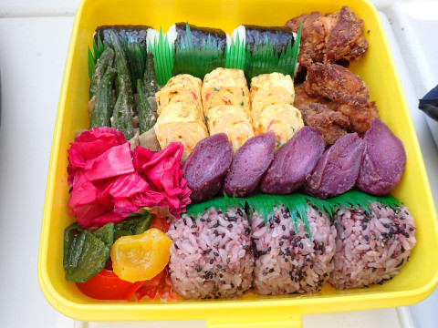
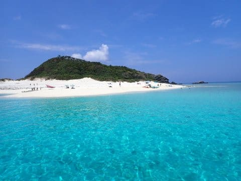

# 2023年8月，座間味で親子3世代ダイビング！その7…お昼休みの後は3本目へ

📅 投稿日時: 2023-09-17 03:15:11

えー．

実は今日も，とある山を歩いてきたのですが．

…山沿いは午後から天気が崩れるかも？

という予報だったので．

残念ながら，本来行きたかった山に行くのは

あきらめて．

近場で時間がかからず，そこまでコースタイムも

長くない山に行って来ました…

朝のうちは，

「ホントに今日，午後から天気が崩れるの？」

って感じで，見事な展望を楽しめましたが…

昼近くになると，周りの山は軒並み山頂付近が

雲に覆われていたので．

まぁ，昼前に下山できる山にしておいて正解…

でも．

今日は天気も良く，展望がいい山だったので．

かなりゆっくりと景色を楽しんだり，

高台にある岩の上で景色を堪能したり…

と，いつもの全力疾走と違う感じで．

山歩きらしい景色は十分満喫できたけど．

ただ…

今回，ここを登る一般的ルートに比べると，

かなりの大回りルートを通ったけど，

休憩含めても4時間50分で回っちゃって，

朝10時には下山してしまったので．

うーん．

身体を全然追い込めてなくて，ちょっと

運動が足りない感じ…

最近では，距離16㎞，標高差1500m弱では

全く山に登った感じがない…←それ，ヤバいから．

山は体を追い込むために行く場所じゃないから．

山に行く目的として間違ってるから…！

ってなことで，本題へ．

…そろそろ飽きてきてるころかもしれませんが．

今日も[前回の続き](e687d12c7ff85de170f88f174e255f9c5.md)，ダイビング日記です！

ーーー

ということで．

2本目のダイビングが終わったら，

もう12時前なので．

ボートはいつものお昼休みの場所，

ガヒ島ビーチの前にやってきました…

何度来ても，このビーチはきれい！

で．

お昼ご飯タイムになりますが．

夕食をやめちゃった星砂さん．

これまでいつも楽しみにしていた，

お昼のお弁当もやめちゃってるんじゃ

ないかと心配したけど…

今年もお弁当を作ってもらえました～！！

いつも通り，ボリュームたっぷりで

結構おいしいお弁当．

これを，船の上から最高の景色を眺めつつ

食べるのは，まさに南国の醍醐味．

夏休みを取って遠くにきてよかった…

と思う，癒しの時間！！

で．

お弁当を食べ終わったら…

娘は小学生のころを思い出して，

いろいろボートの周りで遊んで

ましたが…

せっかく目の前にこんなにきれいな

ビーチがあるんですから．

これは上陸しないわけにいかないでしょ！！！

ということで．

娘を誘って，島まで泳いで…

上陸！

いやー．天気もいいし．

南の島のビーチはいいなぁ…

4年ぶりの沖縄だけど．

やっぱり夏休みはこうじゃなきゃ！！

（レンズの水滴が邪魔…（泣））

しばらく波打ち際を散策していた娘．

何か見つけたのかな…

おっと．

ヤドカリですね…！

ってな感じで．

20分ほど，ビーチをうろついたり，

景色を堪能したりしてましたが…

そろそろお昼休みも終わりに近づいて

来たので．

船に帰りますか…

ってなことで．

フィンを履いて．

船に泳いで帰りますが…

娘は，フィンは履いたものの．

マスクはせずに泳いでいて．

…娘よ…

めんどくさがらずに，ちゃんとマスクは

もっていこうよ…

ってなことで．

お昼休みは終了．

今日のラスト，午後の3本目のポイントへ

移動開始！

（[続く](e34602b833ebed97e5d7fee56e94ded20.md)）

## 💬 コメント一覧

### 💬 コメント by (新米パパさん)
**タイトル**: Unknown
**投稿日**: 2023-09-17 13:56:09

楽しくダイビング記事拝見しております。

これは、モルジブだと言われたら、モルジブに見える景色ですねー。(10時間以上飛行機乗って、さらにスピードボートで1時間以上揺られて、見えたものは沖縄とかわらんやん　と以前思いました。)

ケラマも珊瑚の白化や損傷が酷いのかと思いきや、意外と大丈夫に見えますねー。

Sさんの記事を参考に、ケラマでリフレッシュダイブしてまた始めてみようかしら、、その時は、宿とダイビングサービスをご教授下さい。

私も色々潜りましたが、あえて行く価値あったなと思えたのは、パラオのブルーコーナーとメキシコ、セノーテぐらいで

あとは、オキナワと石垣で十分やん、と。

### 💬 コメント by (mae)
**タイトル**: Unknown
**投稿日**: 2023-09-17 14:49:41

安慶名敷島、本当に心が癒されますね!!

懐かしくなり、ログブックを引っ張り出してきました。

ケラマは1990年9月久場島のイソバナコースが初ダイブでした。

それから33年が経過して、長女が大学の授業？？で

なんと、来月ケラマにダイビング行くと言ってます（笑）

妻も大学のサークルでダイビングを始めてますから、親譲りの性格なんだなと思いました(笑）

### 💬 コメント by (Skier_S)
**タイトル**: 潜りに行きたい…
**投稿日**: 2023-09-18 02:26:06

＞新米パパさま

座間味，いいですよ．

他のダイビングショップはわかりませんが，ザマミセーリングさんは

お昼にほぼ必ずガヒ島に寄るので…

このビーチはいい感じです．

石垣はひどかったけど，慶良間はサンゴの白化の影響はほとんどないですね．

昔は石垣は感動の海でしたが，今は石垣より慶良間のほうがサンゴが元気で安心できます．

座間味に行くなら，ペンション星砂さんとザマミセーリングさんの組み合わせをおススメしておきます．

しかし，ブルーコーナーはいいですよね！

私が最後に行ったのはもう5年以上前か…

娘はまだコーナーを潜るのは無理だろうな…

＞maeさま

安慶名敷，いいですよね～…

そして，娘さんもダイビングするんですか？

ダイビングサークルに所属してるんでしょうか…

私は社会人になってからダイビングを始めたので，学生でダイビングを始めるのは

すごいと思います…

せっかくなので，ぜひ親子でダイビングにチャレンジしてみてはいかがでしょうか？

### 💬 コメント by (mae)
**タイトル**: Unknown
**投稿日**: 2023-09-18 17:26:53

サークルには所属しておらず校外授業のようです。

自分は「彼女が水着に着替えたら」の映画の刺激を受けて22才で所得しましたが、妻は19歳の学生の時に取得したそうですが、親譲りなのでしょうか。

今の私の経済状況では親子ダイビングは無理です。😭

それよりも山登りやスキーを一緒にしてくれたら良いのですが.....、😅

### 💬 コメント by (Skier_S)
**タイトル**: ＞maeさま
**投稿日**: 2023-09-19 01:34:39

え…校外授業でダイビングってすごいですね…

そんな大学があるんですね！

Cカード取得してないなら，Cカード取得から初めて親子ダイビングはきついですね…

山登りなら確かに費用は安いですが，うちの娘も山登りはやってくれません（涙）．

しんどいのは嫌だし，虫がキライということで…

残念．

