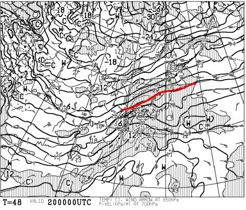
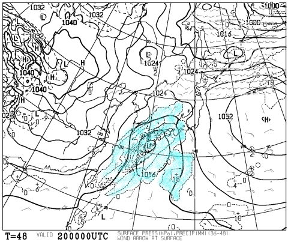
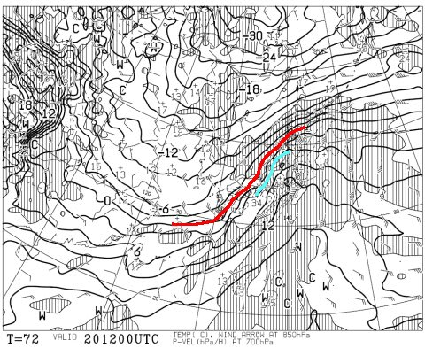
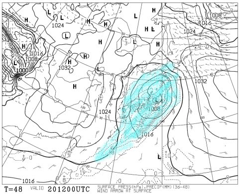
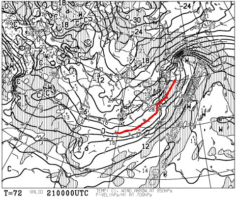
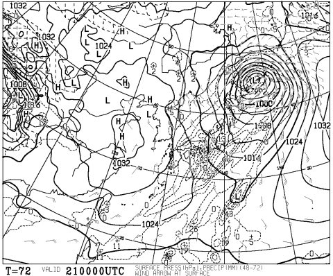

# 2月20日の週末の志賀高原の天気は…土曜は曇りのち小雨，日曜は雪のち晴れかな？

📅 投稿日時: 2016-02-19 01:13:34

ということで．

3日連続，天気ネタが続く気がするのだが．

…でも，今シーズンほど天気が気になるシーズンはないので．

今日も，週末天気予想を行くのだ．

…と，その前に．

先日は，やっぱりそこそこ積もったようで．

[焼額も40cmの積雪](https://www.facebook.com/yakebitaiyama/posts/938003162961697)があったようですね…

…これで，先週の壊滅的天候によるブッシュが隠れてくれて．

アイスバーンになった下地も埋まってくれたのかな～．

…

でも，また土曜の高温で，雪質は劣化しそうですが（涙）．

とりあえず，最新の土日の天気図を見てみると…

土曜日の朝9時の850hpa気温図は．

…うーむ．やっぱり0℃線は志賀高原より北か…（涙）．

でも，土曜の朝9時の地上天気図は，こんな感じで．

水色に塗った降水域が志賀高原にかかってないので…

うむ．

やはり，昨日の予想通り，午前中は降らずにもちそうだな．

午前の早いうちは，日が射すかも？

…ってくらい．

そして，土曜夜9時には．

あぁ…やっぱり，志賀高原には0℃線どころか，+6℃線が…（涙）．

で，夜9時の地上天気図を見ると…

だ，ダメか…

降水域が日本全国を覆っているよ…（涙）．

なので．

おそらく．

土曜の夕方からは雨になりそうですが…

…

でも，運が良ければ，降り始めはリフト営業終了後に近いかも？？

そして，低気圧が昨日の予想よりわずかに南に下がり，

志賀高原の南を通るパターンになったので．

志賀高原は，それほど雨が降らなさそう！

本格的どしゃ降りにならずに済むかな～．

で．日曜朝9時の850hpa気温図は…

うむ．

0℃線はかなり南に下がり，志賀高原は-6℃線がかかってます．

朝は-10℃近い気温にまで下がりそうな感じですね～！

で，地上天気図はこんな感じで，日曜は冬型になるので．

やっぱり朝は雪降り．

朝は10cm～20cmくらい積もってるかな？？

午後は，低気圧が遠ざかっていくので，

晴れていきそうな感じです．

ってことで，まとめると．

概ね，昨日段階の予想と変わらない感じです．

土曜：朝から南風で気温は上がり気味．朝は0℃前後．

　昼間はプラス気温．

　朝早いうちは雲の切れ間から日も射すかも．

　朝イチの圧雪はいい感じ．

　昼間は気温が上がるので，ちょっと雪が重くなっていく．

　基本的に曇りの一日だけど，夕方近くにはぽつ，ぽつと…液体が落ちてくるかも．

　夜に雨が降り始めるけど，夜中に雪にかわっていく．

日曜：朝は前日の高温で硬めになった雪の上に新雪．10cm～20cmかな？

　朝は雪がちらつく天気．午前に雪は止み，午後に向かって晴れていく．

　朝イチは，前日からの冷えた雪が圧雪されていい感じ．

　雪が蹴散らされると，新雪の下に固い下地が出てきて滑りにくくなるかも…

　前日と違って，昼間も気温は低め．-10℃～-5℃程度．

という感じで．

土曜はどしゃ降りという，最悪の事態は避けられた感じです！！

というか，土曜の昼間は降らずに済むかも？？

暖気流入のピークが夜になったので，

地上付近の気温はそれほどひどく上がらずに

済みそうな感じです…．

冷え冷え踊りPart3が効いたのかな…？？

…しかし．

まだ，気を抜いてはいけないのだ！

皆さんの必死の踊りの結果は，土曜日にわかるのだ！！

## 💬 コメント一覧

### 💬 コメント by (まいる)
**タイトル**: 踊らないと
**投稿日**: 2016-02-19 13:16:56

お疲れ様です(^^)v　今週の土日は宮城蔵王えぼしです。当然、志賀高原よりは北なのでよいはずなのですが、現時点では、雨のような雪のような・・・

冷え冷え踊り頑張りましょう！

### 💬 コメント by (Skier_S)
**タイトル**: まいるさま
**投稿日**: 2016-02-19 21:57:13

宮城蔵王ですか…

土曜の夜は雨の確率が高いかと．

それも，かなり強風の雨かも．

でも，志賀高原と同じで夜中のうちに

雪になります．

…昼間に降られないように，

冷え冷え踊り＆雨よ降るな踊りを踊りましょう！！

