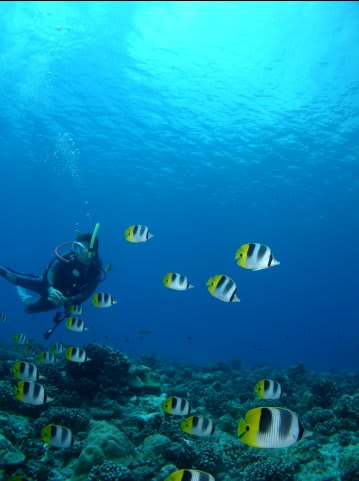
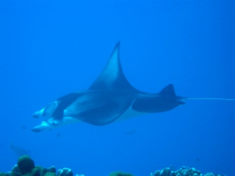
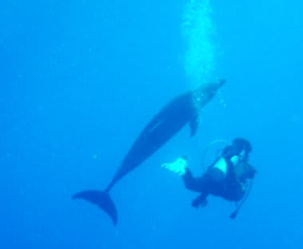
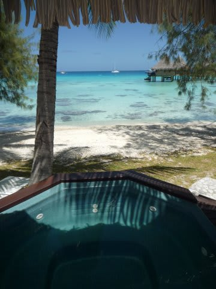
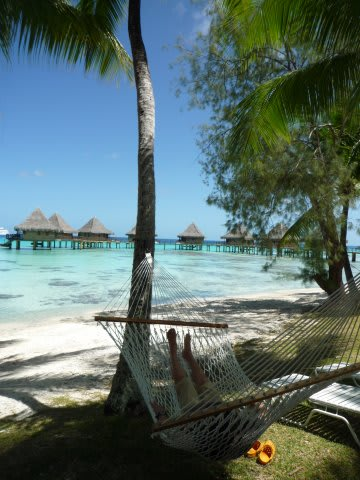

# 2009年　初の海外子連れダイビング旅行記　プロローグ3　タヒチのダイビング

📅 投稿日時: 2012-08-24 00:16:34

をいをい，プロローグだけで一体何回続くんだい…？？

って感じですが．

あきらめてお付き合いください(笑）．

んで．

タヒチ情報の続きですが．

もし．

目的が純粋にダイビングだけなら．

…はっきり言って，モルジブかパラオのほうがいいです．

タヒチのダイビングですが，

ボラボラ島は…

マンタポイントはあるけど最近はマンタ出ないらしいし．

群れものを見れるとか，大物が見れるとかいう海ではないです．

あー．でも．

海の透明度は高く，きれいな海ですよ．

ランギロアは大物は出るけど，

「ぱっと通過するだけ」の感じ．

魚影が濃い！という海ではないし．

＃イルカとの遭遇頻度はかなり高いですが

あと，タヒチ全体にわたって．

マクロという概念が全く無いダイビングです．

オールワイド．ワイド系のみ．

たまに「ハゼが見たい！」といっても，

そんなダイビングは存在しません．

ですので．

ダイビングがんがん！

もう，海があればあとは何もなくてもいい！

って感じだと．多少物足りないかも．

リゾートでのんびり，というほうにも重点を置いて．

ダイビング半分，ビーチリゾート半分，と考えれば．

最高の場所です．

まぁ，今回，子供づれなわけですから．

がんがんダイビングとは行かないので，

陸上も美しい，タヒチがベスト！と思ったわけですが．

しかし．

しかし．

何度も書くようですが．

タヒチ．

物価が高い～っ！！！！！！！

旅費が高い～っ！！！！！！

レストランに夕食を食べに行くと．

夕食+ビール1-2本程度で大体一人，

3000円～5000円（涙）

ちょっとしたエクスカーションに参加すると，あっという間に

数万円取られます．

タヒチのリゾート．

ハワイやグアムみたいな，チャラい若者はおりません．

大声で騒いだり，ビュッフェの飲み放題ドリンクを水筒に

いれて持ち帰っちゃうとかみたいな（^^;品格を疑うような方々はおりません．

ホテルのゲストに限らず，観光客全般に落ち着き感があり．

ゲストの皆さんに，たいへん知的レベルが高そうな感じが漂っております．

これは，このような品格を疑うような方々から，タヒチが「エコノミカル・バリアー」

によって守られているからにほかなりません…

「高い金払って，免税店もブランドショップもない，何も無い島で

過ごしたい」という方々が集まる場所ですから…

おかげで．

落ち着いた，たいへんすごしやすいリゾートとなっております．

というわけで．

「ものすげーお金持ちになったら，もう一回来よう」

と誓った2005年だったのですが． 

何をとち狂ったのか．

「子供がタダのうちにっ！」

という，わけ分からん理由で．

またボラボラとランギロアの２島ともに

再訪することにしてしまったという…
