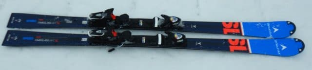
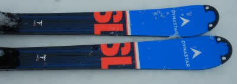
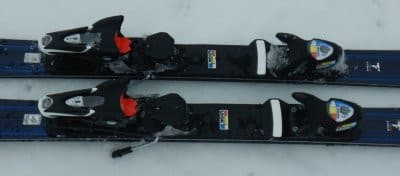
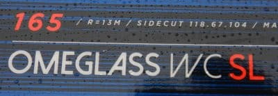
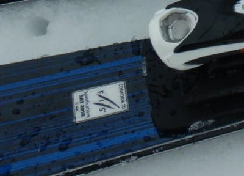

# 2022シーズンモデルのスキー板，試乗レポートその7…DYNASTAR SPEED OMEGLASS WC SL

📅 投稿日時: 2021-06-09 01:08:19

ということで．

昨日は1日休載しましたが…

今日は復活！

…しかし．

昨日から気温が一気に上がり，

夏っぽくなってきましたね～…

でも．

今シーズンもまだ終了しておらず，

私の頭の中もまだスキーシーズンだし．

このBlogはまだ冬モード！←いつも通り季節感の無いBlogだ…

ってなわけで．

夏日の今日も，季節感を無視してスキー板の

試乗レポートに行くのだ！

本日はディナスター編．

では，どうぞ～！

○DYNASTAR SPEED OMEGLASS WC SL 165cm

SL競技用

この板も，2021シーズンからのキャリー

オーバーで，来シーズンもデザインは

変わらないようですね…

で，この板．

ビンディングヒールピース後ろを見ると，

FISマークも入っているし．

FIS認定の本格SL板のようですが．

履いてみたところ…

え？

選手用SL板ということで身構えたけど．

ものすごい滑りやすい！

板が硬すぎる，強すぎるということは無く．

スッとトップから楽にエッジがかかり，

自然にターンに入っていき，

いい感じで板がたわんでいきます．

そして，いい感じで圧が溜まって…

その圧がターン切替に向けて，すっと

解放され，次のターンがオートマチックで

始められます．

SLの競技用の板って，圧の解放が

強かったり早すぎたりで手ごわいんじゃ

ないかという思い込みがあったけど．

この板は返りの量もタイミングも，

ゲレンデでガンガン気持ちいい小回りを

するのにちょうどいい感じ！！

そして．

板も硬すぎず，柔らかめの雪でも比較的

簡単にたわませられて．

たわみ量のコントロールで，自由に

ターン弧を変えていける感じ．

SL競技用ってもっと硬くて，こんなに

簡単にたわませられないってイメージが

あったんだけど…

普通の基礎小回り用と比べれば，

グリップは強めだし，板の張りもちょっと

強めかもしれないけど．

SL競技用にしては，かなり扱いやすい！

滑った安定感はあるのに，重さは感じないし．

…競技用ってより，ゲレンデ小回り用の

板として，かなりイケてるんじゃない？

ただ，グリップがそこそこ強めで，

ガッツリグリップして滑る板なので．

あまりずらして滑ろうとか思わない，

カービングマシーンです．

この板を楽しむには，ある程度の速度が

いるので，乗り手には当然ある程度

以上の技術レベルを求めますが…

でも，そこそこの技術があれば

ゲレンデでも十分楽しめる板です！

試乗したバーンが，ちょっと柔らかめ

だったので，ホントのガッチリ硬めの

バーンでどうなるかは分からないけど．

スピードを出していった中でも安定感

もあり，ガチのSL競技用として

身構えるより扱いやすくて．

気持ちよくカービング小回りが滑れる，

ゲレンデ小回り用として結構使えそうな，

ポテンシャルの高い板でした…

## 💬 コメント一覧

### 💬 コメント by (Unknown)
**タイトル**: Unknown
**投稿日**: 2021-06-09 09:20:59

ブーツを替えてから別次元になったんですね

一般レジャースキーヤーには参考にならない試乗記（褒めている）

### 💬 コメント by (Skier_S)
**タイトル**: ＞Unknownさま
**投稿日**: 2021-06-10 02:07:26

ブーツを変えてから，強めの板の評価が高くなりがちですが…

私も一般レジャースキーヤーですから…っ！！！

### 💬 コメント by (ikkun)
**タイトル**: Unknown
**投稿日**: 2021-06-10 09:54:03

おはようございます❗ダイナスター？懐かしい( *´艸｀)三郎さんのファンで赤色コンタクトSL に デモも買いましたなあ(笑)  ディナスターは基本乗りやすいですよね❤️ 野沢でもやはり好印象でしたし(笑)

### 💬 コメント by (Skier_S)
**タイトル**: ＞ikkunさま
**投稿日**: 2021-06-10 23:56:03

渡部三郎さんのディナスター（当時はダイナスター）って…

またこれは古い話題を（笑）．

私はディナスターはこれまで買ったことがないブランドだったりします…

### 💬 コメント by (ikkun)
**タイトル**: Unknown
**投稿日**: 2021-06-13 13:55:40

お疲れ様です 自爆してますね( *´艸｀)  実は三郎さんからじきじきに教えて頂ける機会がありまして(笑)縁とは不思議と思っています(笑)  無駄な力を使わない？ステキな滑りに💗マークって…そうゆう趣味はないですよ( *´艸｀)

### 💬 コメント by (Skier_S)
**タイトル**: ＞ikkunさま
**投稿日**: 2021-06-14 02:02:38

あら！渡部三郎さんから直々に教えてもらえるってうらやましい！

いいですね～…！

